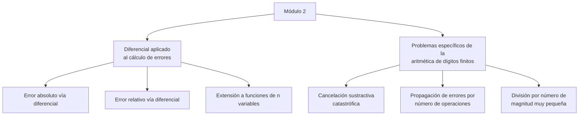
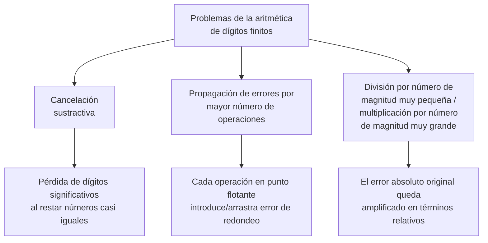

---
tags:
  - materia/calculo-numerico
  - modulo/m2
  - tipo/teoria
materia: Calculo Numerico
modulo: M2 - Diferencial y Problemas Especificos
tipo: teoria
descripcion: "Aplicacion del diferencial al calculo de errores — error absoluto y relativo via diferencial (1 y n variables), y tres problemas de la aritmetica de digitos finitos: cancelacion catastrofica (racionalizacion), propagacion por operaciones (Metodo de Horner), division por magnitudes pequenas."
conceptos_clave:
  - diferencial
  - error absoluto
  - error relativo
  - cancelacion catastrofica
  - Metodo de Horner
  - propagacion de errores
relacionados:
  - "[[M1 - Teoria de errores]]"
  - "[[M1 - Ejercicios]]"
---
# M2 - Resumen completo

> [!note] Fuentes de este resumen
> - `M2_Presentacion.pdf` — "Aplicación del diferencial al cálculo de errores"
> - `M2_1__Aplicacion_del_diferencial_al_calculo_de_errores.pdf` — "Algunos problemas específicos de la aritmética de dígitos finitos"
> - `P1__Teoria_de_errores.pdf` — Ejercicios 11 a 15 (requieren el diferencial, cubierto en este módulo)

---

## Mapa general del módulo

Este módulo conecta dos ideas: primero, cómo usar el **diferencial** de una función para estimar el error que se propaga al evaluarla con datos aproximados; segundo, cómo ciertos **patrones operatorios** (restas de números casi iguales, muchas operaciones encadenadas, divisiones por números muy chicos) amplifican el error de redondeo en la práctica, y qué hacer para evitarlo.

---

## 1. El diferencial aplicado al cálculo de errores

### 1.1 Definición de diferencial

El diferencial de una función $y = f(x)$ en un punto $x$ se define como:

$$dy = df(x) = f'(x) \cdot \Delta x$$

Si se considera la función identidad $f(x) = x$, su diferencial es:

$$dy = d(x) = 1 \cdot \Delta x$$

Por lo tanto, al incremento de la variable independiente $\Delta x$ se lo designa también con $dx$, y la definición anterior puede escribirse como:

$$dy = df(x) = f'(x)\, dx$$

Despejando $f'(x)$:

$$f'(x) = \frac{dy}{dx} = \frac{df(x)}{dx}$$

> [!tip] Idea clave
> Si $\Delta x \to 0$, entonces el incremento de la función es aproximadamente igual al diferencial:
> $$\Delta y \approx f(x+\Delta x) - f(x) \approx dy$$

### 1.2 Error absoluto mediante el diferencial

Si $y = f(x)$ y $x = x^{*} + \Delta x$, entonces el error absoluto que se comete al aproximar $f(x^{*}+\Delta x)$ por el valor aproximado $f(x^{*})$ es:

$$E_a(y) = \Delta y = f(x^{*}+\Delta x) - f(x^{*}) \approx dy = f'(x^{*}) \cdot \Delta x$$

$$\boxed{E_a(y) = f'(x^{*}) \cdot \Delta x}$$

> [!note]
> El diferencial de una función en un punto coincide aproximadamente con el incremento de la función en dicho punto.

### 1.3 Error relativo mediante el diferencial

$$E_r(y) \approx \frac{E_a(y)}{y} = \frac{f'(x^{*}) \cdot \Delta x}{f(x^{*})}$$

$$\boxed{E_r(y) \approx \frac{f'(x^{*})}{f(x^{*})} \cdot \Delta x}$$

### 1.4 Ejemplo 1 — Raíz cúbica

**Enunciado:** sabiendo que el número aproximado $65,2$ tiene todos sus dígitos exactos:
a) Calcular la raíz cúbica aproximada de dicho número.
b) Acotar el error absoluto.
c) ¿Cómo debe expresarse el resultado?
d) Acotar el error relativo.

**a) Cálculo de la raíz cúbica aproximada**

Se considera la función $y = f(x) = \sqrt[3]{x}$.

$$y^{*} = \sqrt[3]{65,2} = 4,024845357$$

**b) Cota del error absoluto**

Como $y = f(x) = \sqrt[3]{x}$, su derivada es:

$$f'(x^{*}) = \frac{1}{3\sqrt[3]{x^2}}$$

Como $x^{*}=65,2$ tiene tres dígitos exactos:

$$\Delta x = 0,5 \cdot 10^{1-3+1} = 0,05$$

Aplicando la fórmula del error absoluto:

$$E_a = \Delta y \approx \frac{1}{3\sqrt[3]{x^2}} \cdot \Delta x = \frac{1}{3\sqrt[3]{65,2^2}} \cdot 0,05 = 0,00103$$

**c) Expresión del resultado**

Como el error absoluto es $E_a = 0,001030 \leq 0,005 = 0,5\cdot10^{-2}$, todos los dígitos ubicados desde la posición $10^{-2}$ hacia la izquierda son exactos. Por lo tanto, el resultado debe expresarse con un dígito más y su cota de error absoluto correspondiente. Como el primer dígito a despreciar es 8, se suma 1 al dígito anterior:

$$\Delta y = 4,025 \pm 0,001$$

**d) Error relativo**

$$E_r(y) \cong \frac{\Delta y}{y^{*}} = \frac{0,001}{4,025} = 0,000248$$

> [!example] Ejercitación (P1, Ejercicios 11 a 13) — diferencial en una variable
>
> **11) Plantear con diferenciales la función polinómica $f(x)=x^3-6,1x^2+3,2x+1,5$ (evaluada en el módulo anterior), considerando $x=4,71\pm0,01$:**
>
> $$f'(x) = 3x^2-12,2x+3,2 \quad \Rightarrow \quad f'(4,71) = 12,29$$
> $$E_a = \Delta f(4,71) = f'(4,71)\cdot\Delta x = 12,29\cdot0,01 = 0,123$$
> $$E_r = \frac{\Delta f(4,71)}{f(4,71)} = 0,0068$$
>
> **12) Volumen de una esfera de radio $r=10$ m, con $\Delta r=0,2$ m. Expresar $E_r$ con dos dígitos significativos:**
>
> $$V(r) = \frac{4}{3}\pi r^3 \quad \Rightarrow \quad V'(r) = 4\pi r^2$$
> $$E_a = V'(10)\cdot\Delta r = 4\pi(100)(0,2) = 80\pi \approx 251,3 \text{ m}^3$$
> $$E_r = \frac{E_a}{V(10)} = \frac{80\pi}{\frac{4000}{3}\pi} = 0,06 \approx 0,061$$
>
> **13) Volumen de un cubo de arista $a=5$ m, con $\Delta a=0,1$ m:**
>
> $$V(a) = a^3 \quad \Rightarrow \quad V'(a) = 3a^2$$
> $$E_a = V'(5)\cdot\Delta a = 3(25)(0,1) = 7,5 \text{ m}^3$$
> $$E_r = \frac{E_a}{V(5)} = \frac{7,5}{125} = 0,06$$

### 1.5 Extensión a funciones de varias variables

El diferencial también permite calcular los errores absoluto y relativo de funciones de $n$ variables. Si $z = f(x_1, x_2, \dots, x_n)$ y $x_j = x_j^{*} \pm \Delta x_j$, entonces:

$$E_a(z) \cong f'_{x_1}(x_1^{*}, x_2^{*}, \dots, x_n^{*})\cdot \Delta x_1 + f'_{x_2}(x_1^{*}, x_2^{*}, \dots, x_n^{*})\cdot \Delta x_2 + \dots + f'_{x_n}(x_1^{*}, x_2^{*}, \dots, x_n^{*})\cdot \Delta x_n$$

$$E_r(z) \cong \frac{f'_{x_1}(x_1^{*},\dots,x_n^{*})\cdot \Delta x_1 + \dots + f'_{x_n}(x_1^{*},\dots,x_n^{*})\cdot \Delta x_n}{f(x_1^{*}, x_2^{*}, \dots, x_n^{*})}$$

### 1.6 Ejemplo 2 — Producto de dos variables aproximadas

**Enunciado:** si $x = 27,06 \pm 0,04$ e $y = 27,05 \pm 0,03$, calcular:
a) $x\cdot y$ en forma aproximada.
b) El error absoluto, indicando cómo debe expresarse el resultado.
c) El error relativo.

**a) Cálculo aproximado**

$$z = x\cdot y, \quad z'_x = y, \quad z'_y = x$$
$$x^{*} = 27,06, \quad y^{*} = 27,05, \quad \Delta x = 0,04, \quad \Delta y = 0,03$$
$$z^{*} = 27,06 \cdot 27,05 = 731,973$$

**b) Error absoluto y expresión del resultado**

$$E_a(z) \leq y^{*}\cdot \Delta x + x^{*}\cdot \Delta y \implies E_a(z) \leq 27,05\cdot 0,04 + 27,06\cdot 0,03 = 1,8938$$

Se busca la mínima cota del error absoluto de la forma $0,5\cdot 10^{n-k+1}$ que sea mayor que $1,8938$.

Como $E_a(z) \leq 1,8938 = 0,18938 < 0,5\cdot10^{1}$, todos los dígitos desde la posición $10^{1}$ hacia la izquierda son exactos, por lo que el resultado tiene dos dígitos exactos y debe expresarse con un dígito más (el dígito en el que aparece el error). Como el primer dígito a despreciar es 9, se redondea hacia arriba, expresando la cota como 2:

$$z = 732 \pm 2$$

**c) Error relativo**

$$E_r(z) \leq \frac{y^{*}\cdot \Delta x + x^{*}\cdot \Delta y}{x^{*}\cdot y^{*}} \implies E_r(z) \leq \frac{27,05\cdot 0,04 + 27,06\cdot 0,03}{27,06\cdot 27,05} = \frac{1,8938}{731,97} = 2,59\cdot 10^{-3}$$

> [!example] Ejercitación (P1, Ejercicios 14 y 15) — diferencial en varias variables
>
> **14) Área de un círculo de radio exacto $r=12,62$ m, aproximando $\pi\approx3,14$ ($\Delta\pi\approx0,0016$) y $r\approx12,6$ ($\Delta r=0,02$):**
>
> $$S = \pi r^2, \quad S'_\pi = r^2, \quad S'_r = 2\pi r$$
> $$E_a(S) \approx r^{*2}\cdot\Delta\pi + 2\pi^{*}r^{*}\cdot\Delta r = (12,6)^2(0,0016) + 2(3,14)(12,6)(0,02) \approx 1,9 \text{ m}^2$$
> $$E_r(S) = \frac{E_a(S)}{S^{*}} \approx 0,0038$$
>
> **15) Sea $a=100\pm1$, $b=2000\pm40$, $c=2500\pm50$. Cota del error absoluto y relativo propagado:**
>
> a) $x = a-b+c$:
> $$x^{*} = 600 \qquad E_a(x) = \Delta a+\Delta b+\Delta c = 91 \qquad E_r(x) = \frac{91}{600} = 0,15$$
>
> b) $y = b\cdot c$:
> $$y^{*} = 5.000.000 \qquad E_a(y) = c^{*}\Delta b + b^{*}\Delta c = 200.000 \qquad E_r(y) = \frac{200.000}{5.000.000} = 0,04$$
>
> c) $z = \dfrac{c}{b}$:
> $$z^{*} = 1,25 \qquad E_a(z) = \frac{c^{*}}{b^{*2}}\Delta b + \frac{1}{b^{*}}\Delta c = 0,05 \qquad E_r(z) = \frac{0,05}{1,25} = 0,04$$
>
> d) $w = \dfrac{a\cdot c}{b}$:
> $$w^{*} = 125 \qquad E_a(w) = \frac{c^{*}}{b^{*}}\Delta a + \frac{a^{*}}{b^{*}}\Delta c + \frac{a^{*}c^{*}}{b^{*2}}\Delta b = 6,25 \qquad E_r(w) = \frac{6,25}{125} = 0,05$$
>
> e) $t = b^3$:
> $$t^{*} = 8\times10^9 \qquad E_a(t) = 3b^{*2}\cdot\Delta b = 0,48\times10^9 \qquad E_r(t) = \frac{0,48\times10^9}{8\times10^9} = 0,06$$

---

## 2. Problemas específicos de la aritmética de dígitos finitos

### 2.1 Cancelación sustractiva (catastrófica)

Se produce cuando se restan dos números casi iguales: los dígitos coincidentes se cancelan y el resultado queda dominado por el error de redondeo que ya arrastraban los operandos, perdiendo dígitos significativos.

#### Ejemplo 1 — $f(x) = \sqrt{x+1}-\sqrt{x}$ en $x=800$

**a) Cálculo aproximado (valor de referencia)**

$$f(800) = \sqrt{801}-\sqrt{800} = 28,30194 - 28,28427 = 0,01767$$

**b) Cálculo con aritmética de redondeo a 4 dígitos** (aplicando el redondeo a cada término y al resultado):

$$fl(f(800)) = fl\big(fl(\sqrt{801}) - fl(\sqrt{800})\big) = fl(28,30 - 28,28) = fl(0,02) = 0,02$$

**c) Error relativo**

$$E_r = \frac{0,01767 - 0,02}{0,01767} = 0,13 \implies E\% = 13\%$$

**d) Racionalización de la fórmula**

Se multiplica y divide por el conjugado para eliminar la resta:

$$f(x) = \sqrt{x+1}-\sqrt{x} = \frac{(\sqrt{x+1}-\sqrt{x})(\sqrt{x+1}+\sqrt{x})}{\sqrt{x+1}+\sqrt{x}} = \frac{1}{\sqrt{x+1}+\sqrt{x}}$$

Recalculando con redondeo a 4 dígitos:

$$fl(f(800)) = fl\left(\frac{1}{fl(\sqrt{801})+fl(\sqrt{800})}\right) = fl\left(\frac{1}{28,30+28,28}\right) = fl\left(\frac{1}{56,58}\right) = fl(0,01767409) = 0,01767$$

$$E_r = \frac{0,01767409-0,01767}{0,01767409} = 0,000234 \implies E\% = 0,0234\%$$

> [!warning] Conclusión
> El error se reduce drásticamente ya que, con la nueva fórmula, se evita la pérdida de dígitos significativos debida a la sustracción de números casi iguales.

#### Ejemplo adicional resuelto — $f(x) = \sqrt{4x^2+1}-2x$ en $x=15$

Este ejercicio sigue exactamente la misma lógica que el Ejemplo 1 y sirve como segundo caso de cancelación catastrófica.

**a) Valor exacto (7 cifras significativas)**

$$f(15) = \sqrt{4(15)^2+1} - 2(15) = \sqrt{901}-30 = 0,01666204$$

**b) Aritmética de redondeo a 4 dígitos significativos**

$$4x^2+1 = 901,0 \quad \sqrt{901,0} = 30,02 \quad 2x = 30,00$$
$$f(15) = 30,02-30,00 = 0,02000$$

$$E_r = \frac{|0,01666204-0,02000|}{0,01666204} = 0,2003 \implies E\% = 20,03\%$$

**c) Fórmula racionalizada**

$$f(x) = \sqrt{4x^2+1}-2x = \frac{(4x^2+1)-4x^2}{\sqrt{4x^2+1}+2x} = \frac{1}{\sqrt{4x^2+1}+2x}$$

Con redondeo a 4 dígitos: $\sqrt{901,0}+2x = 30,02+30,00 = 60,02$

$$f(15) = \frac{1}{60,02} = 0,01666$$

$$E_r = \frac{|0,01666204-0,01666|}{0,01666204} = 0,0001224 \implies E\% = 0,01224\%$$

**d) Explicación**

La diferencia entre b) y c) se debe a la **cancelación catastrófica**: en la fórmula original se restan dos cantidades casi iguales ($\sqrt{4x^2+1}$ y $2x$, ambas cercanas a 30), lo que cancela los dígitos coincidentes y deja al resultado dominado por el error de redondeo de los operandos. La fórmula racionalizada reemplaza esa resta por una suma y una división, operaciones que no amplifican el error relativo de la misma manera, por lo que el resultado es numéricamente mucho más estable.

### 2.2 Propagación de errores por número de operaciones

Cuantas más operaciones en punto flotante se encadenan, más se acumula el error de redondeo. Escribir una expresión con **menos operaciones** (por ejemplo, forma anidada de un polinomio) reduce la propagación del error.

#### Ejemplo 2 — Evaluación de un polinomio con aritmética de 3 dígitos

**Enunciado:** evaluar $f(x) = x^3 - 6,1\cdot x^2 + 3,2\cdot x + 1,5$ en $x=4,71$ utilizando aritmética de tres dígitos en cada operación, y calcular el error relativo.

| | $x$ | $x^2$ | $x^3$ | $6,1\cdot x^2$ | $3,2\cdot x$ |
|---|---|---|---|---|---|
| Exacto | 4,71 | 22,1841 | 104,487111 | 135,32301 | 15,072 |
| Tres dígitos (corte) | 4,71 | 22,1 | 104 | 134 | 15,0 |
| Tres dígitos (redondeo) | 4,71 | 22,2 | 105 | 135 | 15,1 |

- Exacto: $f(4,71) = -14,263899$
- Tres dígitos (corte): $f(4,71) = -13,5 \implies E_r = 0,05355$
- Tres dígitos (redondeo): $f(4,71) = -13,4 \implies E_r = 0,06$

**Forma anidada del polinomio** (Método de Horner), evaluada nuevamente en $x=4,71$:

$$f(x) = x^3-6,1\cdot x^2+3,2\cdot x+1,5 = x\cdot[x^2-6,1\cdot x+3,2]+1,5 = x\cdot[x\cdot(x-6,1)+3,2]+1,5$$

Empleando redondeo a 3 dígitos, paso a paso:

$$fl\Big[fl\big[4,71\cdot(fl(4,71\cdot(4,71-6,1))+3,2)\big]+1,5\Big]$$
$$= fl\Big[fl\big[4,71\cdot[fl(4,71\cdot(-1,39))+3,2]\big]+1,5\Big]$$
$$= fl\big[fl[4,71\cdot[fl(-6,5469)+3,2]]+1,5\big] = fl\big[fl[4,71\cdot[(-6,55)+3,2]]+1,5\big]$$
$$= fl[fl[4,71\cdot(-3,35)]+1,5] = fl[fl[-15,7785]+1,5]$$
$$= fl[fl(-15,78)+1,5] = fl(-14,28) = -14,3$$

**Error relativo:**

$$E_r = \left|\frac{-14,263899-(-14,3)}{-14,263899}\right| = 0,00253$$

> [!tip] Conclusión
> Cuando los polinomios se escriben en forma anidada se realizan menos operaciones y, por lo tanto, hay menos propagación de error ($E_r = 0,00253$ frente a $E_r = 0,05355$ o $0,06$ de la evaluación término a término).

### 2.3 División por un número de magnitud muy pequeña

Dividir un número por otro de magnitud mucho menor (o multiplicar por uno de magnitud mucho mayor) amplifica fuertemente el error relativo, porque cualquier error absoluto cometido en el numerador queda dividido por un número muy chico.

#### Ejemplo 3 — Aproximación de la derivada de $f(x)=x^2$ en $x=1{,}00$

**Enunciado:** aproximar la derivada mediante

$$f'(x) \approx \frac{f(x+h)-f(x)}{h}$$

con paso $h = 0,000314$, empleando aritmética de redondeo a tres dígitos significativos.

**Valor real (sin redondeo intermedio):**

$$f(1,00) = 1,00^2 = 1,00 \qquad f(1,00+0,000314) = 1,000314^2 = 1,000628$$
$$f'(1,00) \approx \frac{1,000628-1,00}{0,000314} \approx 2,000$$

Analíticamente, $f'(x) = 2x \implies f'(1,00) = 2,00$, lo cual coincide.

**Empleando la aritmética de redondeo a tres dígitos:**

$$x+h = 1,00+0,000314 \implies fl(1,000314) = 1,00$$

Se pierde el valor de $h$ porque $x$ es de una magnitud mucho mayor que $h$.

$$f(x+h) = (x+h)^2 \implies f(1,00) = 1,00^2 = 1,00$$

Entonces la aproximación a la derivada resulta:

$$f'(1,00) \approx \frac{1,00-1,00}{0,000314} = \frac{0,00}{0,000314} = 0,00$$

**Error relativo:**

$$E_r = \frac{2,00-0,00}{2,00} = 1,00 \implies E\% = 100\%$$

> [!warning] Conclusión
> El error se debe a que se está dividiendo un número ($x$) por otro de magnitud mucho menor ($h$). Lo mismo sucedería al multiplicar un número por otro de magnitud mucho mayor.

### 2.4 Síntesis — Errores más frecuentes en aritmética de dígitos finitos

- **Sustracción "catastrófica":** pérdida de dígitos significativos por resta de números casi iguales.
- **Propagación de errores** debido a un mayor número de operaciones.
- **Amplificación del error** debido a la división de un número por otro de magnitud mucho menor, o a la multiplicación de un número por otro de magnitud mucho mayor.

---

## Resumen de fórmulas clave del módulo

| Concepto | Fórmula |
|---|---|
| Diferencial | $dy = f'(x)\,dx$ |
| Error absoluto (1 variable) | $E_a(y) \approx f'(x^{*})\cdot \Delta x$ |
| Error relativo (1 variable) | $E_r(y) \approx \dfrac{f'(x^{*})}{f(x^{*})}\cdot \Delta x$ |
| Error absoluto ($n$ variables) | $E_a(z) \approx \sum_{j=1}^n f'_{x_j}\cdot \Delta x_j$ |
| Error relativo ($n$ variables) | $E_r(z) \approx \dfrac{\sum_{j=1}^n f'_{x_j}\cdot \Delta x_j}{f(x_1^{*},\dots,x_n^{*})}$ |
| Cancelación catastrófica | Racionalizar / reformular para evitar restas de cantidades casi iguales |
| Propagación por operaciones | Reescribir en forma anidada (Horner) para minimizar operaciones |
| División por magnitud pequeña | Evitar dividir por cantidades mucho menores que los demás términos, o reformular la expresión |