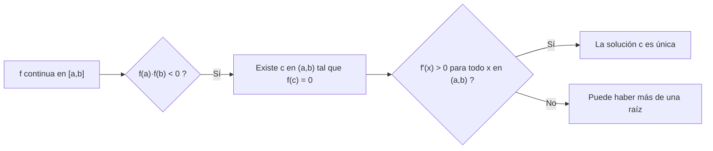
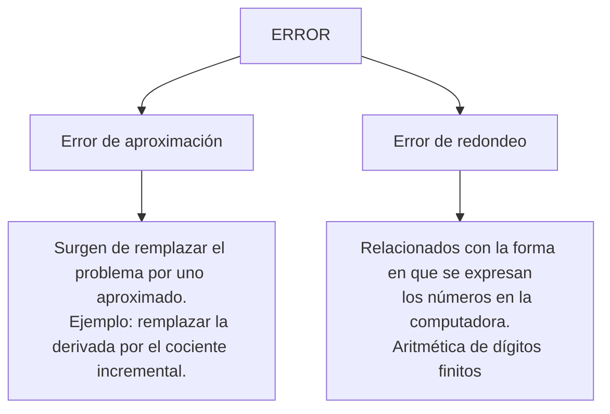
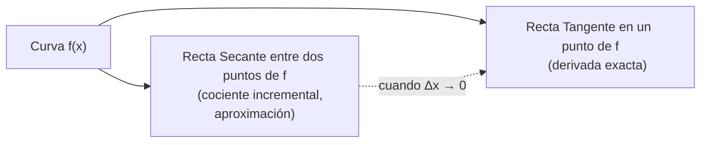
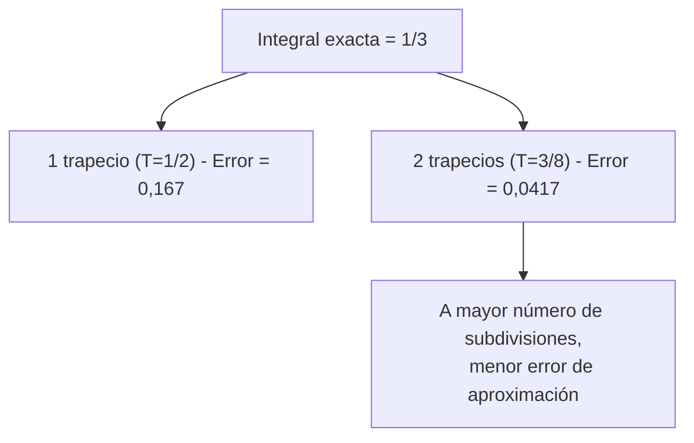
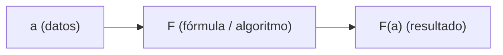
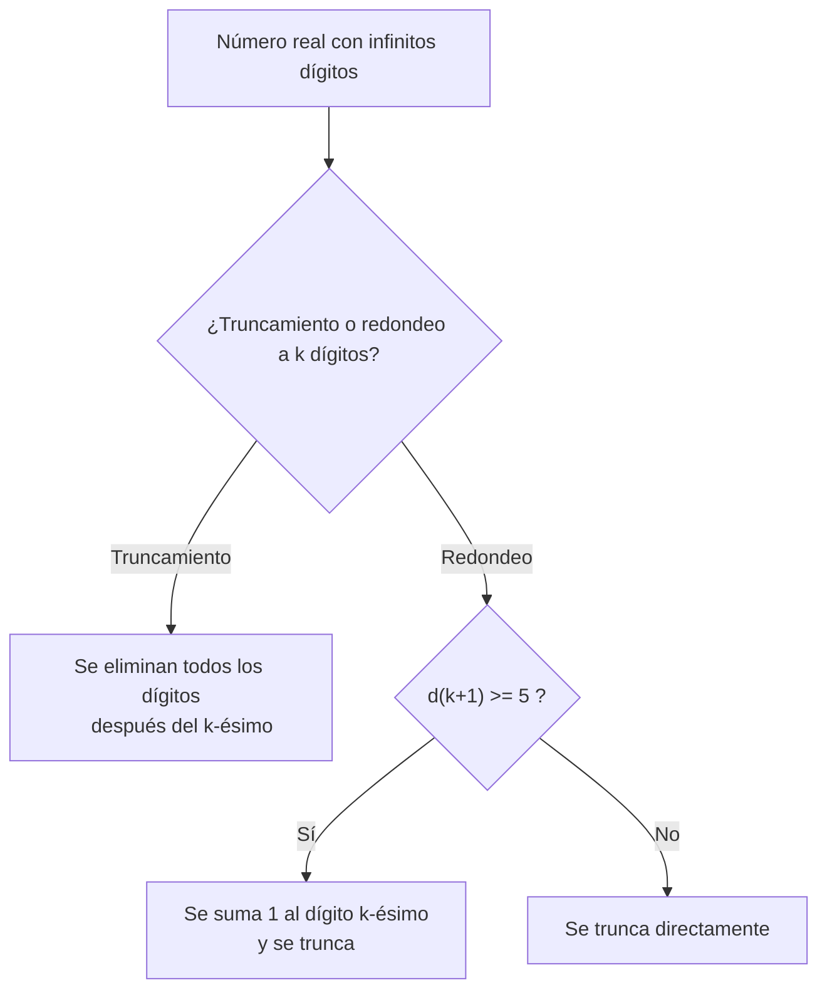
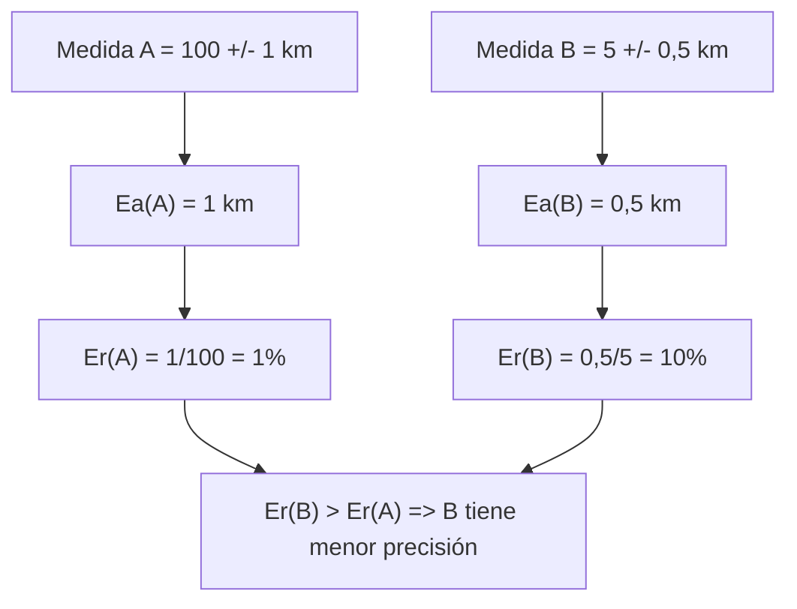
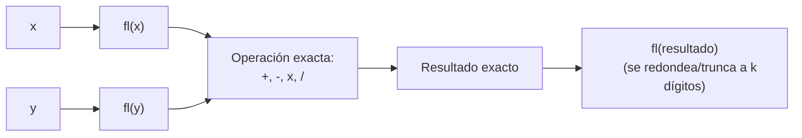

# Módulo 1 - Cálculo Numérico

## Introducción al cálculo numérico

El cálculo numérico consiste en el desarrollo de "métodos constructivos" para hallar la "solución aproximada" de problemas matemáticos.

De estos problemas, la matemática garantiza la existencia y unicidad de la solución (en algunos casos no provee el algoritmo para obtener la solución del problema).

**Observaciones:**
- Solución numérica en contraposición a solución exacta.
- Los métodos constructivos también reciben el nombre de "algoritmos".

### Ejemplo: existencia y unicidad de la solución

Hallar la solución de

$$f(x) = 0$$

en un intervalo $[a; b]$

- Si $f$ es continua en $[a; b]$ y $f(a) \cdot f(b) < 0$, existe $c \in (a; b)$ tal que $f(c) = 0$.
- Hay que ver la demostración para obtener una forma constructiva para encontrar la solución.
- Si además $f'(x) > 0$ para todo $x \in (a; b)$, la solución es única.

**Descripción de la imagen (gráfico del teorema de Bolzano):**
Se muestra un sistema de ejes cartesianos con una curva roja creciente que representa la función f. En el eje horizontal se marcan los puntos a, c y b, en ese orden de izquierda a derecha. El punto a está sobre el eje horizontal en su extremo izquierdo, y desde ahí sube verticalmente (línea punteada azul) hasta el valor f(a), marcado en el eje vertical con un punto rojo, que se ubica por debajo del eje horizontal (es decir, f(a) es negativo). El punto b está en el extremo derecho, y desde ahí sube verticalmente hasta f(b), marcado en el eje vertical por encima del eje horizontal con otro punto rojo (f(b) es positivo). La curva f pasa por el punto c, ubicado entre a y b sobre el eje horizontal, marcado con un círculo rojo hueco, que es el punto donde la curva cruza el eje (f(c) = 0). El gráfico ilustra visualmente el Teorema de Bolzano: como f(a) y f(b) tienen signos opuestos y f es continua, existe un c entre ambos donde f se anula.

### Métodos constructivos (o algoritmos)

Procedimiento ordenado, secuencial que, para una dada precisión, determina la solución aproximada del problema en un número finito de pasos.

**Precisión:** proximidad entre lo que se puede hacer y lo que se desea encontrar.

Precisión, solución aproximada → ERROR.

### Tipos de error

**Descripción:** El esquema clasifica el error en dos grandes categorías. La primera es el error de aproximación, que surge de reemplazar el problema original por uno aproximado (por ejemplo, reemplazar la derivada exacta por el cociente incremental). La segunda es el error de redondeo, relacionado con la forma en que la computadora representa los números internamente, es decir, con la aritmética de dígitos finitos.

### Ejemplo: remplazar la derivada por el cociente incremental

La derivada exacta se define como:

$$f'(x_0) = \lim_{\Delta x \to 0} \frac{f(x_0 + \Delta x) - f(x_0)}{\Delta x}$$

y se remplaza (aproxima) por el cociente incremental:

$$f'(x_0) \approx \frac{f(x_0 + \Delta x) - f(x_0)}{\Delta x}$$

**Descripción de la imagen:** Se muestra una curva roja llamada f, con dos puntos marcados sobre ella unidos por líneas verticales punteadas hacia el eje horizontal. Entre esos dos puntos se traza una recta azul llamada "Secante", que pasa por ambos puntos de la curva (representa el cociente incremental, la aproximación). Además, en el primero de los puntos se traza una recta verde llamada "Tangente", que representa la derivada exacta en ese punto. El gráfico ilustra que la secante (aproximación mediante el cociente incremental) se acerca a la tangente (derivada exacta) a medida que Δx se hace más pequeño, es decir, a medida que el segundo punto se acerca al primero.

### Ejemplo 2: cálculo aproximado de una integral (error de aproximación)

Calcular

$$\int_0^1 x^2 \, dx$$

Valor exacto:

$$\int_0^1 x^2 \, dx = \frac{1}{3}$$

Empleando la fórmula del trapecio:

$$T = \frac{f(a)+f(b)}{2} \cdot (b-a)$$

$$T = \frac{f(0)+f(1)}{2} \cdot (1-0) = \frac{1+0}{2} \cdot 1 = \frac{1}{2}$$

$$Error = \left| \frac{1}{3} - \frac{1}{2} \right| = \frac{1}{6} = 0{,}167$$

Si reiteramos el método partiendo el intervalo en dos partes iguales:

$$T = \frac{f(0)+f\left(\frac{1}{2}\right)}{2} \cdot \left(\frac{1}{2}-0\right) + \frac{f\left(\frac{1}{2}\right)+f(1)}{2} \cdot \left(1-\frac{1}{2}\right)$$

$$= \frac{\frac{1}{4}}{2} \cdot \frac{1}{2} + \frac{\frac{1}{4}+1}{2} \cdot \frac{1}{2} = \frac{3}{8}$$

$$Error = \left| \frac{1}{3} - \frac{3}{8} \right| = \frac{1}{24} \approx 0{,}0417$$

**Observación:** al aumentar el número de subdivisiones del intervalo (reiterar el método), el error disminuye (de $0{,}167$ a $0{,}0417$), mostrando cómo mejora la aproximación al refinar el método constructivo.

**Descripción de las imágenes (dos gráficos del método del trapecio aplicado a $x^2$):**

*Primer gráfico:* muestra la curva de $x^2$ (línea verde) entre 0 y 1, junto con una línea azul recta que va desde $(0,0)$ hasta $(1,1)$, formando un triángulo/trapecio que aproxima el área bajo la curva usando un solo trapecio (un solo intervalo $[0,1]$). El área sombreada en celeste representa la aproximación $T = 1/2$, que sobreestima el área real bajo la curva ($1/3$).

*Segundo gráfico:* muestra la misma curva $x^2$, pero ahora el intervalo $[0,1]$ está dividido en dos subintervalos, $[0, 0{,}5]$ y $[0{,}5, 1]$, cada uno aproximado por su propio trapecio (líneas azules quebradas que siguen más de cerca a la curva verde). El área sombreada celeste se ajusta mejor a la curva real, reflejando la mejora en la aproximación ($T = 3/8$, más cercano a $1/3$ que la aproximación anterior).

---

## Notación de Punto Flotante, Dígitos Significativos y Errores

### Estructura general de un problema numérico

Todo problema numérico presenta la siguiente forma:

$$a \rightarrow F \rightarrow F(a)$$

donde "a" son los datos, F la fórmula (o algoritmo) y F(a) el resultado de aplicar F a "a".

**Existen tres tipos de errores:**
1. Errores en a (en la entrada de datos)
2. Errores en F (el algoritmo o método utilizado)
3. Errores en F(a) (errores de salida)

Ejemplo mencionado: si queremos evaluar el seno de un ángulo $\alpha$, en este caso $a = \alpha$, $F = \text{sen}$ y $F(a) = \text{sen}(\alpha)$.

### Notación de punto flotante normalizada

Los métodos numéricos permiten resolver ciertos problemas computacionales con rapidez y exactitud. Sin embargo, el uso de las computadoras presenta ciertas dificultades.

Las computadoras no almacenan números como $2$, $\frac{2}{3}$, $\pi$ porque tienen una capacidad limitada de almacenamiento. En su lugar, todas las computadoras utilizan lo que se conoce como números de punto flotante.

En este sistema, todos los números se representan en la forma:

$$fl(x) = 0.d_1 d_2 d_3 \cdots d_k \times 10^n$$

donde $d_1, d_2, d_3, \cdots, d_k$ son dígitos enteros no negativos, $d_1 \neq 0$, y $n$ es un número entero.

Cualquier número escrito de esta forma se llama "número normalizado de punto flotante" y se denota por $fl(x)$.

En la ecuación anterior:
- El número $d_1 d_2 d_3 \cdots d_k$ se llama **mantisa**.
- El número $n$ se llama **exponente**.

Se debe cumplir la relación:

$$\frac{1}{base} < d_1 d_2 d_3 \cdots d_k < 1$$

El número $k$ es el número de cifras o **dígitos significativos** de la expresión.

### Dígitos significativos

Un dígito significativo de un número aproximado es cualquier dígito no nulo en su representación decimal, o cualquier cero situado entre dígitos significativos, o utilizado como indicador posicional, para indicar determinado lugar.

Todos los ceros restantes del número aproximado que sirven solamente para fijar la posición de la coma no son dígitos significativos.

**Ejemplo 1:**

En el número $0{,}002080$:
- Los tres primeros ceros no son dígitos significativos, ya que únicamente sirven para fijar la posición de la coma e indicar el valor posicional de los otros dígitos.
- Los otros dos ceros sí son dígitos significativos: el primero cae entre los dígitos 2 y 8, y el segundo indica que se conserva el lugar decimal $10^{-6}$ en el número aproximado.
- Si el último dígito de $0{,}002080$ no fuera significativo, entonces el número debería escribirse de la forma $0{,}00208$.
- Desde este punto de vista, los números $0{,}002080$ y $0{,}00208$ no son iguales, ya que el primero tiene cuatro dígitos significativos y el segundo tiene tres.

Los ceros a la derecha de un número grande pueden servir tanto para indicar dígitos significativos como para fijar la posición de los otros dígitos. Esto puede ocasionar confusión al escribir los números en forma ordinaria.

En el número $689.000$ no queda claro cuántos dígitos significativos hay, aunque podemos afirmar que al menos hay tres. La ambigüedad puede evitarse utilizando la notación de punto flotante, escribiendo el número como $0{,}689 \times 10^6$ si tiene tres dígitos significativos, o $0{,}68900 \times 10^6$ si tiene cinco.

**Ejemplo 2:** los siguientes números se expresan en forma normalizada de punto flotante:

$$x = \frac{1}{4} \quad \Rightarrow \quad fl(x) = 0.25$$

$$x = 2378 \quad \Rightarrow \quad fl(x) = 0.2378 \times 10^4$$

$$x = -0.000816 \quad \Rightarrow \quad fl(x) = -0.816 \times 10^{-3}$$

$$x = 83.27 \quad \Rightarrow \quad fl(x) = 0.8327 \times 10^2$$

### Truncamiento y redondeo

Si el número de dígitos significativos fuera ilimitado no habría problema, pero casi siempre que se introducen números en la computadora los errores comienzan a acumularse. Esto puede ocurrir de dos maneras:

**Truncamiento a $k$ dígitos significativos:** todos los dígitos significativos después de $k$ de ellos simplemente "se eliminan". Por ejemplo, si se trunca

$$\frac{2}{3} = 0{,}66666\cdots$$

a 8 dígitos significativos, se guarda como

$$fl\left(\frac{2}{3}\right) = 0.66666666 \times 10^0$$

**Redondeo a $k$ dígitos significativos:**
- Si $d_{k+1} \geq 5$, entonces se suma "1" a $d_k$ y se trunca el número resultante.
- Si $d_{k+1} < 5$, el número simplemente se trunca.

Por ejemplo, si se redondea $\frac{2}{3} = 0{,}66666\cdots$ a 8 dígitos significativos, se guarda como

$$fl\left(\frac{2}{3}\right) = 0.66666667 \times 10^0$$

### Error Absoluto

Si $x$ es el valor real de un número y $x^*$ es el número que aparece en la computadora o el "número aproximado", entonces el error absoluto $E_a$ está definido por:

$$E_a(x) = |x - x^*|$$

**Observación:** cuando se escribe un número aproximado procedente de una medida, es común dar una "cota" del error absoluto. Una cota del error absoluto es cualquier número positivo $\alpha$ tal que

$$|x - x^*| \leq \alpha$$

Por propiedad del valor absoluto:

$$-\alpha \leq x - x^* \leq \alpha$$

Despejando el valor verdadero $x$:

$$x^* - \alpha \leq x \leq x^* + \alpha$$

**Ejemplo 3:** si utilizamos $x^* = 3{,}14$ como aproximación de $\pi$, el error absoluto será:

$$E_a(\pi) = |\pi - 3{,}14| \approx 0{,}00159$$

Una cota del error absoluto es, por ejemplo, $0{,}01$, ya que

$$E_a(\pi) = |\pi - 3{,}14| \leq 0{,}01$$

**Ejemplo 4:** si la longitud de un segmento es $l^* = 214$ cm con un error de $0{,}5$ cm, se escribe:

$$l = 214 \pm 0{,}5 \text{ cm}$$

En este caso, la cota del error absoluto es $0{,}5$ cm y significa que la magnitud exacta de la longitud está dentro del margen

$$213{,}5 \text{ cm} \leq l \leq 214{,}5 \text{ cm}$$

### Error Relativo

En la mayoría de las situaciones es más útil el error relativo $E_r$, definido por:

$$E_r(x) = \frac{|x - x^*|}{|x|} = \frac{E_a(x)}{|x|}$$

El error relativo da idea de la precisión de un número o una medida y se suele manejar en forma de porcentaje (error porcentual).

**Ejemplo 5:** sea $x = 2$ y $x^* = 2{,}1$, entonces

$$E_a(x) = 0{,}1 \qquad E_r(x) = \frac{0{,}1}{2} = 0{,}05$$

Si $x = 2000$ y $x^* = 2000{,}1$, entonces

$$E_a(x) = 0{,}1 \qquad E_r(x) = \frac{0{,}1}{2000} = 0{,}00005$$

El error absoluto de $0{,}1$ en el primer caso es más significativo que el error de $0{,}1$ en el segundo, ya que representa un 5% del valor real, mientras que en el segundo caso representa un 0,005%.

A menudo no conocemos el valor exacto de $x$. En ese caso, para hallar el error relativo se divide el error absoluto (o una cota del error absoluto) por el valor aproximado, considerado como valor verdadero:

$$E_r(x) = \frac{|x - x^*|}{|x|} \approx \frac{\alpha}{|x^*|}$$

**Ejemplo 6:** ¿en cuál de las siguientes medidas hay mayor error?

$$A = 100 \pm 1 \text{ km} \qquad B = 5 \pm 0{,}5 \text{ km}$$

Los errores absolutos son:

$$E_a(A) = 1 \text{ km} \qquad E_a(B) = 0{,}5 \text{ km}$$

El error absoluto en $A$ es mayor que el error absoluto en $B$, pero esto no da mucha idea de la comparación porque depende de sobre qué cantidades se calculen dichos errores.

Calculemos los errores relativos:

$$E_r(A) = \frac{E_a(A)}{A} = \frac{1}{100} = 0{,}01 = 1\%$$

$$E_r(B) = \frac{E_a(B)}{B} = \frac{0{,}5}{5} = 0{,}1 = 10\%$$

Por lo tanto, la medida $B$ tiene menor precisión porque tiene un error relativo mayor.

### Error de redondeo y cotas

Es el error que se comete al reemplazar el número por su forma de punto flotante (sea por truncamiento o redondeo).

**Cotas del error absoluto:**

- El máximo error absoluto de truncamiento es:

$$E_a(t) = |x - fl(x)| \leq 1 \times 10^{n-k+1}$$

donde $n$ es la potencia de 10 del primer dígito significativo de $x$ y $k$ es el número de dígitos significativos.

  **Definición:** si $k$ es el mínimo número entero para el cual se cumple esta cota del error absoluto de truncamiento, se dice que $fl(x)$ es una aproximación de $x$ con $k$ dígitos exactos en sentido amplio.

- El máximo error absoluto de redondeo es:

$$E_a(red) = |x - fl(x)| \leq 0{,}5 \times 10^{n-k+1}$$

  **Definición:** si $k$ es el mínimo número entero para el cual se cumple esta cota del error absoluto de redondeo, se dice que $fl(x)$ es una aproximación de $x$ con $k$ dígitos exactos en sentido estricto.

**Cotas del error relativo:**

- El máximo error relativo de truncamiento con $k$ dígitos es:

$$E_r(t) = \frac{|x - fl(x)|}{|x|} \leq 1 \times 10^{-k+1}$$

- El máximo error relativo de redondeo con $k$ dígitos es:

$$E_r(red) = \frac{|x - fl(x)|}{|x|} \leq 0{,}5 \times 10^{-k+1}$$

- El número aproximado $x^*$ tendrá con toda seguridad $k$ dígitos exactos en sentido estricto si

$$E_r(x) < 0{,}5 \times 10^{-k+1}$$

**Ejemplo 7:** obtener una aproximación de $\pi$ con cinco dígitos significativos exactos. Hallar el error absoluto y el error relativo.

$$\pi = 3{,}14159265\cdots$$

$$\pi^* = 3{,}1416$$

$$E_a = |\pi - 3{,}1416| = 0{,}00000735$$

$$E_r = \frac{|\pi - 3{,}1416|}{\pi} = 0{,}00000234 < 0{,}000005 = 0{,}5 \times 10^{-4}$$

$$\Rightarrow -k+1 = -4 \Rightarrow k = 5$$

### Aritmética en la computadora

Además de la representación poco exacta de los números, la aritmética efectuada en una computadora no es exacta. Esta aritmética requiere el manejo de dígitos binarios con varias operaciones lógicas.

Supongamos que se dan las representaciones de punto flotante $fl(x)$ y $fl(y)$ de los números $x$ e $y$. Se supone una aritmética de dígitos finitos dada por:

$$fl(x+y) = fl(fl(x) + fl(y))$$

$$fl(x-y) = fl(fl(x) - fl(y))$$

$$fl(x \times y) = fl(fl(x) \times fl(y))$$

$$fl\left(\frac{x}{y}\right) = fl\left(\frac{fl(x)}{fl(y)}\right)$$

Esta aritmética equivale a realizar las operaciones exactas sobre las representaciones de punto flotante de $x$ e $y$, y luego convertir el resultado exacto en su representación de punto flotante con finitos dígitos.

**Ejemplo 8:** $x = \frac{1}{3}$, $y = \frac{5}{7}$, con un redondeo a 5 dígitos, entonces:

$$fl(x) = 0{,}33333$$

$$fl(y) = 0{,}71429$$

| Operación | Resultado en $fl$ | Valor real | Error absoluto | Error relativo |
|---|---|---|---|---|
| $x + y$ | $1{,}0746$ | $\frac{22}{21}$ | $0{,}000019$ | $0{,}000018$ |
| $x - y$ | $-0{,}38096$ | $-\frac{8}{21}$ | $0{,}00000762$ | $0{,}00002$ |
| $x \times y$ | *(no consta en el archivo)* | *(no consta en el archivo)* | *(no consta en el archivo)* | *(no consta en el archivo)* |
| $x \div y$ | *(no consta en el archivo)* | *(no consta en el archivo)* | *(no consta en el archivo)* | *(no consta en el archivo)* |

**Nota:** en el archivo original, las filas correspondientes a $x \times y$ y $x \div y$ de la tabla, así como el valor final del "máximo error relativo", aparecen sin completar (en blanco), y la conclusión indicada en el material es que "la aritmética produce resultados satisfactorios de 5 dígitos".

