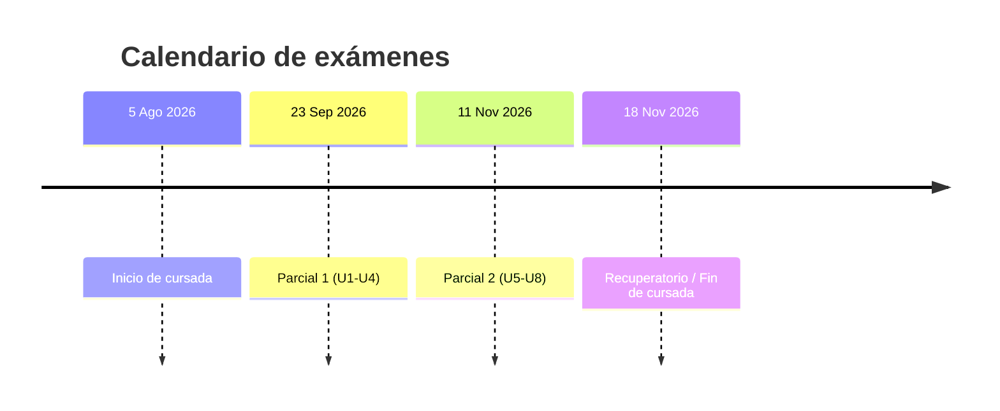
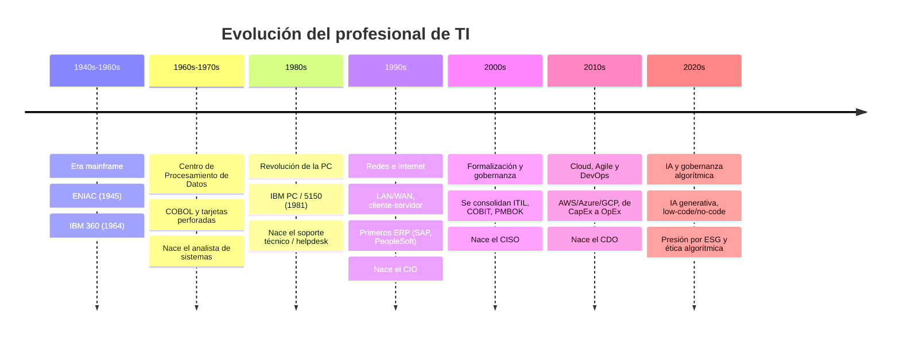
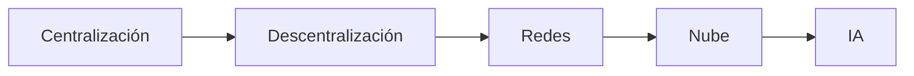
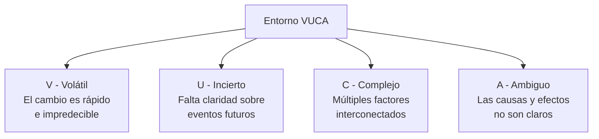

# M1 - El Profesional de TI como Actor Estratégico

## 1. Introducción al módulo

Históricamente, el profesional de Tecnologías de la Información (TI) fue encasillado como un **agente técnico subordinado** a las áreas funcionales de la organización, enfocado en soporte operativo y resolución de incidentes.

La confluencia de tres fenómenos reposicionó radicalmente este rol:
- **Aceleración digital**
- **Disrupción de paradigmas productivos**
- **Tecnologización transversal** de las actividades económicas

Como consecuencia, hoy el profesional de TI se posiciona como un **actor estratégico esencial**, responsable de:
- Generar ventajas competitivas sostenibles.
- Catalizar la innovación organizacional.
- Gestionar riesgos emergentes en ecosistemas digitales.
- Habilitar nuevas arquitecturas de creación de valor.

> La mutación del perfil de TI no responde a una evolución incremental de la infraestructura tecnológica, sino a un **cambio de paradigma** en cómo se construye y sostiene el valor organizacional.

---

## 2. Mapa de la materia: 8 unidades

La materia se organiza en 8 unidades más un cierre. Actualmente estamos en la **Unidad 1**.

```mermaid
flowchart LR
    U1["U1 · Introducción a la Gestión de TI<br/>(ESTAMOS ACÁ)"] --> U2["U2 · Gobierno corporativo<br/>y estándares relacionados"]
    U2 --> U3["U3 · Transformación digital"]
    U3 --> U4["U4 · Gestión de Infraestructura<br/>y Operaciones de TI"]
    U4 --> U5["U5 · Normas y estándares"]
    U5 --> U6["U6 · Gestión de Equipos y<br/>Recursos Humanos en TI"]
    U6 --> U7["U7 · Gestión de Contratos<br/>y Proveedores de TI"]
    U7 --> U8["U8 · Indicadores de Desempeño<br/>y Toma de Decisiones en TI"]
    U8 --> UF["★ El futuro del<br/>profesional de TI"]

    style U1 fill:#f7b733,stroke:#333,stroke-width:2px
```

**Descripción de la imagen original:** el mapa se presenta como una fila horizontal de 8 círculos numerados del 1 al 8, más una estrella final, conectados en secuencia. El círculo 1 está resaltado (naranja) con la leyenda "ESTAMOS ACÁ" indicando la posición actual del curso. Se aclara que se va a volver a este mapa al empezar cada unidad, para ubicar siempre en qué parte del recorrido está la clase.

### El hilo conductor (una frase por unidad)

| Unidad | Relato central |
|---|---|
| U1 | Empieza como técnico y se convierte en estratega |
| U2 | Aprende a gobernar con marcos y a dirigir proyectos |
| U3 | Lidera la transformación digital del negocio |
| U4 | Administra infraestructura con criterio financiero |
| U5 | Garantiza calidad, seguridad y cumplimiento normativo |
| U6 | Lidera personas y equipos de alto desempeño |
| U7 | Gestiona el ecosistema externo de proveedores |
| U8 | Mide, decide y demuestra valor con datos |
| ★ | Cierra mirando hacia dónde va la profesión |

---

## 3. Mecánica de la cursada

- **Duración:** 16 clases, del 5 de agosto al 18 de noviembre.
- **Evaluación:** 2 parciales.
  - Parcial 1 (Unidades 1-4): 23 de septiembre.
  - Parcial 2 (Unidades 5-8): 11 de noviembre.
  - Calificación mínima para aprobar: 4 (60%).
- **Recuperatorio:** 18 de noviembre (uno solo, cubre lo dado en la cursada).
- **Actividades dentro de la cursada:**
  - 2 Trabajos Prácticos.
  - Lectura de papers y presentación en clase.
- **Asistencia:** 75% requerido para aprobar la cursada.
- La evaluación pondera más las **actividades** (análisis, casos, TPs grupales) que la repetición memorística de conceptos.

---

## 4. Evolución histórica del rol de TI en la empresa

La Unidad 1 recorre 7 eras que muestran cómo el rol de TI fue mutando de tarea puramente técnica a función estratégica.

### 4.1. Era mainframe (1940s-1960s)

- **ENIAC (1945):** primera computadora electrónica de propósito general, encargada por el ejército de EE.UU. para calcular tablas de tiro de artillería.
- **IBM 360 (1964):** estandariza la arquitectura mainframe comercial. Computación centralizada y carísima.
- Los operadores y programadores trabajaban en Assembler, **aislados del negocio**.

*Descripción de la imagen:* fotografía histórica en blanco y negro de dos operadoras trabajando sobre el panel de cableado del ENIAC, y otra fotografía de dos hombres de traje junto a un armario de la IBM 360 con cintas magnéticas.

### 4.2. Centro de Procesamiento de Datos (1960s-1970s)

- COBOL y *batch processing* con tarjetas perforadas. Nace el rol del **analista de sistemas**.
- IT es back-office: un área **subordinada a Finanzas**, sin asiento en las decisiones del negocio.

*Descripción de la imagen:* fotografía de una tarjeta perforada (punch card) de la época, usada para el procesamiento por lotes.

### 4.3. Revolución de la PC (1980s)

- **IBM PC / IBM 5150 (agosto de 1981):** la computación se descentraliza, escritorio por escritorio.
- Nace el **soporte técnico / helpdesk** como función propia dentro de las organizaciones.

*Descripción de la imagen:* fotografía de una computadora IBM PC de época, con monitor CRT, teclado y dos disqueteras.

### 4.4. Redes e Internet (1990s)

- LAN/WAN, arquitecturas cliente-servidor e Internet comercial.
- Aparecen los primeros ERP (SAP, PeopleSoft).
- **Nace el CIO** (Chief Information Officer): primera vez que alguien de tecnología se sienta en el comité de dirección.

### 4.5. Formalización y gobernanza (2000s)

- Se consolidan **ITIL, COBIT y PMBOK**. Outsourcing y offshoring masivos.
- **Nace el CISO** (Chief Information Security Officer), responsable de la gestión de la seguridad de la información: protección de datos y gestión de riesgos de ciberseguridad.
- IT empieza a ser **auditada** como cualquier otra función de negocio.

*Descripción de la imagen:* ícono de una laptop siendo examinada con una lupa, simbolizando la auditoría de TI.

### 4.6. Cloud, Agile y DevOps (2010s)

- AWS, Azure y GCP maduran: la infraestructura pasa de **comprarse (CapEx) a alquilarse (OpEx)**.
- Agile/Scrum se vuelve estándar de facto. DevOps rompe la barrera entre desarrollo y operación.
- Aparece el **CDO** (Chief Digital Officer), impulsor de la estrategia digital, la innovación y la analítica avanzada.

### 4.7. IA y gobernanza algorítmica (2020s)

- IA generativa como herramienta de productividad masiva. Low-code / no-code.
- Presión creciente por sostenibilidad (**ESG**) y **ética algorítmica**.

### 4.8. El hilo que conecta todo

**Idea central:** en cada salto tecnológico, el negocio le exigió **menos operación pura y más criterio** al profesional de TI. No es que el técnico "evolucionó" por gusto: cada vez que la tecnología se volvió más accesible y potente, lo que quedó escaso y valioso fue el **juicio humano para gobernarla**. Por eso hoy el profesional de TI es un actor estratégico: no porque cambió de intereses, sino porque la historia de la tecnología lo empujó ahí.

### ¿Qué motoriza este cambio?

1. **Aceleración digital:** la velocidad de adopción tecnológica redefine los tiempos del negocio.
2. **Disrupción de paradigmas productivos:** nuevos modelos de negocio desplazan a los tradicionales.
3. **Tecnologización transversal:** la tecnología atraviesa todas las actividades, no solo el área de sistemas.

---

## 5. De especialista técnico a agente de gobernanza estratégica

| Responsabilidades tradicionales | Nuevos imperativos estratégicos |
|---|---|
| Mantenimiento reactivo de infraestructuras | Orquestar procesos de transformación digital que redefinan los modelos de negocio |
| Desarrollo interno de soluciones informáticas | Gestionar riesgos tecnológicos: ciberseguridad, privacidad de datos y continuidad operativa |
| Administración de bases de datos operativas | Alinear proactivamente la estrategia de TI con los objetivos corporativos |
| | Cocrear valor en red con stakeholders internos y externos mediante la tecnología |
| | Fomentar ecosistemas de innovación abierta y promover una cultura de responsabilidad tecnológica |

La mutación del perfil no es incremental (más infraestructura), sino un **cambio de paradigma** en cómo se construye y sostiene el valor organizacional.

---

## 6. Entornos VUCA

El entorno actual se caracteriza como **VUCA**: Volátil, Incierto, Complejo y Ambiguo.

### Lo que VUCA exige, en concreto

- **Decisiones tecnológicas como vectores críticos:** de sostenibilidad financiera, reputacional y operativa.
- **Negociación avanzada con proveedores:** las alianzas estratégicas exigen evaluación de riesgos integrados.
- **Gestión estratégica del talento en TI:** emerge como un diferenciador competitivo crucial.

> "El profesional de TI no solo opera sistemas: diseña futuros organizacionales posibles."

En este marco, el profesional de TI no solo opera sistemas: **diseña futuros organizacionales posibles**.

---

## 7. Competencias estratégicas del profesional de TI contemporáneo

La praxis del profesional de TI se sustenta en la articulación sinérgica de competencias técnicas, estratégicas y socio-emocionales:

| # | Competencia | Descripción |
|---|---|---|
| 1 | **Visión estratégica de TI** | Interpretación y anticipación de escenarios de negocio |
| 2 | **Capacidad de gestión integral** | Dirección de proyectos complejos, administración de riesgos y optimización de recursos |
| 3 | **Pensamiento crítico adaptativo** | Evaluación sistémica de soluciones y agilidad para la reconceptualización |
| 4 | **Comunicación estratégica** | Mediación entre lenguajes técnicos y narrativas de negocio |
| 5 | **Ética profesional avanzada** | Compromiso con la equidad digital, la privacidad y la sostenibilidad |

---

## 8. Marcos normativos como instrumentos de gobernanza

El dominio y la aplicación crítica de marcos normativos y estándares internacionales es un imperativo metodológico para el profesional de TI. **No son fines en sí mismos**, sino sistemas de mediación entre la intención estratégica y la ejecución táctica.

| Marco | Qué cubre | Cuándo se ve en la materia |
|---|---|---|
| **COBIT 2019** | Gobernanza y gestión de TI alineada al negocio | Clases 3 y 9 |
| **PMBOK 7ª edición + Scrum** | Dirección ágil y predictiva de proyectos | Clases 4 y 5 |
| **ITIL 4** | Gestión de servicios de TI basada en valor co-creado | Clase 10 |
| **ISO/IEC 27001** | Gestión de seguridad de la información | Clase 10 |
| **ISO/IEC 38500** | Directrices para el buen gobierno corporativo de TI | Clase 2 |
| **FinOps** | Optimización financiera en entornos de nube | Clase 7 |

---

## 9. El profesional de TI como vector de transformación organizacional

El profesional de TI debe ser asumido como un agente de transformación organizacional sistémica:

1. **Catalizador** de procesos de transformación digital sostenibles.
2. **Arquitecto** de culturas organizacionales innovadoras.
3. **Promotor** de prácticas éticas y de inclusión digital.
4. **Constructor** de estructuras resilientes ante disrupciones tecnológicas y de mercado.

---

## 10. Síntesis / Conclusión

La evolución del profesional de TI trasciende el dominio técnico y se inscribe en el campo **estratégico, organizacional y ético**. Se espera que estos profesionales actúen como líderes capaces de articular tecnología, negocio y valores humanos en un contexto globalizado, incierto y de innovación disruptiva constante.

La materia se propone formar profesionales de TI dotados de:
- Pensamiento estratégico.
- Competencias de liderazgo.
- Rigor metodológico.
- Sensibilidad ética.

Preparados para asumir posiciones de influencia transformadora en la sociedad del siglo XXI.

---

## 11. Puente a la Clase 2 (12 de agosto)

- **Continúa Unidad 1:** IT Governance — definición, propósito y diferenciación con la gestión de TI. ISO/IEC 38500.
- **Pendiente:** completar la Actividad 1: *"IT Doesn't Matter to CEOs"* (ver resumen separado del paper de Nicholas Carr para el debate).
