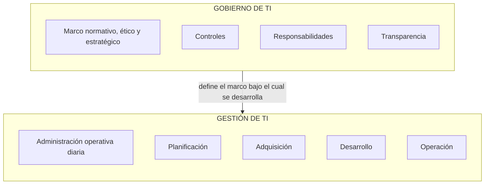
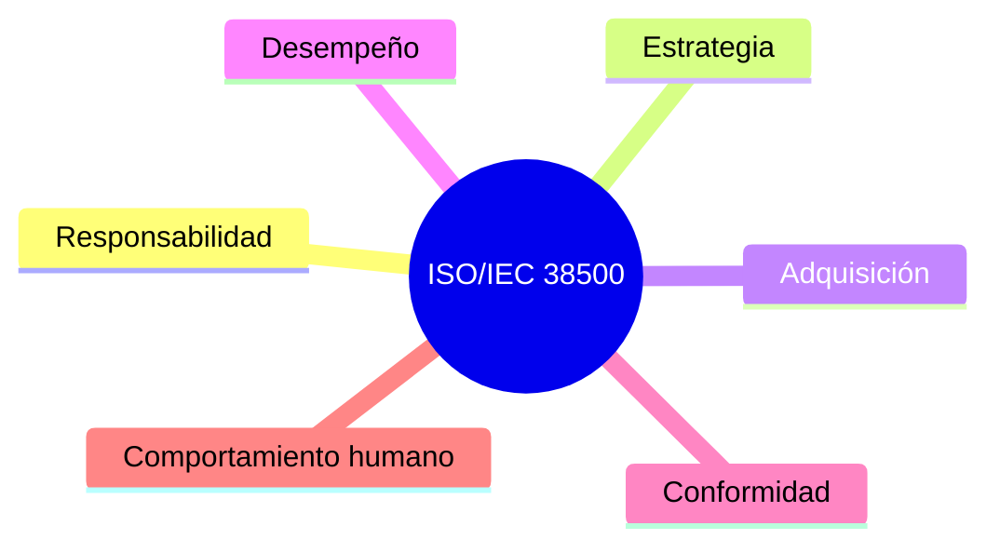
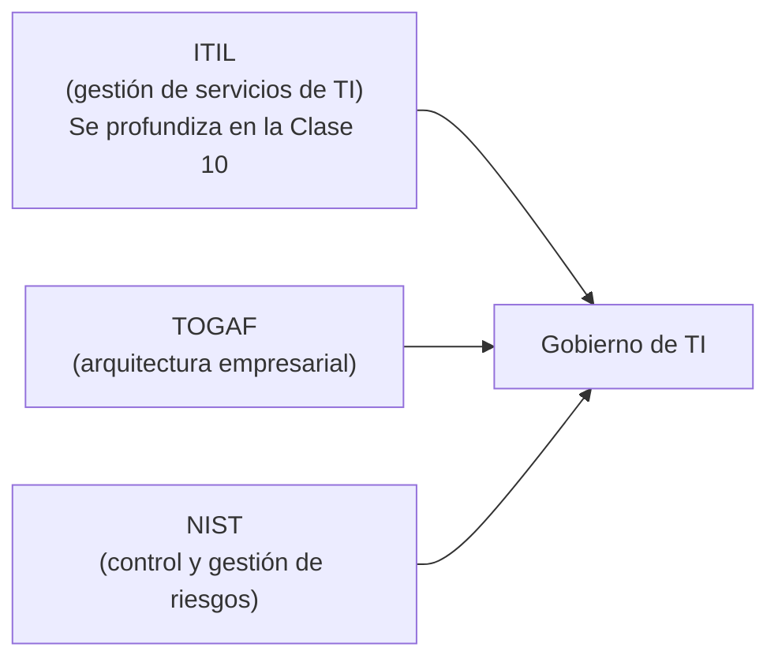
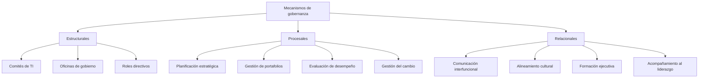
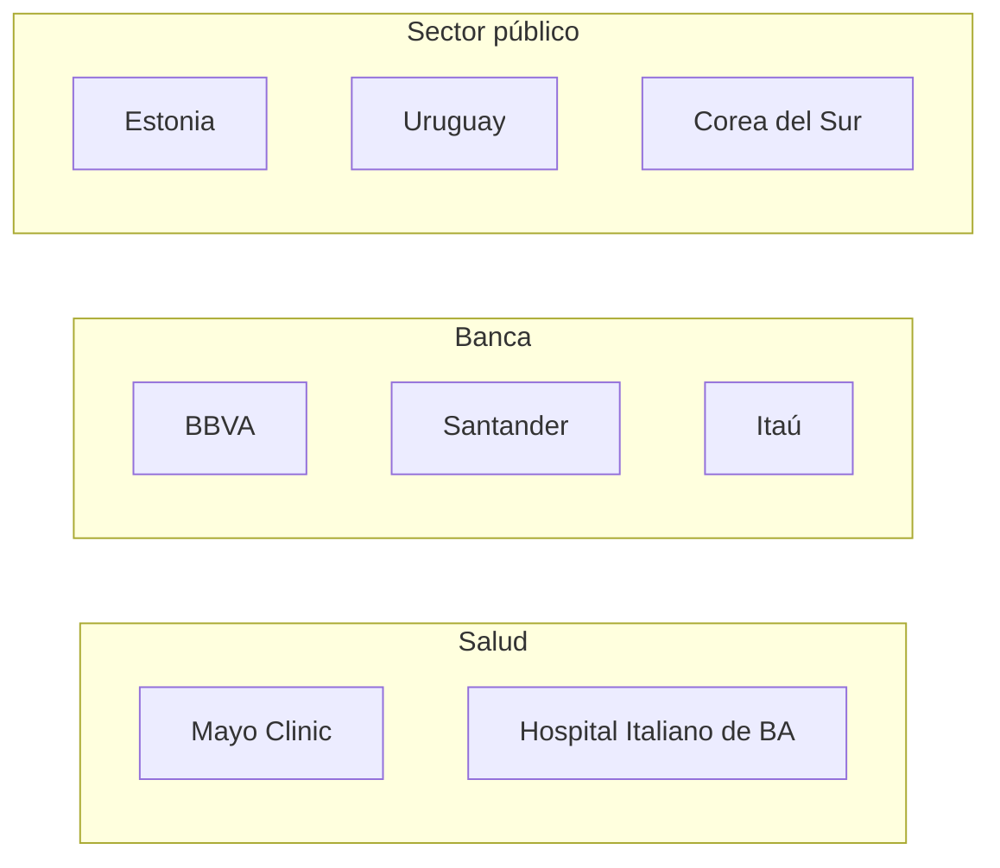

---
tags:
  - materia/profesional-ti
  - modulo/m2
  - tipo/teoria
materia: El Profesional de TI
modulo: M2 - IT Governance
tipo: teoria
fecha_clase: 2026-08-12
descripcion: Gobierno de TI — definicion y proposito dual (valor + riesgo), distincion gobierno vs gestion, marcos internacionales (COBIT 2019, ISO 38500, ITIL, TOGAF, NIST), roles CIO/CISO/CDO, mecanismos estructurales/procesales/relacionales, indicadores, casos sectoriales (salud, banca, sector publico) y desafios futuros.
conceptos_clave:
  - gobierno de TI
  - gestion de TI
  - COBIT 2019
  - ISO 38500
  - ITIL
  - TOGAF
  - NIST
  - CIO
  - CISO
  - CDO
  - mecanismos de gobernanza
  - ESG
relacionados:
  - "[[M1 - Resumen completo]]"
---

**Materia:** El Profesional de TI — Facultad de Ingeniería, Universidad de Palermo
**Clase 2** — 12 de agosto de 2026
**Fuentes:** `M2 - IT Governance.pdf` (slides de clase) + `M2 - Revision Governance.pdf` (documento de repaso, autor Diego Branca, abril 2025)

---

## Mapa de la Unidad 1

Seguimos dentro de la **Unidad 1 — El profesional de TI como actor estratégico** (posición 1 de 8 unidades de la materia). La Clase 2 profundiza específicamente en el bloque de **Gobierno de TI**.

Repaso relámpago de lo visto en la Clase 1 (Módulo 1):

- El profesional de TI es un actor estratégico, no un técnico subordinado.
- Opera en entornos VUCA: volátiles, inciertos, complejos y ambiguos.
- Cinco competencias clave: visión estratégica, gestión integral, pensamiento crítico, comunicación y ética.
- Los marcos normativos (COBIT, PMBOK, ITIL, ISO...) median entre la estrategia y la ejecución.

A partir de acá, la clase entra de lleno en el **Gobierno de Tecnologías de la Información**, presentado como un enfoque estratégico para la creación de valor y la gestión del riesgo organizacional.

---

## 1. Contexto y propósito del documento de repaso

La aceleración digital, la hiperconectividad y la creciente dependencia de las TI como habilitadoras del negocio transformaron radicalmente la naturaleza de la gobernanza organizacional. En este contexto, el gobierno de TI ya no puede entenderse como una función técnica subordinada a las operaciones, sino como una **dimensión estratégica indispensable** para garantizar la alineación entre las capacidades tecnológicas y los objetivos institucionales.

La transformación digital no solo amplió el alcance de la TI: también reformuló los modelos de negocio, reconfiguró los mercados laborales y multiplicó los puntos de contacto entre las organizaciones y sus públicos de interés. Esta interdependencia creciente entre TI y negocio exige nuevos marcos de rendición de cuentas, coordinación, control y liderazgo.

El documento de repaso aborda de forma integral y crítica el concepto de gobierno de TI: su fundamentación teórica, los marcos de referencia internacionales, los mecanismos de implementación, los indicadores de desempeño, los modelos de madurez y los desafíos emergentes, incluyendo casos de estudio en salud, banca y administración pública, y su relación con gestión de riesgos, auditoría, ciberseguridad, innovación, sostenibilidad organizacional y principios ESG (ambientales, sociales y de gobernanza).

---

## 2. ¿Qué es el gobierno de TI?

> "Conjunto de estructuras, procesos y mecanismos relacionales que aseguran que la TI de una organización respalde, habilite y extienda sus estrategias y objetivos institucionales."
> — Weill & Ross, 2004

El gobierno de TI tiene un **propósito doble**:

- **Maximizar valor:** generar el mayor retorno posible de las inversiones en tecnología.
- **Mitigar riesgo:** reducir la exposición a los riesgos asociados al uso de la TI.

Weill y Ross (2004) contribuyeron significativamente a delimitar el concepto, estableciendo que un buen gobierno de TI permite:

- Tomar decisiones efectivas sobre el uso de TI.
- Clarificar **quién** toma las decisiones.
- Clarificar **cómo** se toman esas decisiones.
- Clarificar **cómo se supervisan** sus resultados.

Así, el gobierno de TI configura un marco de **accountability distribuido** que trasciende el área de sistemas para involucrar a toda la organización.

### 2.1 Gobierno de TI ≠ Gestión de TI

Es fundamental distinguir estos dos conceptos:

| | Gestión de TI | Gobierno de TI |
|---|---|---|
| Qué es | Administración operativa diaria | Marco normativo, ético y estratégico |
| Actividades | Planificación, adquisición, desarrollo, operación de la TI | Controles, responsabilidades, transparencia |
| Nivel | Ejecución | Dirección y supervisión |

La analogía con el **gobierno corporativo** es pertinente: se trata de establecer controles, asignar responsabilidades, definir estructuras de poder y asegurar transparencia y resultados — igual que en el directorio de una empresa.

**Descripción del diagrama:** el gobierno de TI se ubica en un nivel superior de dirección: define el marco normativo, ético y estratégico (controles, responsabilidades, transparencia) que enmarca y condiciona a la gestión de TI, la cual se ocupa de la administración operativa cotidiana (planificación, adquisición, desarrollo y operación).

---

## 3. Marcos de referencia internacionales

### 3.1 COBIT 2019 (Control Objectives for Information and Related Technologies)

Desarrollado por **ISACA**. Es uno de los marcos más reconocidos y utilizados a nivel global. Se profundiza en la Clase 3 de la materia. COBIT 2019 promueve una gobernanza adaptativa, orientada a la creación de valor, mediante **cinco principios clave**:

1. Satisfacer las necesidades de los stakeholders
2. Cubrir la organización de extremo a extremo
3. Aplicar un marco único integrado
4. Habilitar un enfoque holístico
5. Separar gobierno de gestión

COBIT define áreas de gobierno y de gestión, cada una con objetivos, prácticas y métricas asociadas. Su enfoque flexible permite adaptar el modelo a organizaciones de distinto tamaño y madurez.

### 3.2 ISO/IEC 38500

Norma internacional que ofrece un **modelo de gobierno corporativo de TI**, aplicable a cualquier organización — actúa como guía para directorios y niveles superiores de toma de decisiones. Se estructura en **seis principios**:

1. Responsabilidad
2. Estrategia
3. Adquisición
4. Desempeño
5. Conformidad
6. Comportamiento humano

Su valor reside en su **aplicabilidad transversal** a organizaciones de cualquier sector y tamaño.

**Descripción del diagrama:** la norma ISO/IEC 38500 se organiza como seis principios de igual jerarquía que en conjunto conforman el modelo de gobierno corporativo de TI: responsabilidad, estrategia, adquisición, desempeño, conformidad y comportamiento humano. No hay una relación de dependencia entre ellos, sino que todos aplican de forma simultánea como dimensiones de evaluación del gobierno.

### 3.3 Marcos complementarios: ITIL, TOGAF, NIST

Estos marcos no gobiernan por sí solos, pero se **integran** con el gobierno de TI para reforzarlo desde distintos ángulos:

**Descripción del diagrama (slide "Marcos complementarios"):** en la presentación se muestran como tres tarjetas horizontales, cada una con el nombre del marco a la izquierda y su descripción a la derecha:

- **ITIL:** esencialmente un marco de gestión de servicios de TI; su integración con el gobierno asegura una provisión de servicios alineada con el negocio. (Se profundiza en la Clase 10.)
- **TOGAF:** ofrece lineamientos de arquitectura empresarial, favoreciendo la coherencia entre procesos, sistemas y datos.
- **NIST:** aporta modelos de control y gestión de riesgos, especialmente relevantes en ciberseguridad y resiliencia operativa.

Aunque ITIL es esencialmente un marco de gestión de servicios de TI, su integración con el gobierno es clave para asegurar una provisión de servicios alineada con las expectativas del negocio.

---

## 4. Estructuras, roles y mecanismos

Un modelo efectivo de gobierno de TI requiere:

- Definir **estructuras organizacionales claras** (comités, juntas directivas, CIO, CISO, CDO).
- Establecer **mecanismos de toma de decisiones** (políticas, SLA, auditorías, tableros de control).
- Fomentar **relaciones colaborativas** entre unidades de negocio y áreas técnicas.

### 4.1 Roles clave

| Rol | Sigla completa | Función |
|---|---|---|
| CIO | Chief Information Officer | Puente entre la estrategia de negocio y la operación tecnológica |
| CISO | Chief Information Security Officer | Responsable de la gestión de la seguridad de la información |
| CDO | Chief Digital Officer | Impulsor de la estrategia digital, la innovación y la analítica avanzada |

### 4.2 Mecanismos de gobernanza

Los mecanismos de gobernanza se clasifican en tres tipos:

**Descripción del diagrama:** la slide presenta tres columnas paralelas bajo el título "Mecanismos de gobernanza":

- **Estructurales:** comités de TI, oficinas de gobierno, roles directivos.
- **Procesales:** planificación estratégica, gestión de portafolios, evaluación de desempeño, gestión del cambio.
- **Relacionales:** comunicación interfuncional, alineamiento cultural, formación ejecutiva, acompañamiento al liderazgo.

---

## 5. Indicadores, medición y evaluación

El éxito del gobierno de TI debe evaluarse mediante **métricas cuantitativas y cualitativas** que midan tanto la efectividad de las decisiones como el impacto estratégico generado.

### 5.1 Ejemplos de indicadores

- ROI y valor percibido de las inversiones en TI
- Nivel de madurez del modelo de gobernanza (utilizando escalas como el COBIT maturity model o CMMI)
- Grado de alineación estratégico-tecnológica (evaluado mediante frameworks como SAM o Luftman)
- Índices de riesgo residual y cumplimiento normativo
- Nivel de satisfacción de los stakeholders internos y externos

### 5.2 Instrumentos de medición

- Balanced Scorecards
- Encuestas de gobernanza
- Heatmaps de riesgo
- Auditorías de madurez

Estos instrumentos son esenciales para la mejora continua y la rendición de cuentas.

---

## 6. Aplicaciones sectoriales y casos de estudio

**Descripción del diagrama (slide "El gobierno de TI en la práctica"):** se muestran tres bloques sectoriales en paralelo, cada uno con ejemplos de organizaciones/países y una breve descripción de cómo aplican el gobierno de TI.

### 6.1 Sector salud

En instituciones como hospitales y laboratorios, el gobierno de TI permite equilibrar la innovación (historia clínica electrónica, inteligencia artificial diagnóstica, interoperabilidad) con la protección de datos sensibles y la continuidad operativa. Casos como el de **Mayo Clinic** o el **Hospital Italiano de Buenos Aires** evidencian cómo un gobierno robusto puede facilitar tanto la innovación como la seguridad del paciente.

### 6.2 Sector bancario

Bancos como **BBVA**, **Santander** o **Itaú** integraron modelos de gobierno de TI con prácticas de ciberseguridad, transformación digital y cumplimiento regulatorio (Basilea III, GDPR, normativas locales), utilizando tableros de control, estructuras ágiles de toma de decisiones y marcos híbridos de gobernanza.

### 6.3 Sector público

Gobiernos como el de **Estonia**, **Uruguay** o **Corea del Sur** desarrollaron agencias de gobierno digital que aplican modelos de IT governance para asegurar transparencia, interoperabilidad y eficiencia en la provisión de servicios públicos. La adopción de estrategias nacionales de datos, identidad digital y ciudadanía electrónica son ejemplos de cómo el gobierno de TI puede transformar la relación Estado-ciudadano.

---

## 7. Desafíos contemporáneos y futuro del gobierno de TI

### 7.1 Desafíos actuales

- Creciente exposición a ciberamenazas y ataques de ransomware
- Disrupción tecnológica constante (IA generativa, blockchain, edge computing, quantum computing)
- Presiones regulatorias más complejas y dinámicas
- Expectativas de mayor agilidad, personalización e innovación

### 7.2 El gobierno de TI del futuro deberá...

- Ser dinámico, iterativo y basado en evidencia
- Integrarse con marcos ESG y objetivos de desarrollo sostenible (ODS)
- Incorporar inteligencia artificial para la toma de decisiones y la automatización de controles
- Centrar su acción en la experiencia del usuario, la equidad digital y la ética del diseño

> "La gobernanza de TI ya no es una opción: es una condición para la viabilidad y legitimidad de las organizaciones del siglo XXI."

---

## 8. Conclusión

El gobierno de TI es un componente **estratégico, transversal y evolutivo** de la gobernanza organizacional en la era digital. Su correcta implementación permite transformar la tecnología en un activo diferenciador, minimizar los riesgos tecnológicos y garantizar que cada decisión técnica contribuya de manera verificable al logro de los objetivos organizacionales.

El desafío no es únicamente técnico: es profundamente **humano, cultural, político y ético**. Requiere liderazgo distribuido, visión sistémica, capacidad de adaptación, y sensibilidad para equilibrar eficiencia con impacto social.

Formar profesionales con competencia en gobierno de TI es formar líderes capaces de traducir complejidad tecnológica en decisiones responsables, sostenibles y transformadoras.

**Síntesis de la clase:** el gobierno de TI conecta la estrategia con la ejecución. No es una función técnica subordinada: es la dimensión estratégica que asegura que la tecnología respalde los objetivos institucionales, distribuyendo responsabilidades y decisiones más allá del área de sistemas.

---

## 9. Puente a la próxima clase

**Próxima clase — 19 de agosto:** Unidad 1 (cierre): **COBIT 2019 en profundidad** — estructura, dominios EDM/APO/BAI/DSS/MEA, implementación y casos.

---

## 10. Referencias bibliográficas (del documento de repaso)

- Weill, P., & Ross, J. W. (2004). *IT Governance: How Top Performers Manage IT Decision Rights for Superior Results.* Harvard Business School Press.
- ISACA. (2019). *COBIT 2019 Framework: Governance and Management Objectives.* ISACA.
- ISO/IEC. (2015). *ISO/IEC 38500:2015 - Governance of IT for the Organization.* International Organization for Standardization.
- ITIL Foundation. (2020). *ITIL 4 Edition.* AXELOS Global Best Practice.
- Peterson, R. (2004). *Crafting Information Technology Governance.* Information Systems Management, 21(4), 7–22.
- Luftman, J., et al. (2004). *Assessing Business-IT Alignment Maturity.* Communications of the Association for Information Systems.
- NIST. (2018). *Framework for Improving Critical Infrastructure Cybersecurity.* National Institute of Standards and Technology.
- OECD. (2021). *Digital Government Index.* OECD Public Governance Reviews.
- World Bank. (2023). *GovTech Maturity Index Report.*