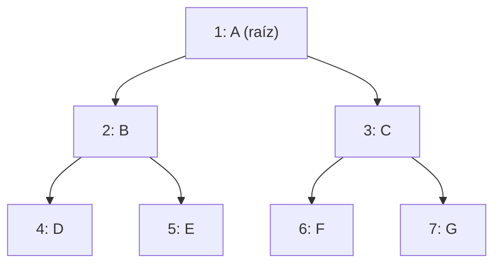
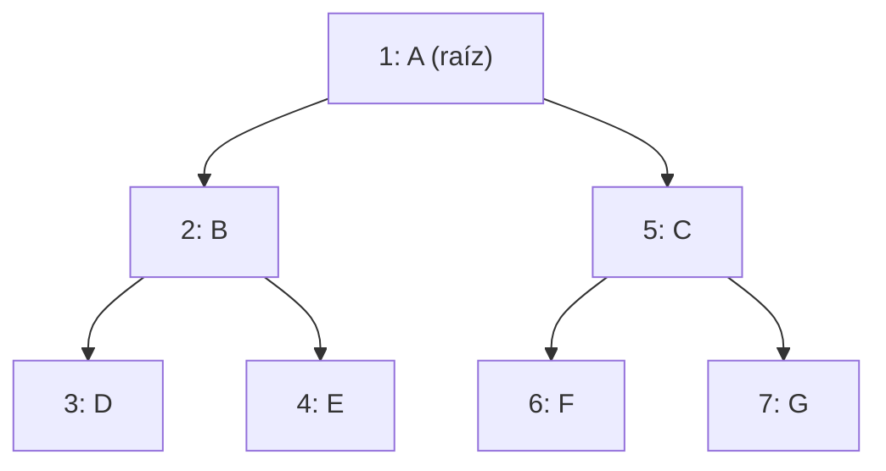
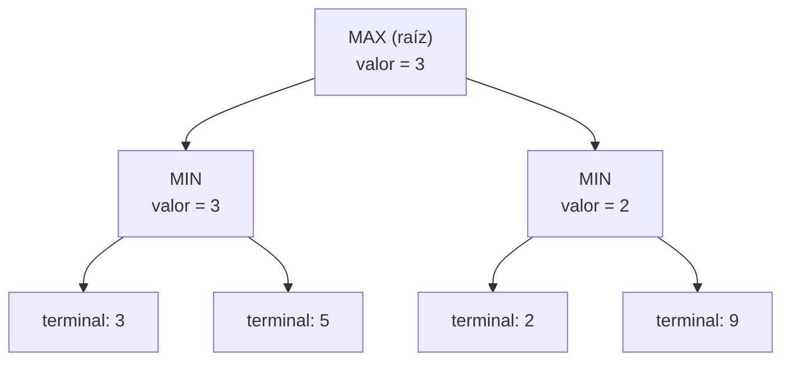

---
tags:
  - materia/inteligencia-artificial
  - modulo/m3
  - tipo/teoria
materia: Inteligencia Artificial
modulo: M3 - Busqueda y Planificacion
tipo: teoria
fuente: "Russell, S. J. (2009). Inteligencia artificial: un enfoque moderno (3ª ed.)"
descripcion: Algoritmos de busqueda y planificacion — clasificacion en completas/no informadas (BFS, DFS) e informadas/heuristicas (A*), formula F=G+H y listas abierta/cerrada de A*, algoritmo Minimax para juegos adversariales de suma nula, y cuadro comparativo entre los cuatro algoritmos.
conceptos_clave:
  - busqueda no informada
  - busqueda informada
  - BFS
  - DFS
  - algoritmo A*
  - heuristica
  - listas abierta y cerrada
  - minimax
  - juegos de suma nula
relacionados:
  - "[[M2 - Agentes]]"
  - "[[M1 - Intro a la IA]]"
---
# Módulo 3 - Búsqueda y Planificación

> [!info] Idea central
> Un agente basado en objetivos (visto en el Módulo 2) necesita un mecanismo concreto para decidir **qué secuencia de acciones** lo lleva del estado actual al estado meta. Ese mecanismo es la búsqueda. Este módulo cubre cómo resolver ese problema, primero sin conocimiento del dominio (búsquedas no informadas) y después usando heurísticas (búsquedas informadas) y árboles de decisión adversariales (Minimax).

## 1. Clasificación de los algoritmos de búsqueda

La búsqueda es el conjunto de acciones orientadas a encontrar la o las soluciones posibles a un problema. Se divide en dos grandes grupos:

| Tipo | Características | Costo |
|---|---|---|
| **Completas / No informadas** | Garantizan encontrar el objetivo si existe una solución. No usan información adicional más allá de la definición del problema (solo distinguen estado objetivo de no-objetivo) | Complejidad exponencial, computacionalmente costosas |
| **Incompletas / Heurísticas** | Se apoyan en conocimiento intuitivo o formal sobre el problema (heurística) para guiar la exploración | Ahorro computacional considerable, pero sin garantía absoluta de optimalidad |

> [!tip] Conexión con Módulo 2
> Esta clasificación es la contracara algorítmica de los **agentes basados en objetivos y en utilidad**: la búsqueda no informada es el equivalente a un agente que explora sin preferencias entre caminos igual de válidos, mientras que la búsqueda heurística ya incorpora una función de evaluación, un antecedente directo del razonamiento de un agente utilitario.

---

## 2. Búsquedas completas / no informadas

### 2.1 Búsqueda en amplitud (BFS - Breadth First Search)

Recorre el grafo nivel por nivel: explora primero todos los vecinos del nodo raíz, luego los vecinos de esos vecinos, y así sucesivamente hasta recorrer todo el árbol.

- Es un algoritmo **sin información** (no usa heurística).
- Expande y examina sistemáticamente todos los nodos.
- Calcula la distancia mínima (en cantidad de vértices) desde el nodo fuente `s` a cada vértice alcanzable, y produce un árbol con raíz en `s`.
- El camino resultante es el más corto medido en número de vértices (no necesariamente en costo).
- Se llama "en amplitud" porque expande uniformemente la frontera entre lo descubierto y lo no descubierto: llega a los nodos a distancia *k* solo después de haber llegado a todos los de distancia *k-1*.
- Si el grafo tiene aristas con pesos negativos, no es aplicable directamente y corresponde usar **Bellman-Ford**.

> [!example] Estructura del pseudocódigo
> BFS usa una **cola (Q)**: se inicializan todos los vértices como NO_VISITADO con distancia infinita, se encola el nodo fuente con distancia 0, y en cada iteración se extrae un nodo, se marcan y encolan sus vecinos no visitados, actualizando su distancia y su padre.

**Ejemplo de recorrido (orden de visita numerado):**

Notar que se visitan primero todos los hijos directos de A (nivel 1) antes de bajar al nivel 2 — esa es la "amplitud" del recorrido.

### 2.2 Búsqueda en profundidad (DFS - Depth First Search)

Recorre el grafo siguiendo un camino hasta el final antes de retroceder (backtracking) y probar con otra rama.

- Explora de forma ordenada pero **no uniforme** (a diferencia de BFS).
- Se expande recursivamente por un camino concreto; cuando no quedan más nodos por visitar en ese camino, retrocede y repite el proceso con los "hermanos" del nodo procesado.
- El pseudocódigo típico usa marcas de tiempo de descubrimiento (`d[u]`) y finalización (`f[u]`) para cada nodo, además de listas de estado (NO_VISITADO / VISITADO / TERMINADO) y padre.

**Ejemplo de recorrido sobre el mismo árbol (orden de visita numerado):**

Acá se baja lo más posible por una rama (A → B → D) antes de retroceder (backtracking) y recién después probar la otra rama de B, y luego la otra rama de A. Comparado con el ejemplo de BFS de arriba, es el mismo árbol pero con un orden de visita completamente distinto — esa diferencia es la que conviene tener presente para responder preguntas de "¿qué nodo se visita en la posición N?".

> [!important] BFS vs. DFS
> BFS es preferible cuando interesa el camino más corto en número de pasos y el espacio de estados es "ancho pero poco profundo". DFS es más económico en memoria y conviene cuando el espacio es profundo y se sospecha que la solución no está cerca de la raíz, aunque no garantiza el camino más corto.

---

## 3. Búsqueda informada: algoritmo A*

Presentado en 1968 por Peter E. Hart, Nils J. Nilsson y Bertram Raphael. Encuentra el camino de menor costo entre un nodo origen y uno objetivo, siempre que se cumplan ciertas condiciones sobre la heurística.

### 3.1 Idea general

El área de búsqueda se simplifica dividiéndola en una rejilla (matriz bidimensional), donde cada celda es transitable o intransitable. El punto central de cada celda se llama **nodo**. El camino se arma moviéndose de nodo en nodo desde el inicio (A) hasta el destino (B).

### 3.2 La ecuación de puntuación

$$F = G + H$$

- **G**: costo real de movimiento desde el nodo inicial hasta el nodo actual, siguiendo el camino ya generado.
- **H (heurística)**: costo estimado (no exacto) desde el nodo actual hasta el destino. Es una suposición porque ignora los obstáculos reales del camino.
- **F**: estimación total del costo del camino que pasa por ese nodo. Es el criterio para elegir qué nodo explorar a continuación.

> [!note] Costos de movimiento habituales
> Movimiento ortogonal (horizontal/vertical): costo 10. Movimiento diagonal: costo 14 (aproximación entera de $10\sqrt{2} \approx 14{,}14$). Se usan enteros por eficiencia computacional.

**Cálculo de G:** costo G del padre + 10 (ortogonal) o + 14 (diagonal).

**Cálculo de H (método Manhattan):** cantidad de celdas movidas en horizontal + vertical hasta el destino, ignorando obstáculos, multiplicado por 10. Existen otros métodos de heurística además del Manhattan.

### 3.3 Ejemplo de grilla trabajada

Fila del medio de una grilla simple, con **A** como inicio, un tramo de **muro** intransitable, y **B** como destino. Cada celda muestra `F / G / H`:

|                | Col 1          | Col 2 (muro) | Col 3        | Col 4           |
| -------------- | -------------- | ------------ | ------------ | --------------- |
| **Fila sup.**  | 54 / 14 / 40   | ▓▓▓          | —            | —               |
| **Fila media** | **A (inicio)** | ▓▓▓          | 40 / 10 / 30 | —               |
| **Fila inf.**  | 54 / 14 / 40   | ▓▓▓          | —            | **B (destino)** |

- La celda a la derecha de A tiene `G=10` (movimiento ortogonal) y `H=30` (distancia Manhattan ignorando el muro), por lo tanto `F=40` — es la de menor F, así que es la primera en salir de la lista abierta.
- Las celdas diagonales a A tienen `G=14` en vez de 10.
- A medida que el algoritmo avanza, va rodeando el muro: el camino final no es la línea recta A→B (bloqueada), sino el que minimiza F esquivando el obstáculo.

> [!tip] Cómo practicar esto en Obsidian
> Si querés ejercitar el cálculo a mano, podés copiar esta tabla, cambiar el tamaño de la grilla y la posición del muro, y recalcular F/G/H celda por celda siguiendo el algoritmo de la sección 3.4.

### 3.4 Listas abierta y cerrada

- **Lista abierta**: nodos candidatos, pendientes de evaluar.
- **Lista cerrada**: nodos ya evaluados, que no necesitan revisarse de nuevo.

### 3.5 Algoritmo paso a paso

1. Agregar el nodo inicial a la lista abierta.
2. Repetir:
   a. Tomar de la lista abierta el nodo con **F más bajo** → nodo actual.
   b. Moverlo a la lista cerrada.
   c. Para cada uno de sus 8 vecinos:
      - Si es intransitable o ya está en la lista cerrada → ignorar.
      - Si no está en la lista abierta → agregarlo, fijar el nodo actual como padre, calcular F, G, H.
      - Si ya está en la lista abierta → comparar el G por el camino actual contra el que ya tenía. Si el nuevo G es menor, actualizar padre, G y F.
   d. Terminar cuando el nodo objetivo entra a la lista abierta (camino encontrado) o cuando la lista abierta se vacía sin haberlo alcanzado (no hay camino).
3. Reconstruir el camino recorriendo los punteros de padre desde el objetivo hasta el inicio.

> [!warning] Qué NO es A*
> Un algoritmo solo puede llamarse A* si implementa listas abierta/cerrada y puntuación F = G + H. Otros métodos de pathfinding existen y a veces son mejores en casos puntuales, pero no son A*.

### 3.6 Consideraciones prácticas de implementación

- **Mantenimiento de la lista abierta**: recorrerla linealmente es simple pero lento; mantenerla ordenada mejora el rendimiento; la opción más eficiente es un **heap binario** (2-3 veces más rápido en general, más de 10 veces en caminos largos).
- **Otras entidades en el mapa**: conviene no incluir unidades móviles dentro del cálculo del camino base, sino resolver colisiones con lógica aparte, ya que esas entidades pueden haberse movido para cuando el personaje llega a esa posición.
- **Costo de terreno variable**: si hay celdas transitables pero más costosas (pantanos, escaleras), se suma ese costo extra al calcular G. Esto permite además crear "mapas de influencia" que penalicen zonas peligrosas.
- **Áreas inexploradas**: se puede mantener una matriz de "transitabilidad conocida" por jugador, asumiendo transitable lo no explorado hasta comprobar lo contrario.
- **Suavizado de caminos**: A* da el camino más corto pero no necesariamente el más "prolijo" visualmente; se puede penalizar el cambio de dirección o repasar el camino final.
- **Áreas no basadas en cuadrícula**: el mismo esquema se puede aplicar a grafos irregulares (países en un mapa tipo Risk, sistemas de waypoints), reemplazando la adyacencia de celdas por una tabla de adyacencia explícita.
- **Optimización de rendimiento general**: mapas/celdas más grandes, colas de búsqueda por ciclos de juego en vez de simultáneas, preprocesamiento de zonas inaccesibles ("islas"), sistemas jerárquicos (búsqueda gruesa + fina).

---

## 4. Minimax (juegos con adversario)

Método de decisión de teoría de juegos para **minimizar la pérdida máxima esperada** en juegos con adversario e información perfecta. Es un algoritmo recursivo.

> [!quote] Idea base
> Elegir el mejor movimiento propio asumiendo que el oponente siempre va a elegir el peor movimiento posible para uno.

### 4.1 Origen teórico

Formulado por John von Neumann (Teoría Minimax, 1926). Para juegos bipersonales de suma nula con información perfecta de la estrategia del rival, existe una estrategia que permite a ambos jugadores minimizar su pérdida máxima. Es óptima para ambos solo si sus minimax son iguales en valor absoluto y de signo contrario; si ese valor común es cero, el juego resulta indiferente (sinsentido).

### 4.2 Algoritmo paso a paso

1. **Generar el árbol de juego** completo hasta los estados terminales.
2. **Calcular la función de utilidad** en cada nodo terminal.
3. **Propagar valores hacia arriba**: en cada nivel se alterna entre tomar el valor mínimo (turno del oponente) y el máximo (turno propio), de ahí el nombre Minimax.
4. **Elegir la jugada** según el valor que llegó a la raíz.

| Juego | Rango de valores de utilidad |
|---|---|
| Ajedrez | +1 (ganar), 0 (empate), -1 (perder) |
| Backgammon | [-192, +192] según valor de fichas |

**Ejemplo de propagación de valores (árbol de profundidad 2, dos jugadores):**

Lectura del ejemplo: en el nivel MIN, el oponente elige el valor más bajo de sus hijos (N1 toma 3 en vez de 5; N2 toma 2 en vez de 9). En el nivel MAX, el jugador propio elige el mayor de esos mínimos (3 sobre 2). Por eso la raíz vale 3: es el resultado de "maximizar la ganancia mínima garantizada" frente a un rival que juega óptimo.

> [!tip] Ejemplo de aplicación
> Frente al dilema del prisionero, Minimax elige siempre la opción que maximiza el resultado propio asumiendo que el rival intentará minimizarlo — coherente con la definición de agente racional utilitario del Módulo 2, pero en un entorno **multiagente y adversarial** en vez de cooperativo o neutro.

---

## 5. Cuadro comparativo de los algoritmos vistos

| Algoritmo | Tipo | Informado | Garantiza óptimo | Uso típico |
|---|---|---|---|---|
| BFS | No informado | No | Sí (en número de pasos) | Grafos poco profundos, camino mínimo en aristas |
| DFS | No informado | No | No | Espacios profundos, bajo uso de memoria |
| A* | Informado | Sí (heurística H) | Sí, si H es admisible | Pathfinding, rutas óptimas en costo |
| Minimax | Adversarial | No (heurística opcional en variantes con poda) | Óptimo bajo juego racional del rival | Juegos de suma cero, dos jugadores |

---

## 6. Conexiones con el resto del curso

- **Módulo 1**: la búsqueda formaliza en algoritmos concretos la noción de espacio de estados, operadores y tipos de solución ya introducida al definir qué es un "problema".
- **Módulo 2**: BFS/DFS/A* son las herramientas internas que un agente basado en objetivos o en utilidad usaría para decidir su secuencia de acciones; Minimax extiende esa lógica a agentes que interactúan con un adversario racional, no solo con un entorno pasivo.
- **Trabajo de ética (Módulo 1)**: la elección de heurística en A* o de función de utilidad en Minimax no es neutral — el diseño de esa función es una decisión de diseño con consecuencias, en línea con el argumento de que la ética debe ser parte constitutiva del desarrollo de sistemas de IA.

---

## Bibliografía

- Russell, S. J. (2009). *Inteligencia artificial: un enfoque moderno* (3ª ed.). México: Prentice Hall Hispanoamericana.

---
*Nota generada a partir del material del Módulo 3 (Universidad de Palermo) — organizada y resumida para estudio personal.*