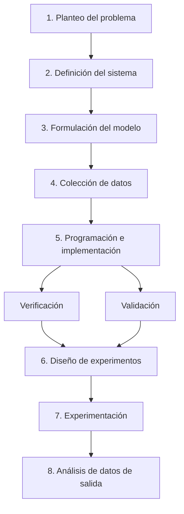

---

tags: [simulacion, modulo1, UP, sistemas-modelos-simulacion] curso: Simulación modulo: "1" fuentes:

- "M1 Introducción a la Simulación.pdf"
- "M1 Presentación.pdf"
- "M1 Crónica Apolo 13.pdf"

---

> [!info] Sobre este apunte Compilado a partir de los tres documentos del Módulo 1: el texto teórico completo, la presentación de clase (slides) y la crónica del Apolo 13 (caso de aplicación real). Pensado para repasar en Obsidian con enlaces `[[ ]]` entre conceptos.

## Mapa del módulo

- [[#1. Los tres conceptos fundamentales: Sistema – Modelo – Simulación]]
- [[#2. Sistemas — definiciones y componentes]]
- [[#3. Variables, parámetros y estados de un sistema]]
- [[#4. Ejemplo aplicado — Sistema de filas o colas]]
- [[#5. Clasificación de sistemas y modelos]]
- [[#6. El arte de modelar]]
- [[#7. Usos y aplicaciones de la simulación]]
- [[#8. Etapas de una simulación]]
- [[#9. ¿Cuándo conviene aplicar simulación?]]
- [[#10. Ventajas y desventajas de la simulación]]
- [[#11. Antecedentes históricos]]
- [[#12. Caso de estudio — Apolo 13 y el primer Gemelo Digital]]
- [[#Repaso rápido (preguntas y respuestas)]]

---

## 1. Los tres conceptos fundamentales: Sistema – Modelo – Simulación

En la vida cotidiana tomamos decisiones sobre sistemas (una empresa, una ciudad, un equipo de trabajo). Experimentar directamente sobre el **sistema real** trae costos y riesgos de seguridad, por lo que se lo reemplaza por una versión simplificada: el **modelo**. Al proceso de ensayar alternativas sobre ese modelo se lo llama **simulación**.

> [!abstract] Definiciones clave
> 
> - **Sistema**: conjunto de objetos o ideas interrelacionados como una unidad, orientados a un objetivo. Es la porción del universo que se analiza.
> - **Modelo**: representación simplificada del sistema; resume solo los elementos y variables más importantes. Un mismo sistema puede tener varios modelos distintos según el objetivo de estudio.
> - **Simulación**: experimentación sobre el modelo, para aprender el comportamiento del sistema real o evaluar estrategias alternativas de funcionamiento.

La **estrategia de la simulación** es el conjunto de alternativas definidas para ensayar.

### Diagrama funcional (de la presentación)

```
Sistema:  Entrada → Correspondencia → Salida   (+ Parámetros, + Interferencia)
Modelo:   Entrada → Correspondencia → Salida   (+ Parámetros)
```

El modelo debe guardar **correspondencia** con el sistema real para que sus entradas/salidas sean representativas.

---

## 2. Sistemas — definiciones y componentes

- **Sistema**: totalidad arbitraria de variables que el investigador elige, dentro de un conjunto mayor de variables que pertenecen al sistema real. Es la reunión de componentes con propiedades identificables entre los que se perciben relaciones. Su exterior es el **contorno**.
- **Subsistema**: conjunto que se aísla dentro del sistema y puede tratarse de forma conjunta o independiente.
- **Entidades**: componentes del sistema (ej.: motor, ruedas, carrocería de un auto).
- **Atributos**: propiedades de las entidades (ej.: potencia del motor, tamaño de las ruedas).

### Relaciones entre componentes

|Tipo|Descripción|Ejemplo|
|---|---|---|
|Estáticas / estructurales|No cambian|"Un auto posee 4 ruedas"|
|Dinámicas / funcionales|Cambian con la operación|"Un auto consume nafta si se enciende el motor"|

> [!tip] El comportamiento del sistema depende de:
> 
> 1. El comportamiento de cada subsistema.
> 2. Las relaciones entre los subsistemas.
> 3. Las relaciones con el mundo exterior (medioambiente).
> 
> Estas relaciones constituyen la **estructura del sistema**.

---

## 3. Variables, parámetros y estados de un sistema

Los atributos también se llaman **variables** o **parámetros**.

- **Parámetro (P)**: atributo fijado en un valor constante durante el diseño (ej.: cilindrada del motor, gravedad).
- **Variables de entrada**:
    - **Manipulables (U)**: se fijan a voluntad (ej.: posición del acelerador).
    - **No manipulables (D)**: fijadas por el entorno; si es una entrada no manipulable, se llama **perturbación** (ej.: velocidad del viento).
- **Variables de salida (Y)**: medidas de desempeño, resultado esperado de la experimentación.

### Estado del sistema

Es el conjunto de valores que toman los atributos en un momento dado.

- **Estático (estacionario / de régimen)**: constante en el tiempo.
- **Dinámico**: evoluciona en el tiempo.
- Generalmente un sistema arranca en estado dinámico y luego alcanza el **régimen**.

### Estabilidad

- **Estado estacionario estable**: el sistema vuelve a él tras una perturbación (ej.: péndulo en reposo).
- **Estado estacionario inestable**: el sistema se aleja tras la perturbación (ej.: péndulo invertido).
    - Respuesta **acumulativa**: crece/decrece continuamente o llega a otro estado estacionario.
    - Respuesta **oscilatoria**: crece y decrece cíclicamente (sin fricción) o se amortigua (con fricción).

---

## 4. Ejemplo aplicado — Sistema de filas o colas

Clientes llegan para ser atendidos por uno o varios servidores; si están ocupados, se forma una cola (ej.: cajero, técnico de reparaciones, central telefónica).

> [!important] Condición de estabilidad Para que la cola no crezca indefinidamente, la velocidad media de arribo **λ** debe ser **menor o igual** a la velocidad media de atención **μ**: $$ \lambda \leq \mu $$

**Componentes del sistema de colas:**

- Población de clientes (infinita o finita)
- Naturaleza de los arribos
- Naturaleza del servicio
- Capacidad del sistema
- Disciplina de la fila

**Clasificación de variables en este ejemplo:**

- **Parámetros (P)**: tamaño de la fila disponible, cantidad de servidores.
- **Variables de entrada (X)**: velocidad de atención de los servidores, velocidad de llegada de clientes (generadas desde distribuciones aleatorias).
- **Variables de salida (Y)** — índices de desempeño típicos:
    - Longitud de cola
    - Tiempo de espera en cola
    - Tiempo total en el sistema
    - Utilización del servidor

> [!note] La clasificación de un atributo (parámetro / entrada / salida) depende siempre del **objetivo** con el que se diseña el sistema.

---

## 5. Clasificación de sistemas y modelos

|Categoría|Tipo|Definición|Ejemplo|
|---|---|---|---|
|Aleatoriedad|**Determinístico**|Sin elementos aleatorios; salidas totalmente definidas por entradas y parámetros|Máquina de coser|
||**Estocástico**|Contiene elementos aleatorios; mismos inputs no garantizan mismo output|Tragamonedas|
|Continuidad temporal|**Continuo**|El estado evolúa en infinitos puntos del tiempo|Temperatura de un termotanque|
||**Discreto**|El estado cambia en un conjunto finito de instantes (**eventos**)|Interruptor eléctrico|
|Variación temporal|**Dinámico**|El estado varía con el tiempo|Sistema circulatorio, motor funcionando|
||**Estático / estacionario**|El estado no cambia en el tiempo (relativo al período de análisis)|Una piedra, un recipiente sin flujo|
|Naturaleza de la representación|**Físico**|Representación tangible, a escala o análoga|Maquetas, prototipos, túneles de viento|
||**Matemático / Analítico / Numérico**|Representación abstracta (fórmulas, ecuaciones diferenciales)|Modelos teóricos lineales o no lineales|

> [!example] Sistema y modelo pueden no ser del mismo tipo
> 
> - Un sistema **continuo** (flujo de un fluido) puede representarse con un modelo **discreto** (gotas de agua).
> - El **método de Montecarlo** aproxima el área bajo una curva (problema determinístico) usando un modelo **probabilístico**: `área ≈ n / N` (n = puntos dentro del área, N = puntos totales).

---

## 6. El arte de modelar

Habilidad clave: analizar el problema, resumir características esenciales, definir supuestos básicos y luego enriquecer el modelo progresivamente.

### Pasos sugeridos

1. Definir con claridad el **objetivo** del sistema.
2. Analizar el sistema real: cómo funciona y qué variables predominan.
3. Dividir el problema en **problemas simples** (modularizar).
4. Buscar **analogías** con sistemas ya estudiados.
5. Tomar un **ejemplo numérico** concreto como caso testigo.
6. Determinar las **variables de interés**.
7. Escribir las **ecuaciones** teóricas o empíricas que las relacionan.
8. Si el modelo es manejable → **enriquecerlo**; si no → **simplificarlo**.

### Simplificar un modelo implica:

- Convertir variables en constantes
- Eliminar o combinar variables
- Suponer linealidad
- Agregar supuestos más fuertes / restricciones
- Restringir los límites del sistema

> [!quote] Regla de oro "El mejor modelo es el más simple que puede resolver el problema con el grado de exactitud requerido." Se debe evitar tanto la **sobresimplificación** (invalida el modelo) como la **sobreespecificación** (dificulta construirlo).

Existen dos enfoques para comprender el sistema a modelar:

- **Flujo físico**: basado en el flujo de entidades a través del sistema, con puntos de procesamiento y reglas de decisión.
- **Eventos (cambio de estados)**: basado en variables de estado internas y la descripción de la operación cuando ocurre un evento.

---

## 7. Usos y aplicaciones de la simulación

|Área|Aplicación|
|---|---|
|**Manufactura**|Detectar cuellos de botella, distribuir recursos, dimensionar estaciones de trabajo|
|**Sistemas públicos**|Predecir demanda de energía, clima, propagación de enfermedades|
|**Transporte**|Zonas de congestión, riesgo de accidentes, demanda horaria|
|**Construcción**|Efecto de vientos/sismos, iluminación, condiciones ambientales|
|**Diseño**|Selección de materiales y formas, sensibilidad a parámetros no controlables|
|**Educación**|Comprimir/expandir tiempo, medir variables no observables en la realidad|
|**Capacitación**|Aprendizaje por prueba y error sin riesgo (ej. "juego de empresas", tropas en Tormenta del Desierto, pilotos)|
|**Estrategias de guerra**|Ensayo de operaciones militares, comparación de estrategias|
|**Colas / filas**|Llegada en grupo, rechazo por cola larga, etc.|
|**Inventarios**|Variables estocásticas: tiempo de entrega, demanda, costo de inventario|
|**Proyectos de inversión**|Incertidumbre en flujos de efectivo, tasas de interés, inflación|
|**Sistemas económicos**|Evaluar devaluación, cambios impositivos sobre PBI, balanza comercial, etc.|

---

## 8. Etapas de una simulación



1. **Planteo del problema**: identificar el problema, definir objetivos, resultados esperados, plan de experimentación, tiempo disponible, variables de interés, tratamiento estadístico.
2. **Definición del sistema**: acordar límites del sistema y las interacciones con el medioambiente a considerar.
3. **Formulación del modelo**: partir de un modelo simple e iterar. Evitar sobresimplificación y sobreespecificación.
4. **Colección de datos**: registros históricos, laboratorio o mediciones reales. Definir funciones de distribución para variables estocásticas; elegir tamaño de muestra válido.
5. **Programación e implementación**:
    - **Verificación**: ¿el modelo está correctamente implementado? (consistencia interna, depuración).
    - **Validación**: ¿el modelo es fiel a la realidad? (comparación con datos históricos/reales).
6. **Diseño de experimentos**: tiempo de arranque, tiempo de simulación, número de simulaciones.
7. **Experimentación**: correr las simulaciones, recolectar y procesar resultados, evaluación estadística, cuidado con estados estacionarios en fenómenos periódicos.
8. **Análisis de datos de salida**: sensibilidad del modelo, recolección de datos adicionales si hace falta, presentación clara y compacta de resultados.

---

## 9. ¿Cuándo conviene aplicar simulación?

- No existe una formulación matemática **analíticamente resoluble** (ej.: conducta de un cliente en una fila).
- Existe formulación matemática, pero es **difícil de resolver analíticamente** (ej.: reactor nuclear, planta química, área de figura compleja).
- El **sistema real no existe** o se está innovando (diseño de sistemas nuevos).
- Experimentar con el sistema real es **inviable** por razones económicas, de seguridad, calidad o éticas (ej.: simular fallas de un avión, cambios impositivos).
- El sistema evoluciona **muy lento o muy rápido** (clima a lo largo de siglos, una explosión en fracciones de segundo).

---

## 10. Ventajas y desventajas de la simulación

### Ventajas

- Rápida experiencia a **bajo costo y sin riesgo**.
- Identifica **cuellos de botella** en sistemas complejos.
- Permite estudio sistemático de alternativas (variaciones imposibles en la realidad).
- **Sin límite de complejidad**: cualquier sistema puede modelizarse.
- Útil para **diseño de sistemas nuevos** y prueba de modificaciones antes de implementarlas.
- Mejora el **entendimiento** del sistema y sus interrelaciones; sirve como herramienta **pedagógica**.
- Permite experimentar con **situaciones nuevas** de las que hay poca información.
- **Compresión del tiempo**: días/meses reales se simulan en segundos/minutos.

### Desventajas

- El desarrollo del modelo puede ser **costoso, laborioso y lento**.
- Un modelo mal construido o mal manejado da **resultados incorrectos**.
- **No se puede conocer el grado de imprecisión** de los resultados (no siempre hay info previa para validar).
- **No hay criterio científico** para elegir qué alternativas simular (estrategia); se puede omitir una buena idea.
- Riesgo de usar el modelo **fuera de los límites** para los que fue construido.
- La simulación **no es una técnica de optimización**: responde "¿qué pasaría si...?" pero no "¿qué es lo mejor?"; solo evalúa las alternativas propuestas, no genera soluciones óptimas.

---

## 11. Antecedentes históricos

> [!history]
> 
> - La construcción de modelos se remonta al **Renacimiento**, con científicos como **Leonardo Da Vinci**.
> - **1944, Laboratorio Nacional de Los Álamos**: **Von Neumann** y **Stanislaw Ulam** simularon la aleatoriedad de las reacciones nucleares (bomba atómica) usando otro fenómeno aleatorio: **la ruleta**. Así resolvieron problemas cuya solución experimental era muy costosa y el análisis matemático demasiado complejo. _(Origen del método de Montecarlo.)_

### Otros ejemplos históricos de aplicación (de la presentación)

- **La Perestroika**: estudios de simulación en la URSS (décadas de 1970-80) convencieron a los dirigentes de la necesidad de pasar del comunismo a la democracia.
- **El regreso del Apolo 13**: la simulación fue clave para el plan de emergencia (ver caso completo abajo).
- **Las sondas Voyager**: la simulación permitió establecer itinerarios óptimos con mínimo consumo de energía, aprovechando la gravedad de los planetas.
- **Modelos climáticos del planeta**: predicción de calentamiento global / nueva era glaciar.
- **Capacitación militar**: tropas en la Guerra del Golfo ("Tormenta del Desierto").
- **Capacitación policial**: entornos virtuales para situaciones de riesgo.
- **Simuladores de vuelo**: entrenamiento de pilotos.

---

## 12. Caso de estudio — Apolo 13 y el primer Gemelo Digital

> [!cite] Fuente: artículo "Apolo 13: el primer Gemelo Digital" (Stephen Ferguson, blog de Siemens, republicado 20/05/2020)

### Contexto

El 13 de abril de 1970, a más de 300.000 km de la Tierra, una explosión en los tanques de oxígeno dañó gravemente el módulo de servicio del Apolo 13, dejando a la tripulación (Jim Lovell, Fred Haise, Jack Swigert) sin motor principal y perdiendo oxígeno al espacio.

### La tesis del artículo

Los **simuladores** usados por la NASA (15 en total) fueron, según el autor, el **primer ejemplo real de "Gemelo Digital"**, aunque el término se acuñó recién 32 años después.

### Uso de los simuladores **antes** del lanzamiento

- Se usaron para definir, probar y refinar las **"reglas de misión"**.
- Simuladores del módulo de comando y del módulo lunar: **80%** de las 29.967 horas de entrenamiento del programa Apolo.
- Gene Kranz y el equipo "Blanco" tuvieron 11 días de simulación para el aterrizaje del Apolo 11.
- Hasta **10 computadoras** en red simulaban un solo gran problema (4 para el módulo de comando, 3 para el módulo lunar).

### Simulaciones que evitaron desastres reales

1. **Apolo 11**: alarma "código 1201" durante el descenso lunar. Gracias a una simulación previa similar, el oficial Steve Bales identificó que era una advertencia (no un error crítico) y reescribió la regla de misión 9 días antes del alunizaje — evitando un aborto innecesario.
2. **Apolo 10**: se simuló el fallo de las celdas de combustible (similar a lo que realmente pasaría en el Apolo 13). Aunque el escenario simulado terminó "mal" (no lograron encender el módulo lunar a tiempo), inspiró el desarrollo de procedimientos para usar el módulo lunar como **"bote salvavidas"**.

### Durante la crisis real del Apolo 13

- Los simuladores se **reconfiguraron en horas** para reflejar la nueva masa, centro de gravedad y empuje real de la nave dañada.
- Se diseñaron nuevos procedimientos: estabilización con piloto automático + despliegue del tren de aterrizaje.
- **Alineación manual** de la nave usando el sol como referencia (ideada tras horas de prueba y error en el simulador), ante la imposibilidad de usar las estrellas por los escombros alrededor de la nave.
- **John Aaron** definió una secuencia mínima de encendido para reactivar el módulo de comando con la poca energía restante; **Ken Mattingly** (originalmente tripulante, luego reemplazado) ensayó y refinó esa secuencia en un simulador antes de transmitirla a la tripulación.

### Características que definen a los simuladores del Apolo como un "Gemelo Digital"

|Característica|Explicación en el caso|
|---|---|
|**Físico**|Se vincula a un activo físico fuera del alcance de intervención humana directa|
|**Conectado**|Retroalimentación constante de datos reales (telemetría/telecomunicaciones) que actualizaban el modelo|
|**Adaptable**|Reconfiguración en horas ante una situación no prevista en el diseño original|
|**Interconexión**|No un modelo único, sino **15 simuladores** combinados para distintos aspectos de la misión|
|**Receptivo**|Toda la adaptación y reingeniería ocurrió en apenas 3 días y medio|

> [!success] Resultado Los tres astronautas regresaron con vida. El artículo concluye que sin estos simuladores/gemelos digitales, es improbable que el rescate hubiera sido exitoso.

---

## Repaso rápido (preguntas y respuestas)

> [!question]- ¿Cuál es la diferencia entre sistema, modelo y simulación? Sistema = la realidad que se estudia. Modelo = representación simplificada de esa realidad. Simulación = experimentar/ensayar alternativas sobre el modelo.

> [!question]- ¿Qué condición garantiza la estabilidad de un sistema de colas? λ (velocidad de arribo) ≤ μ (velocidad de atención).

> [!question]- ¿Qué diferencia hay entre verificación y validación? Verificación = el modelo está bien implementado (consistencia interna, sin errores de programación). Validación = el modelo representa fielmente la realidad (comparación con datos reales).

> [!question]- ¿Por qué la simulación NO es una técnica de optimización? Porque responde "¿qué pasaría si...?" evaluando alternativas propuestas, pero no encuentra por sí misma la mejor solución posible ("¿qué es lo mejor?").

> [!question]- ¿Qué experimento histórico dio origen al método de Montecarlo? Von Neumann y Ulam (1944, Los Álamos) simulando reacciones nucleares aleatorias usando el modelo de una ruleta.

> [!question]- ¿Qué hace que los simuladores del Apolo 13 sean considerados el "primer gemelo digital"? Eran físicos, estaban conectados por datos reales de telemetría, eran adaptables (reconfigurables en horas), interconectados (15 simuladores) y receptivos (reaccionaron en 3.5 días a la crisis).

---

## Conceptos relacionados (para vincular en Obsidian)

[[Sistema]] · [[Modelo]] · [[Simulación]] · [[Método de Montecarlo]] · [[Sistemas de colas]] · [[Verificación y Validación de modelos]] · [[Gemelo Digital]] · [[Von Neumann]] · [[Apolo 13]]