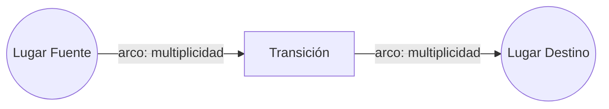
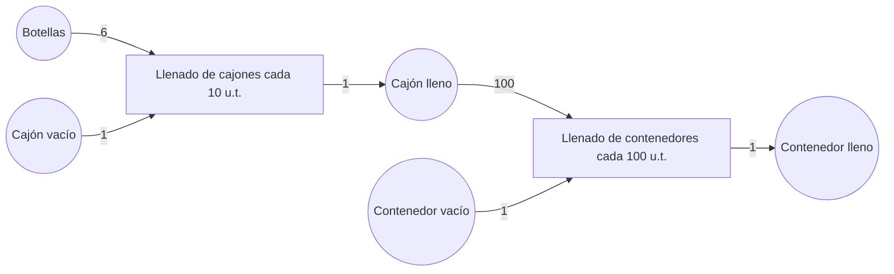

---
tags:
  - materia/modelos-simulacion
  - modulo/m2
  - tipo/teoria
materia: Modelos y Simulacion
modulo: M2 - Sistemas Discretos Deterministicos y Redes de Petri
tipo: teoria
fuentes:
  - "M2 - Sistemas Discretos Deterministicos.pdf"
  - "M2 - Presentacion sistemas discretos deterministicos (Redes de Petri).pdf"
  - "M2 - MYS uso de HPSIM.pdf"
descripcion: Sistemas discretos deterministicos y Redes de Petri — definiciones (sistema discreto, evento, entidad), estructura de una Red de Petri (lugares, transiciones, arcos), propiedades (marcacion, demora, multiplicidad), reglas de habilitacion y disparo, patrones de comportamiento (secuencial, conflicto, concurrencia, sincronizacion), depositos compartidos, y uso del simulador HPSim con caso aplicado de una planta envasadora.
conceptos_clave:
  - sistema discreto
  - deterministico
  - red de Petri
  - lugar y transicion
  - marcacion
  - demora
  - multiplicidad
  - habilitacion y disparo
  - HPSim
relacionados:
  - "[[M1 - Introduccion a la Simulacion]]"
  - "[[M3 - Sistemas estocasticos, probabilidad y estadistica]]"
---

# Módulo 2 — Sistemas Discretos Determinísticos y Redes de Petri

> [!info] Sobre este apunte
> Compilado a partir de los tres documentos del Módulo 2: el texto teórico, la presentación de clase y la guía de uso del software HPSim. Pensado para repasar en Obsidian con enlaces `[[ ]]` entre conceptos. Se conecta con [[M1 - Introduccion a la Simulacion|Módulo 1]], donde se definieron sistema, modelo y simulación.

## Mapa del módulo

- [[#1. Sistemas discretos determinísticos]]
- [[#2. Ejemplo aplicado — sistema de colas]]
- [[#3. Qué es una Red de Petri]]
- [[#4. Estructura y notación]]
- [[#5. Propiedades — marcación, demora, multiplicidad]]
- [[#6. Reglas de disparo (habilitación y ejecución)]]
- [[#7. Modelado por eventos y condiciones]]
- [[#8. Ejemplo — taller con máquinas y operadores]]
- [[#9. Ejemplo — máquina expendedora]]
- [[#10. Modelado de procesos productivos]]
- [[#11. Patrones de comportamiento en Redes de Petri]]
- [[#12. Depósitos compartidos entre tareas]]
- [[#13. Ventajas y desventajas]]
- [[#14. Extensiones de las Redes de Petri]]
- [[#15. HPSim — software de simulación]]
- [[#Repaso rápido (preguntas y respuestas)]]

---

## 1. Sistemas discretos determinísticos

> [!abstract] Definiciones clave
> - **Sistema discreto**: cambia de estado en un conjunto finito de puntos temporales, es decir, en instantes puntuales donde ocurre un evento (no cambia de forma continua).
> - **Determinístico**: para una entrada y un estado dados, el sistema siempre responde igual (no hay componente aleatorio).
> - **Evento o suceso**: cambio de algún atributo de alguna entidad, en un instante dado. Marca el inicio o el fin de una actividad (interacción entre entidades).
> - **Intervalo**: tiempo transcurrido entre dos instantes.
> - **Entidad**: objeto que opera dentro del sistema.

El tiempo entre eventos puede avanzar de forma **síncrona** (a intervalos regulares) o **asíncrona** (a intervalos variables, según cuándo ocurre cada evento).

## 2. Ejemplo aplicado — sistema de colas

Para un sistema de colas/filas, los eventos típicos son:

1. Llegar al sistema
2. Ingresar a la cola
3. Salir de la cola
4. Iniciar el servicio
5. Fin del servicio
6. Inicio de espera
7. Fin de espera
8. Salir del sistema

Estos eventos suelen darse de forma **asíncrona**. Los estados del sistema son como "fotografías" sucesivas donde se verifican los cambios en los atributos de las entidades.

> [!tip] Conexión
> Este ejemplo retoma la lógica de sistemas y entidades vista en [[M1 - Introduccion a la Simulacion|Módulo 1]], aplicada ahora a un sistema de eventos discretos.

---

## 3. Qué es una Red de Petri

Creada por el alemán **Karl Adam Petri en 1962**, es una metodología reconocida para modelar sistemas de manufactura flexibles y sistemas a eventos discretos (por ejemplo: una máquina expendedora, un taller de producción con operarios y maquinarias).

> [!abstract] Definición
> Una **Red de Petri** es una herramienta de representación matemática y/o gráfica de un sistema a eventos discretos, que permite describir la topología de un sistema distribuido, paralelo o concurrente, combinando estas posibilidades en un mismo modelo.

Su fortaleza principal está en la **expresión gráfica**: observar cómo el modelo cambia de un estado a otro da una perspectiva clara para analizar el sistema.

### Aplicaciones principales
- Modelado y análisis de **protocolos de comunicación**.
- Modelado y análisis de **sistemas de manufactura**: líneas de producción, líneas de ensamble automatizadas, producción automotriz, manufactura flexible, sistemas just-in-time.
- Determinación de la **capacidad requerida** para los depósitos (máximo valor de marcación alcanzado).
- Determinación del **inventario mínimo** para lograr una producción dada.
- Determinación del **inventario crítico** (el depósito que primero se vacía).
- Determinación de **cuellos de botella** (tareas más lentas, que están siempre ejecutándose mientras las demás esperan).

---

## 4. Estructura y notación

Una Red de Petri se compone de tres elementos básicos:

| Elemento | Símbolo gráfico | Rol |
|---|---|---|
| Nodo o lugar | Círculo | Representa un sitio o depósito |
| Transición | Barra o rectángulo | Representa un proceso, tarea o evento |
| Arco | Flecha dirigida | Conecta lugares y transiciones |

Reglas de conexión:
- Un arco que va de un **lugar a una transición** define a ese lugar como **entrada** de la transición.
- Un arco que va de una **transición a un lugar** define a ese lugar como **salida** de la transición.
- Entradas o salidas múltiples se representan con **arcos múltiples**.
- Regla básica: después de un nodo (vía un arco) siempre corresponde dibujar una transición, y viceversa — nunca dos nodos o dos transiciones seguidas.

> [!info] Es un multígrafo dirigido bipartito
> - **Multígrafo**: permite arcos múltiples entre el mismo par de nodos.
> - **Dirigido**: los arcos tienen sentido definido.
> - **Bipartito**: los nodos se dividen en dos conjuntos (lugares y transiciones) y cada arco va siempre de un elemento de un conjunto a un elemento del otro conjunto — nunca lugar-lugar ni transición-transición.

---

## 5. Propiedades — marcación, demora, multiplicidad

| Propiedad | Pertenece a | Significado |
|---|---|---|
| Marcación (μ) | Lugares | Cantidad de tokens/marcadores que contiene el lugar; representa el estado o stock |
| Demora (δ) | Transiciones | Tiempo que debe estar habilitada la transición antes de ejecutarse |
| Multiplicidad | Arcos | Cantidad de tokens consumidos o producidos a través de ese arco |

Los **tokens** (o marcadores, "monedas") residen en los lugares y se mueven a través de la red: son la parte dinámica del modelo. Se representan como puntos o números dentro del círculo. Su cantidad en un lugar puede variar sin límite.

### Tipos de demora en las transiciones
- **Inmediata**: sin demora.
- **Determinística**: con demora fija.
- **Exponencial**: la demora sigue una distribución exponencial.
- **Uniforme**: la demora sigue una distribución uniforme.

> [!warning] Redes de Petri estocásticas
> Cuando las transiciones usan demoras exponencial o uniforme, la red deja de ser puramente determinística y se convierte en una **Red de Petri estocástica**.

---

## 6. Reglas de disparo (habilitación y ejecución)

> [!abstract] Regla de habilitación
> Una transición está **habilitada** cuando todos los lugares que la alimentan (entradas) tienen una cantidad de marcadores igual o mayor a la multiplicidad de los arcos correspondientes.

Cuando una transición habilitada se **dispara** (ejecuta):
1. Se **resta** a los lugares fuente la multiplicidad de los arcos de entrada.
2. Se **suma** a los lugares destino la multiplicidad de los arcos de salida.

Ejemplo clásico: si el lugar p1 tiene 2 tokens y la transición t2 consume 2 tokens de p1 para generar 3 tokens en p2, después de disparar t2 el lugar p1 queda con 2 tokens menos y p2 con 3 tokens más.

Las transiciones pueden seguir disparándose indefinidamente hasta llegar a un estado deseado o hasta que ninguna pueda dispararse. Si más de una transición puede dispararse en el mismo instante, se habla de **paralelismo**.

---

## 7. Modelado por eventos y condiciones

Una forma de modelar sistemas complejos es dividirlos en eventos y condiciones:

- Los **nodos (lugares)** representan **condiciones** del sistema: la presencia de un token indica que la condición se cumple.
- Las **transiciones** representan **eventos**: acciones que ocurren si ciertas **precondiciones** son verdaderas.

> [!abstract] Definición
> Una **condición** es un predicado o descripción lógica del estado del sistema; puede ser verdadera o falsa. Al dispararse el evento (transición), las **precondiciones** dejan de cumplirse y las **postcondiciones** pasan a cumplirse.

La validez de una condición está representada por un token en el sitio correspondiente. Al dispararse la transición, se remueven los tokens habilitantes (precondiciones) y se crean nuevos tokens (postcondiciones).

---

## 8. Ejemplo — taller con máquinas y operadores

Un taller tiene tres máquinas (M1, M2, M3) y dos operadores (O1, O2). O1 puede operar M1 y M2; O2 puede operar M1 y M3. Cada orden requiere dos procesos: el primero siempre en M1, el segundo en M2 o M3.

### Condiciones
| Código | Condición |
|---|---|
| a | La orden llegó y está esperando |
| b | La orden fue trabajada por M1 y espera ser procesada por M2 o M3 |
| c | La orden está completada |
| d, e, f | M1, M2, M3 están desocupadas, respectivamente |
| g, h | O1, O2 están sin trabajo, respectivamente |
| i, j | O1, O2 están ocupando M1, respectivamente |
| k | O1 está ocupando M2 |
| l | O2 está ocupando M3 |

### Eventos y sus pre/postcondiciones
Condiciones iniciales: d, e, f, g, h

| Evento | Precondiciones | Postcondiciones |
|---|---|---|
| 1. Llega una orden | Ninguna | a |
| 2. O1 empieza en M1 | a, g, d | i |
| 3. O1 termina en M1 | i | g, d, b |
| 4. O2 empieza en M1 | a, h, d | j |
| 5. O2 termina en M1 | j | b, h, d |
| 6. O1 empieza en M2 | b, g, e | k |
| 7. O1 termina en M2 | k | c, g, e |
| 8. O2 empieza en M3 | b, f, h | l |
| 9. O2 termina en M3 | l | c, f, h |
| 10. Orden terminada y liberada | c | Ninguna |

> [!tip] Cómo leer esta tabla
> Cada fila es una transición: los tokens en las precondiciones habilitan el disparo, y al dispararse esos tokens se remueven y aparecen tokens nuevos en las postcondiciones.

---

## 9. Ejemplo — máquina expendedora

Modela una máquina que espera una orden (moneda), procesa y entrega el producto.

**Condiciones**: (a) la máquina espera, (b) una orden llegó y espera, (c) la máquina está trabajando la orden, (d) la orden está terminada.

**Eventos**: (1) llega una orden, (2) la máquina empieza a trabajar la orden, (3) la máquina termina de procesar la orden, (4) la orden se envía para su entrega.

---

## 10. Modelado de procesos productivos

En procesos productivos:
- Las **transiciones** representan procesos o tareas.
- La **multiplicidad** indica la cantidad de insumos consumidos desde los lugares fuente y de productos enviados a los lugares destino.
- Los **marcadores** representan el stock de insumos o productos en cada lugar (interpretado como depósito).

### Ejemplo: línea de embalaje de botellas

- "Llenado de cajones": se ejecuta cada 10 unidades de tiempo; consume 6 botellas + 1 cajón vacío para producir 1 cajón lleno.
- "Llenado de contenedores": se ejecuta cada 100 unidades de tiempo; consume 100 cajones llenos + 1 contenedor vacío para producir 1 contenedor lleno.

> [!warning] Aproximación de las transiciones instantáneas
> Cuando se dispara una transición, se actualizan simultáneamente los marcadores de origen y destino. Esto es una simplificación: en la realidad, si la tarea tiene duración, primero se deberían actualizar los lugares fuente al iniciar y recién los lugares destino al finalizar. El error que introduce esta aproximación suele ser pequeño.

---

## 11. Patrones de comportamiento en Redes de Petri

| Patrón | Descripción |
|---|---|
| Ejecución secuencial ("en línea") | Una transición solo puede dispararse después de otra; modela relaciones causales |
| Conflicto | Varias transiciones habilitadas compiten por el mismo lugar; disparar una inhabilita a las otras (se puede resolver asignando probabilidades) |
| Concurrencia (paralelismo) | Una misma transición alimenta a varias transiciones que pueden dispararse en simultáneo |
| Sincronización | Una transición debe esperar a que llegue un marcador a un lugar vacío, coordinando dos etapas |
| Confusión | Coexisten conflicto y concurrencia entre distintas transiciones |
| Fusión | La producción de varias transiciones se acumula en el mismo lugar (ej. depósito central) |
| Prioridad (arco inhibidor) | Un arco con círculo lleno en punta de flecha; la transición solo se dispara si el lugar de origen tiene **menos** tokens que la multiplicidad indicada |

---

## 12. Depósitos compartidos entre tareas

Cuando un mismo depósito debe alimentar a dos tareas que se ejecutan simultáneamente, hay que ajustar el modelo:

- **Depósito inicial** (no alimentado por ninguna tarea): se puede dividir en tantos depósitos como tareas deban alimentarse.
- **Depósito intermedio** (alimentado por una tarea): se divide en depósitos ficticios, uno por cada tarea a alimentar. Las capacidades de estos depósitos ficticios deben igualar las multiplicidades de los arcos que salen de ellos. Se conectan al depósito original mediante tareas con tiempo de ejecución nulo.

---

## 13. Ventajas y desventajas

| Ventajas | Desventajas |
|---|---|
| Identificación "global" del sistema muy clara, gracias a la representación gráfica | Las estructuras de datos de cada componente no se ven de forma inmediata |
| El flujo de control del sistema modelado es claro | No es adecuada para reflejar algoritmos demasiado complejos |
| Apta para especificar diversos tipos de sistemas, en especial productivos | Los tokens no poseen atributos propios |
| — | La especificación de tiempos no es flexible |

---

## 14. Extensiones de las Redes de Petri

- **Redes de Petri Coloreadas (PNC)**
- **Redes de Petri Temporales**
- **Redes de Petri Estocásticas**
- Redes de Petri de alto nivel, redes difusas de Petri, entre otras subclases desarrolladas para problemas específicos.

---

## 15. HPSim — software de simulación

> [!info] Qué es
> **HPSim** es un software simulador de Redes de Petri, disponible gratis en internet (winpesim.de). Permite ver la evolución del estado de la red en forma gráfica y grabar los resultados en planillas tipo Excel.

### Funcionalidades del modelo
- Se puede definir la **capacidad de los lugares**: si la cantidad de marcas iguala la capacidad, las tareas que alimentan ese lugar quedan suspendidas hasta liberar espacio.
- Permite modelar **arcos inhibitorios**, que suspenden la actividad destino si el lugar de origen tiene alguna marca.
- Tipos de intervalo de ejecución de las transiciones: inmediato, determinístico, o estocástico (exponencial o uniforme).

### Interfaz
La ventana principal tiene: Barra Principal, Barra de Simulación, Barra de Edición del Modelo, Ventana de Edición del Modelo y Tabla de Propiedades. Con la Barra de Edición se agregan lugares, transiciones y arcos; la Tabla de Propiedades muestra los atributos del elemento seleccionado.

### Propiedades editables por tipo de elemento

| Elemento | Propiedades principales |
|---|---|
| Lugares | Nombre, tamaño del nodo, mostrar nombre/capacidad, marcas iniciales, marcas actuales, capacidad, "Tokens Count" (total histórico de marcas ingresadas, se reinicia con la red) |
| Transiciones | Nombre, tamaño, "Time Mode" (Immediate / Deterministic / Exponential / Uniform Distr.), tiempo de disparo, rango de demora, demora actual, cantidad de marcadores que pasaron |
| Arcos | Multiplicidad, tipo de arco (Normal / Test / Inhibitor), mostrar multiplicidad |

### Pasos para simular
1. Construir el modelo (lugares, transiciones, arcos).
2. Ajustar parámetros en "Extra / Properties / Simulation": conviene fijar un tiempo y una cantidad de pasos muy extensos para que no corten la simulación antes de tiempo. Definir el archivo de salida ("Output File").
3. Elegir el modo de operación (velocidad paso a paso, normal o rápida).
4. Activar la grabación de datos antes de iniciar la simulación y mantenerla hasta el final.
5. HPSim dispara todas las transiciones habilitadas y recién entonces incrementa el tiempo (el incremento lo define el usuario). La simulación termina al alcanzar el número máximo de pasos o el tiempo máximo, lo que ocurra primero.

### Caso aplicado: planta envasadora
Usando el modelo de embalaje de botellas (ver sección 10):
- La primera simulación predijo que la producción se detendría a las **2100 unidades de tiempo** por falta de cajones vacíos, habiendo producido **7 contenedores llenos**, con insumos restantes excesivos.
- Para producir **10 contenedores llenos** sin insumos sobrantes, se determinó (probando varias corridas) que se necesitan: **6000 botellas, 1000 cajones vacíos y 10 contenedores vacíos**.

> [!tip] Conexión con el resto del módulo
> Este caso muestra en la práctica el uso de la Red de Petri para responder las preguntas de la sección 3: capacidad de depósitos, inventario mínimo e inventario crítico.

---

## Repaso rápido (preguntas y respuestas)

> [!question] ¿Qué diferencia a un sistema discreto de uno continuo?
> El discreto cambia de estado solo en puntos temporales puntuales (eventos), no de forma continua.

> [!question] ¿Qué significa que un sistema sea determinístico?
> Que para una misma entrada y estado, siempre responde igual: no hay aleatoriedad.

> [!question] ¿Quién creó las Redes de Petri y cuándo?
> Karl Adam Petri, en 1962.

> [!question] ¿Qué representan los nodos y qué representan las transiciones?
> Los nodos (lugares) representan condiciones o depósitos; las transiciones representan eventos, procesos o tareas.

> [!question] ¿Cuándo está habilitada una transición?
> Cuando todos los lugares de entrada tienen al menos tantos marcadores como indica la multiplicidad de sus arcos hacia esa transición.

> [!question] ¿Qué ocurre al disparar una transición habilitada?
> Se restan marcadores de los lugares fuente y se suman marcadores a los lugares destino, según la multiplicidad de los arcos.

> [!question] ¿Por qué se dice que una Red de Petri es un multígrafo dirigido bipartito?
> Porque admite arcos múltiples entre nodos (multígrafo), los arcos tienen sentido (dirigido), y los nodos se dividen en dos conjuntos —lugares y transiciones— de forma que cada arco conecta siempre un elemento de un conjunto con uno del otro (bipartito).

> [!question] ¿Qué diferencia a un arco normal de un arco inhibidor?
> El arco normal habilita la transición cuando el lugar tiene suficientes marcadores; el arco inhibidor la habilita cuando el lugar tiene menos marcadores que la multiplicidad indicada.

> [!question] ¿Qué patrón describe cuando varias transiciones compiten por el mismo lugar?
> Conflicto.

> [!question] ¿Qué es HPSim?
> Un software gratuito para simular Redes de Petri, que muestra la evolución gráfica del modelo y permite exportar resultados a Excel.

