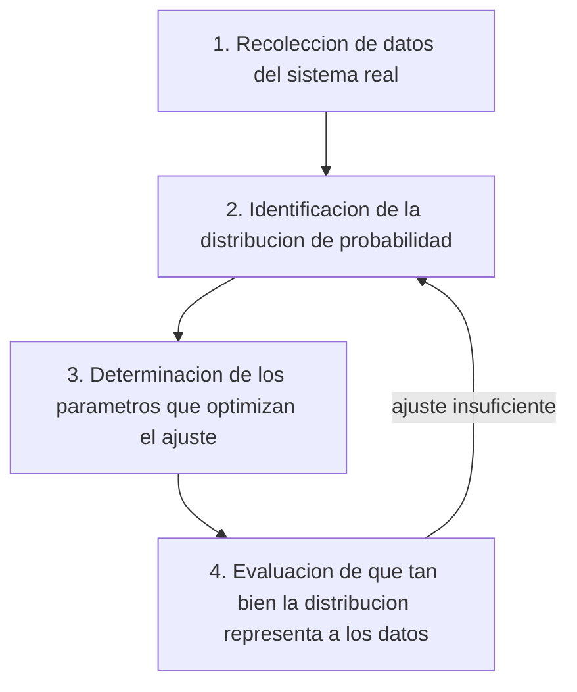

---
tags:
  - materia/modelos-simulacion
  - modulo/m4
  - tipo/teoria
materia: Modelos y Simulacion
modulo: M4 - Analisis de Entradas
tipo: teoria
descripcion: Analisis de entradas en 4 pasos — recoleccion de datos, identificacion de la distribucion (histogramas, escala densidad), estimacion de parametros (ajuste por minimos cuadrados) y evaluacion del ajuste (Kolmogorov-Smirnov, Chi-cuadrado), con catalogo de distribuciones teoricas y ejemplo resuelto de datos exponenciales.
conceptos_clave:
  - analisis de entradas
  - histograma
  - escala densidad
  - distribucion teorica
  - distribucion empirica
  - estimacion de parametros
  - minimos cuadrados
  - bondad de ajuste
relacionados:
  - "[[M3 - Sistemas estocasticos, probabilidad y estadistica]]"
---

## Mapa del módulo

- [[#1. Introducción]]
- [[#2. Los cuatro pasos del análisis de entradas]]
- [[#3. Paso 1 — Recopilación de datos]]
- [[#4. Paso 2 — Identificación de la distribución]]
- [[#5. Histogramas]]
- [[#6. Catálogo de distribuciones teóricas]]
- [[#7. Selección de distribución sin datos disponibles]]
- [[#8. Paso 3 — Estimación de parámetros]]
- [[#9. Paso 4 — Evaluación del ajuste]]
- [[#10. Ejemplo resuelto — datos exponenciales]]
- [[#11. Flashcards de repaso]]

---

## 1. Introducción

> [!info] Idea central Un sistema es estocástico cuando al menos una de sus variables de entrada es aleatoria. Esto hace que las variables de salida dejen de ser resultados exactos y pasen a ser estimaciones.

El análisis de entradas consiste en modelar adecuadamente los componentes aleatorios presentes en una simulación. Es especialmente relevante cuando se dispone de datos reales del sistema en estudio.

Para representar el comportamiento estocástico de una variable se usan funciones de distribución de probabilidad, que pueden ser:

|Tipo|Descripción|Ejemplos|
|---|---|---|
|Teóricas|Funciones matemáticas conocidas que se ajustan a los datos|Normal, Exponencial, Poisson, Binomial|
|Empíricas|Se construyen directamente a partir de tablas de datos o frecuencias, cuando ninguna función teórica se ajusta bien|Tabla de frecuencias del propio relevamiento|

---

## 2. Los cuatro pasos del análisis de entradas

> [!tip] Relación entre pasos El proceso no es necesariamente lineal: si en el Paso 4 la distribución elegida no ajusta bien, se vuelve a probar con otra familia de distribuciones en el Paso 2.

---

## 3. Paso 1 — Recopilación de datos

> [!warning] Limitaciones frecuentes No siempre es posible relevar datos: el sistema puede no existir todavía, o la medición puede ser costosa o peligrosa. En esos casos se recurre a conocimiento de expertos o a registros históricos de sistemas análogos.

Elementos clave de un buen plan de recolección:

- Requiere tiempo, esfuerzo y una planificación detallada.
- Se deben eliminar los datos que no son útiles para la simulación.
- Se deben combinar únicamente conjuntos de datos homogéneos (misma distribución).
- Usar formato estandarizado para registrar la información.
- Registrar variables numéricas con la exactitud original, sin redondear ni categorizar de antemano.
- No tratar registros repetidos del mismo sujeto (por ejemplo, controles periódicos) como si fueran individuos distintos.
- Hacer una prueba piloto antes del relevamiento definitivo, para corregir errores de protocolo.
- Prever la logística de carga y tratamiento estadístico de los datos antes de terminar el relevamiento.

> [!example] Fuentes de error habituales Al tomar la medición, al registrar el dato original, al transcribirlo a una planilla, o al armar la base final. La consistencia se mejora identificando y corrigiendo estos errores donde sea posible.

---

## 4. Paso 2 — Identificación de la distribución

Una vez disponibles los datos, se construye un histograma para cada variable aleatoria. Para esto se necesitan los siguientes valores:

|Símbolo|Significado|
|---|---|
|n|Tamaño de la muestra|
|xmin|Valor mínimo de la variable en la muestra|
|xmax|Valor máximo de la variable en la muestra|
|r|Rango = xmax - xmin|
|c|Cantidad de intervalos o clases (se recomienda entre 6 y 15, o aproximar con $n^{1/2}$)|
|b|Ancho de cada intervalo = $r/c$|

> [!info] Fórmulas de frecuencia por intervalo i
> 
> - Frecuencia absoluta: $f_i$ = cantidad de casos en el intervalo $i$
> - Frecuencia relativa porcentual: $fr_i = (f_i / n) \times 100$
> - Frecuencia acumulada: $fa_i = f_1 + f_2 + \ldots + f_i$
> - Frecuencia acumulada relativa: $far_i = (fa_i / n) \times 100$

Las frecuencias luego se "normalizan" a **escala densidad** para evitar distorsiones, especialmente cuando los intervalos no tienen todos la misma longitud.

---

## 5. Histogramas

### Construcción

Las clases o intervalos deben ser mutuamente excluyentes y exhaustivos: cada dato cae en una y solo una clase, y todos los datos tienen clase asignada.

> [!question]- ¿Por qué no conviene usar demasiados ni muy pocos intervalos? Demasiados intervalos hacen que caigan pocas observaciones por clase y las barras varíen irregularmente. Muy pocos intervalos producen una gráfica más regular pero pueden ocultar las características reales de la forma del gráfico.

### Intervalos de igual longitud vs. distinta longitud

|Caso|Qué representar en la altura de la barra|Motivo|
|---|---|---|
|Intervalos de igual longitud|Frecuencia (o frecuencia relativa) directamente|Área y altura son proporcionales entre sí|
|Intervalos de distinta longitud|Escala densidad = frecuencia del intervalo / longitud del intervalo|El área de la barra debe ser proporcional a la frecuencia, no la altura|

> [!example] Caso Población por grupos de edad (INDEC, Censo 2010) Al graficar la frecuencia relativa directamente en la altura (con intervalos de edad de distinta longitud), se obtiene una imagen engañosa que exagera el grupo de 15 a 64 años. Al usar escala densidad, el gráfico muestra correctamente que la mayor proporción de casos está en los menores de 15 años.

### Histograma vs. gráfico de barras

|Aspecto|Histograma|Gráfico de barras|
|---|---|---|
|Variable|Numérica continua (o discreta con muchos valores)|Categórica (o numérica discreta con pocos valores)|
|Longitud de intervalos|Puede variar; se ajusta con escala densidad|No aplica: categorías, no intervalos|
|Representación de frecuencia|En el área de la barra|En la altura de la barra|
|Espacio entre barras|Sin espacio (continuidad)|Con espacio (no hay continuidad)|

---

## 6. Catálogo de distribuciones teóricas

|Distribución|Qué modela|Ejemplo típico|
|---|---|---|
|Binomial|Número de éxitos en n pruebas independientes de Bernoulli|Disquetes defectuosos en un lote de n|
|Binomial negativa|Número de pruebas necesarias para lograr k éxitos|Disquetes revisados hasta encontrar k defectuosos|
|Poisson|Número de eventos independientes en un intervalo fijo de tiempo o espacio|Clientes que llegan a un centro comercial en una hora|
|Exponencial|Tiempo entre eventos independientes, procesos sin memoria|Tiempo entre arribos de clientes|
|Normal (Gaussiana)|Fenómenos naturales, fisiológicos o sociales que resultan de sumar varios procesos|Estatura de una población, tiempo de ensamblaje de un auto|
|Lognormal|Procesos que resultan de multiplicar varios procesos|Retorno de una inversión con interés compuesto|
|Gamma|Datos positivos asimétricos a la derecha, estudios de fiabilidad|Tiempo hasta que falla un componente eléctrico|
|Beta|Variables limitadas al intervalo [0,1]|Tiempo hasta la culminación de una tarea|
|Erlang|Suma de varios procesos con distribución Exponencial|Falla sucesiva de una PC y sus respaldos|
|Weibull|Tiempos entre fallas de un componente|Tiempos entre fallas de un disco rígido|
|Uniforme (continua o discreta)|Procesos donde todos los resultados son igualmente probables|Selección totalmente al azar|
|Triangular|Procesos de los que solo se conocen mínimo, máximo y valor más probable|Duración estimada de una actividad de proyecto|
|Empírica|Procesos sin distribución teórica adecuada|Se usa la propia tabla de datos relevados|

> [!tip] Cómo elegir la familia de distribución Se combinan dos criterios: la forma visual del histograma y el conocimiento previo sobre la naturaleza del fenómeno (por ejemplo, características fisiológicas humanas suelen ajustar bien a la Normal).

---

## 7. Selección de distribución sin datos disponibles

Cuando el sistema todavía no existe o no se puede medir, se recurre a otras fuentes:

|Fuente|Descripción|
|---|---|
|Especificaciones técnicas|Datos técnicos de fábrica: tiempo medio entre fallas, velocidad de impresión, consumo promedio|
|Opinión de expertos|Estimaciones de valores mínimo, máximo y más probable; permiten construir una distribución Triangular|

---

## 8. Paso 3 — Estimación de parámetros

Cada distribución teórica queda definida por sus propios parámetros:

|Distribución|Parámetro(s)|Primera aproximación|
|---|---|---|
|Poisson|$\alpha$|Media muestral $X_m$|
|Exponencial|$\lambda$|Inversa de la media muestral: $1/X_m$|
|Uniforme [0,b]|$b$|$X_{max} \times (n+1)/n$|
|Normal|$\mu, \sigma^2$|Media muestral $X_m$, desvío estándar $S^2$|

> [!info] Parámetro vs. estimación El parámetro (μ, σ) describe a toda la población y generalmente se desconoce. La estimación es el valor calculado a partir de una muestra, y cambia de una muestra a otra: por eso es en sí misma una variable aleatoria.

### Ajuste por mínimos cuadrados

La primera aproximación de los parámetros rara vez es la mejor. El método de **mínimos cuadrados** ajusta los parámetros minimizando la suma de los errores al cuadrado entre la distribución teórica y el histograma empírico:

> $$\text{Error total} = \sum [y - f(x)]^2$$

Se eleva al cuadrado para que el error no dependa del signo, evitando que errores positivos y negativos se compensen entre sí.

---

## 9. Paso 4 — Evaluación del ajuste

|Método|Criterio de decisión|
|---|---|
|Kolmogorov-Smirnov|Máxima desviación entre la distribución acumulada teórica y la empírica|
|Chi-cuadrado|Suma de errores al cuadrado entre el histograma y la distribución teórica|

> [!warning] Efecto del tamaño de muestra Con muestras pequeñas, las pruebas tienden a aceptar cualquier distribución propuesta. Con muestras grandes, tienden a rechazarlas todas. Por eso estas pruebas son solo una guía más, no un criterio absoluto.

---

## 10. Ejemplo resuelto — datos exponenciales

Datos generados con una distribución Exponencial de media teórica $\lambda = 1$ ($n = 25$):

|Cálculo|Valor|
|---|---|
|n|25|
|xmin|0.0215|
|xmax|4.3410|
|r|4.3196|
|c|5|
|b|0.8639|
|Media muestral (xm)|1.0941|
|Primera aproximación de λ (1/xm)|0.9140|
|λ ajustado por mínimos cuadrados|0.9996|

> [!example] Tabla de frecuencias resultante
> 
> |i|Intervalo (xmin-xmax)|xm|fi|fri|Densidad|FDA|
> |---|---|---|---|---|---|---|
> |1|0.0215-0.8854|0.45|14|0.56|0.648|0.56|
> |2|0.8854-1.7493|1.32|5|0.20|0.232|0.76|
> |3|1.7493-2.6132|2.18|3|0.12|0.139|0.88|
> |4|2.6132-3.4771|3.05|1|0.04|0.046|0.92|
> |5|3.4771-4.3410|3.91|2|0.08|0.093|1.00|

> [!tip] Lectura del resultado La primera aproximación (λ = 0.914) se aleja del valor real (λ = 1), mientras que el ajuste por mínimos cuadrados (λ = 0.9996) lo recupera con mucha mayor precisión. Esto ilustra por qué el ajuste por regresión es preferible a quedarse con la primera estimación.

---

## 11. Flashcards de repaso

> [!question]- ¿Cuándo se considera que un sistema es estocástico? Cuando al menos una de sus variables de entrada tiene comportamiento aleatorio, lo que hace que las salidas sean estimaciones y no resultados exactos.

> [!question]- ¿Cuáles son los cuatro pasos del análisis de entradas?
> 
> 1. Recolección de datos, 2) Identificación de la distribución, 3) Estimación de parámetros, 4) Evaluación del ajuste.

> [!question]- ¿Qué regla práctica se usa para elegir la cantidad de intervalos (c) de un histograma? Se suele adoptar $c = n^{1/2}$, procurando que quede entre 6 y 15 clases.

> [!question]- ¿Qué es la "escala densidad" y quá problema resuelve? Es la frecuencia del intervalo dividida por su longitud (frecuencia / longitud del intervalo). Resuelve la distorsión que aparece al graficar histogramas con intervalos de distinta longitud, asegurando que el área de la barra (y no solo su altura) sea proporcional a la frecuencia real.

> [!question]- Si no se cuenta con datos del sistema porque todavía no existe, ¿qué alternativas hay para elegir una distribución? Recurrir a especificaciones técnicas del producto/proceso, o a la opinión de expertos (estimando mínimo, máximo y valor más probable, lo que habilita usar una distribución Triangular).

> [!question]- ¿Qué diferencia a Kolmogorov-Smirnov de Chi-cuadrado como pruebas de ajuste? Kolmogorov-Smirnov se basa en la máxima desviación entre las distribuciones acumuladas teórica y empírica. Chi-cuadrado se basa en la suma de errores al cuadrado entre el histograma y la distribución teórica.

> [!question]- ¿Por qué el método de mínimos cuadrados eleva el error al cuadrado en lugar de sumarlo directamente? Para que el error no dependa del signo y así evitar que errores positivos y negativos se cancelen entre sí al sumar sobre todo el conjunto de datos.

---

