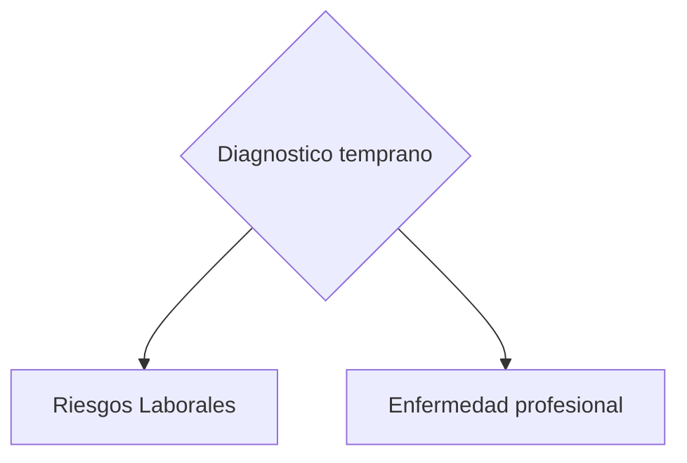
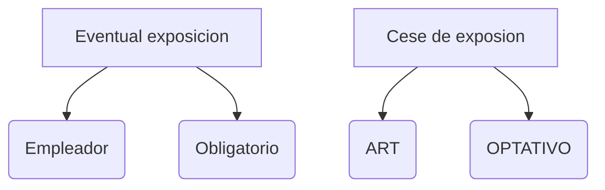

### Ley 19587 - Higiene y Seguridad en el Trabajo

- Ley de carácter generan en materia de Higiene y seguridad laboral. Establece su ámbito de aplicaciones a todos los establecimientos del país, sin distinción de su naturaleza o actividad.
- Define los bienes jurídicos protegidos: los básicos principios y métodos de ejecución de sus postulados: los lineamientos esenciales que deben considerar las normas reglamentarias: y las obligaciones fundamentales del empleador y del trabajador.
### Ley 24557 - Riesgos del trabajo

- Establece el sistema vigente en materia de previsión y prevención de los riesgos del trabajo y de reparación de los daños derivados del mismo. 
- Crea la figura de las aseguradoras de riesgo ART
- Instituye el seguro obligatorio con carácter general, y la posibilidad de optar por el autoseguro para empleadores que reúnan ciertos requisitos.
- Se determinan las obligaciones de las partes a los fines de prevención, las contingencias y situaciones cubiertas por el sistema; el régimen de prestaciones; el régimen financiero del sistema; los entes que tienen a su cargo la regulación y supervisión de la normativa; y los derechos y deberes de las partes y prohibiciones 
### Servicios de Medicina del Trabajo, Higiene y Seguridad en el Trabajo

#### Medicina del trabajo

**Definición**
Rama de la medicina destinada a satisfaces necesidades y problemas médicos dentro de un programa de salud ocupacional.

**Objetivo**
- Prevenir, todo daño que pudiera causarse a la vida y a la salud de los trabajadores, por las condiciones de su trabajo
- Crea las condiciones para que la salud y la seguridad sean una responsabilidad del conjunto de la organización.
- Pueden se internos o Externos 

**Misión Fundamental**
Promover y mantener el mas alto nivel de salud de los trabajadores, ==Decreto 1338/96==, Debiendo ejecutar  entre otras
- Evaluación física y emocional 
- Preservar y mejorar la salud
- Asistencia medica inicial

| **Cantidad trabajadores equivalentes** | **Horas-médico semanales** |
| -------------------------------------- | -------------------------- |
| 151 - 300                              | 5                          |
| 301 - 500                              | 10                         |
| 501 - 700                              | 15                         |
| 701 - 1000                             | 20                         |
| 1001 - 1500                            | 25                         |

### Trabajadores equivalentes y los riesgos de la actividad 
| **Cantidad trabajadores equivalentes** | **A (Capítulos 5, 6, 11, 12, 14, 18 al 21)** | **B (Capítulos 5, 6, 7 y 11 al 21)** | **C (Capítulos 5 al 21)** |
| -------------------------------------- | -------------------------------------------- | ------------------------------------ | ------------------------- |
| 1 - 15                                 | -                                            | 2                                    | 4                         |
| 16 - 30                                | -                                            | 4                                    | 8                         |
| 31 - 60                                | -                                            | 8                                    | 16                        |
| 61 - 100                               | 1                                            | 16                                   | 28                        |
| 101 - 150                              | 2                                            | 22                                   | 44                        |
| 151 - 250                              | 4                                            | 30                                   | 60                        |
| 251 - 350                              | 8                                            | 45                                   | 78                        |
| 351 - 500                              | 12                                           | 60                                   | 96                        |
| 501 - 650                              | 16                                           | 75                                   | 114                       |
| 651 - 850                              | 20                                           | 90                                   | 132                       |
| 851 - 1100                             | 24                                           | 105                                  | 150                       |
| 1101 - 1400                            | 28                                           | 120                                  | 168                       |
| 1401 - 1900                            | 32                                           | 135                                  | 186                       |
| 1901 - 3000                            | 36                                           | 150                                  | 204                       |
| Más de 3000                            | 40                                           | 170                                  | 220                       |

**Categorias**
- A - Riego Bajo: tareas administratibas
- B - Riesgo Medio: talleres, mecanicos, fabricas textiles, logistica y manufactura
- C - Riesgo Alto: construccion, petroquimica, metalurgicas, mineria.

Empleados de produccion = Total Empleados
Empledos administrativos = Total / 2
**Calculo:** (empleados produccion ) + (empleados administrativos / 2) = total trabajadores equivalentes

teniendo el total de trabajadores y la categoria de la empresa se cruzan los datos en la tabla

**Ejemplo:**

- Empleados de produccion = 100
- Empleados = 60
- Calculo = 100 + 60/2 = 130 (rando de 101 - 150 en tabla)
- Categoria de la empresa es B
- Entonces la empresa debe de contar con un medico en planta durante 5 horas semanales en ese turno
### Interrelación hombre - ambiente - tarea

![[Pasted image 20260419145750.png]]
![[Pasted image 20260419145758.png]]
### Salud ocupacional 

**Salud (OMS)**
El estado de bienestar físico, mental y social completo, y no meramente la ausencia de daño o enfermedad 

**Salud ocupacional**
Rama de la salud publica orientada a hombre en su ambiente laboral 

**Salud ocupacional: accion conjunta** del servicio de seguridad e higiene y del servicio medico sobre el hombre y el ambiente para la protección de la salud en la industria. 

**Etapas para llegar a conocer el nivel de exposición**
1. Detectar: Lugar y tipo de contaminante
2. Evaluar: en que cantidad 
3. Actuar

### Finalidades de la salud ocupacional 

-  **Promover el mas alto grado de bienestar físico, mental y social en todas las profesiones**
- **Evitar el desmejoramiento de la salud por las condiciones de trabajo**
- **Protegerlos de los riesgos resultantes de los agentes nocivos**
	- Riesgos de "enfermedad profesional". Agentes químicos, físicos, biológicos.
- **Mantener a los trabajadores de manera adecuada a sus aptitudes fisiológicas y psicológicas**
- **Adaptar el trabajo al hombre y cada hombre a su trabajo**

### Exámenes médicos 
1. Preocupaciones o de ingreso 
2. Periódicos
3. Previos a una transferencia de actividad 
4. Posteriores a una ausencia prolongada
5. Previos a la terminación de la relación laboral o de egreso 

### Resolución N 37/10

#### Examen medico preocupacional 

**Propósitos**
- Determinar la aptitud del postulante para el desempeño de las tareas laborales, conforme a sus condiciones psicofísicas
- Evalúa la adecuación del postulante para afrontar los riesgos de enfermedades profesionales ==Decreto 658/96==
- Servirá par a detectar patologías preexistentes 

**Obligacion**
- Debe de realizarse de forma obligatoria, previamente al inicio de la relacion laboral. Es responsabilidad del empleador

**Condicion**
- En ningun caso puede ser usado como motivo discriminatorio

**Componentes**
1. Exammen fisico completo, que abarque todos los aparatos y sistemas, inclutengo agudeza visual cercana y lejana. 
2. Radiogrtafia panoramica de torax.
3. Electrocardiograma.
4. Examenes de laboratorio: 
	1. Hemograma 
	2. Eritrosedimentacion
	3. Uremia
	4. Glucemia
	5. Reaccion para investigacion de Chagas Mazza
	6. Orina completa 
	7. Estudios neurologicos y psicologicos par cuando las actividades a desarrollar puedan significar riesgos para si, terceros o instalaciones 

#### Examen medico periodico 

**Proposito**
- Deteccion temprana de afecciones producidad por agentes de riesgo a que esta expuesto en sus tareas 

**Obligacion**
- Para los trabajadores que en su ambiente laborar ecistan agentes de riesgo
- Su realizacion es responsabilidad de la aseguradora

**Oportunidad**
- Se efectuara con las frecuencias y contenicos indicados en el anexo II

Identificacion de estados pre-clinicos de la enfermedad (modificaciones bioquimicas, fisiologicas o anatomicas), que pueden ser reversibles o detenidas con tratamiento y/o cese de la exposicion

#### Examen medico previo a la transferencia de activicad 

Tienen en lo pertinente, los objetivos indicados para los examenes de ingreso y de egreso 

#### Examenes optativos

**Examenes medicos posteriores a ausencias prolongadas**
- Son examenes posteriores a ausencias prolongadas
- Son responsabilidad de la ART

**Examenes previos a la terminacion de la relacion laboral o de egreso**
- Responsabilidad de la ART

### Concepto de higiene y seguridad industrial 

#### Higiene Industrial 

**Definicion** 
Ciencia que tiene como objetivo  el reconocimiento, evaluacion y control de los factores ambientales que se originan en el lugar de trabajo y que pueden causar enfermedades o ineficiencie entre los trabajadores o ciudadanos. 

**Funcion** 
Evitar daños, mediante medidas de prevencion y correccion adecuadad, es decir, busca adaptacin cultural al medio laboral

Es una tecnica de prevencion de enfermedades profesionales  que actua sobre el ambiente y las condiciones de trabajo, por lo tanto no trata de curar las EP, lo que intenta hacer es abordar el problema tecnologicamente sobre el ambiente laboral
Estudia y modifica el medio ambiente fisico, quimico o biologico del trabajo, para evitar especialmente las enfermedades profesionales 

#### Seguridad industrial 

Se manifiesta en accion sobre el individuo, sobre las instalaciones y sobre las maquinas. Su objeto es la prevencion de accidentes de trabajo

### Oblicaciones 

#### ART 
- Asistencia medica
- Protesis y ortopedia 
- Rehabilitacion 
- Recalificacion profesional 
- Servicio funerario 

**Del Trabajador**
- Utilizar los EPP
- Cumplir las normas de seguridad e higiene 
- Comunicar a su empleador cualquier hecho de riesgo relacionado con el puesto de trabajo o el establecimiento
- Denunciar a su empleador o ART la ocurrencia de un accidente de trabajo o enfermedad profesional 
- Realizar los examenes medicos y tratamientos de rehabilitacion 
- Asistir a los cursos de capacitacion

**Del empleador**
- Cumplir las normas de higiene y seguridad vigentes 
- Informar a sus trabajadores de la ART afiliado 
- Denunciar ante la ART los accidentes o enfermedades profesionales 
-  Proveer a los trabajadores de los  EPP
- Cumplir recomendaciones de la ART
- Brindar capacitacion en materia de Higiene y Seguridad a sus empleados 

### Incapacidad Laboral 

#### Temporaria 
- Cuando el daño sufrido por el trabajador le impide temporariamente la realizacion de sus tareas habituales 
- La situacion de incapacidad laboral temporaria cesa por
	- Alta medica 
	- Declaracion de incapacidad laboral permanente
	- Transcurso de una año desde la primera manifestacion invalidante 
	- Muerte
#### Permanente 
- Cuando el daño le ocasiona al trabajador una disminucion permanente de su capacidad laborativa 
- Esta es total cuando la disminucion de su capacidad laborativa fuere igual o mayor que 66% y parcial cuando sea menor a este numero
- Este grado es determinado por las comisiones medicas de esta ley, en base a la tabla de evaluacion de las incapacidades laborales, que elaborara el Poder Ejecutivo Nacional y ponderara entre otros factores,  la edad del trabajador, y el tipo de actividad y las posibilidades de reubicacion laboral. 
- El poder ejecutivo nacional garantiza, la aplicacion de criterios homogeneos en la evaluacion de las incapacidades dentro del sistema integrado de jubilacions y pensiones 

# Preguntas 
1. Que es el decreto 1338/96?
	- Reglamente la ley de seguridad e higiene nacional, Define cuando una empresa debe de contar con un servicio de medicina laboral o de higiene interno o externo.
	- Establece la cantidad obligatoria de horas que estos profesionales (de medicina laboral) deben dedicarle a la empresa
	- Determina que la medicina laboral es de caracter preventivo y no asistencial.
2. Que se entiende por trabajadores equivalentes? 
	- Medida que se usa para calcular cuantas horas obligatorias debe dedicarle a la empresa un profesional de higiene y seguridad
3. Como debe de aplicar el empleador las horas del servicio de medicina y de seguridad e higiene en una empresa? 

	- Se calculan consultando las tablas del decreto 1338/96 usando distintos critetios para cada servicio
	- Se mira la cantidad total de trabajadores de turno
	- Se calcula buscando la tabla del decreto cruzando el rubro de la empresa (industrial o comercial/ agropecuario) con la cantidad de empleados. Se asignana horas medicos semanales a partir de ciertos topes
	- **Categorias**
		- A - Riego Bajo: tareas administratibas
		- B - Riesgo Medio: talleres, mecanicos, fabricas textiles, logistica y manufactura
		- C - Riesgo Alto: construccion, petroquimica, metalurgicas, mineria.
	- teniendo el total de trabajadores y la categoria de la empresa se cruzan los datos en la tabla
	- **Ejemplo:**
	- Empleados de produccion = 100
	- Empleados = 60
	- Calculo = 100 + 60/2 = 130 (rando de 101 - 150 en tabla)
	- Categoria de la empresa es B
	- Entonces la empresa debe de contar con un medico en planta durante 5 horas semanales en ese turno
4. El medico laboral debe de ser? 
	- Medico laboral 
5. La higiene industrial se encarga de la prevencion de? 
	- Enfermedades profesionales, usa tecnicas para la prevencion de las mismas 
6. La recalificacion profesional consiste en? 
	- La capacitacion de un empleado que sufrio un accidente o enfermedad proefesional para que ejerza una nueva actividad
7. Los examenes periodicos se realizan a que tipo de trabajadores?
	- A trabajadores que estan expuestos a agentes de riesgos en su trabajo

