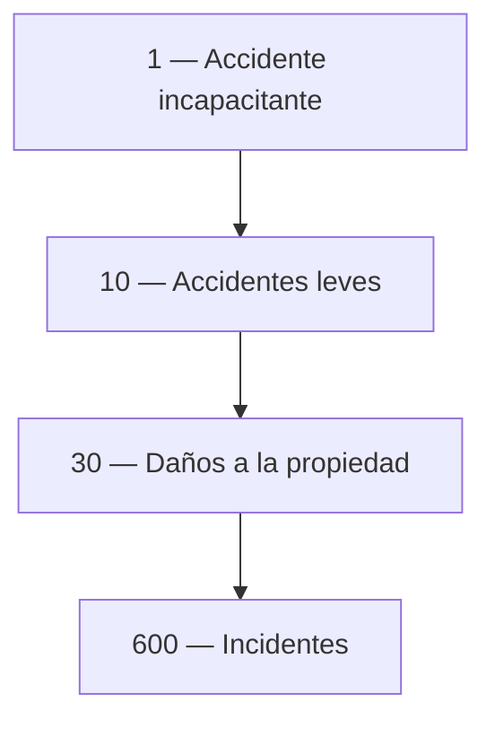
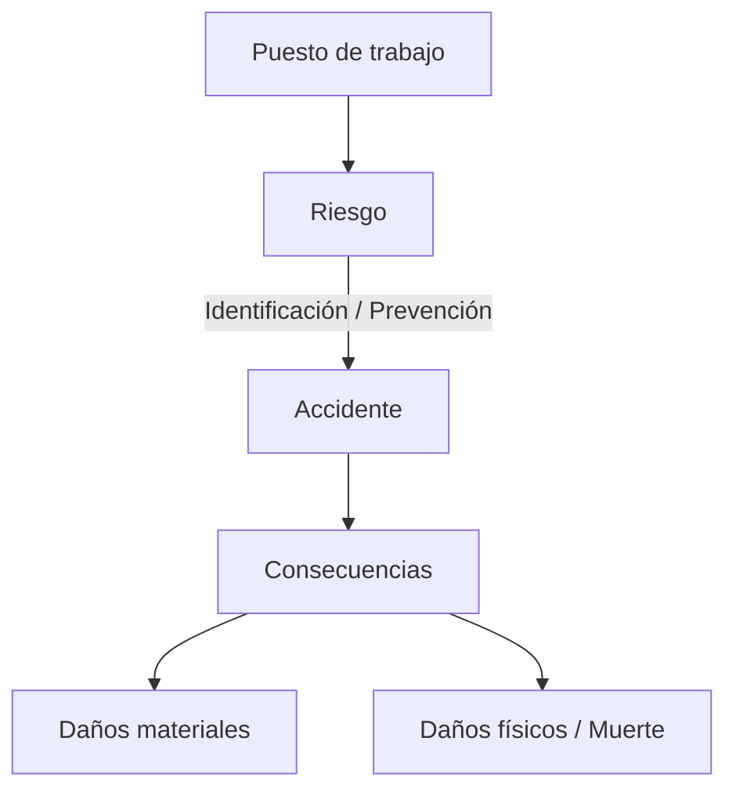

# Accidentes de Trabajo

## Definiciones

**Accidente de trabajo:*
- Acontecimiento súbito y violento ocurrido por el hecho o en ocasión del trabajo, o en el trayecto entre domicilio y lugar de trabajo, siempre que el damnificado no haya interrumpido o alterado dicho trayecto por causas ajenas al trabajo.
- Proceso imprevisto que altera una actividad de trabajo ocasionando lesión al trabajador y/o alteraciones en maquinaria, equipo, materiales y productividad.

**Incidente:** Suceso anormal, no querido ni deseado, que se presenta de forma brusca e imprevista, interrumpe o dificulta la continuidad del trabajo, pudiendo provocar daños en instalaciones, equipos y/o producto, pero que por "casualidad" no produjo lesiones.

### Importancia de los incidentes

1. El mecanismo que produce un incidente es igual al que produce un accidente → es un aviso de lo que pudo pasar.
2. Aunque no produce lesiones ni daños, ocasiona pérdidas de tiempo.
3. Son importantes por su frecuencia.

**Pirámide de Bird** (por cada accidente con lesión incapacitante):

---

## Causas de los accidentes

### Clasificación

|Tipo|Subcategorías|
|---|---|
|**Inmediatas**|Acciones inseguras, Condiciones inseguras|
|**Mediatas**|Factores personales, Factores del trabajo|

### Condiciones inseguras (del ambiente/medio)

- Estructuras o instalaciones inadecuadas o deterioradas.
- Falta de medidas de prevención y protección contra incendios.
- Maquinaria/equipo diseñado, construido o en mal estado de mantenimiento.
- Protección inadecuada o inexistente en maquinaria, equipo o instalaciones eléctricas.
- Herramientas (manuales, eléctricas, neumáticas, portátiles) defectuosas o inadecuadas.
- Equipo de protección personal (EPP) defectuoso, inadecuado o faltante.
- Falta de orden y limpieza.
- Avisos o señales de seguridad e higiene insuficientes o faltantes.

### Actos inseguros (dependen del trabajador)

- Llevar a cabo operaciones sin previo adiestramiento.
- Operar equipos sin autorización.
- Ejecutar el trabajo a velocidad no indicada.
- Bloquear o quitar dispositivos de seguridad.
- Limpiar, engrasar o reparar maquinaria en movimiento.
- No usar los EPP.

---

## Teorías sobre causas

### Teoría del efecto dominó — Heinrich (1931)

- 88% de los accidentes → actos humanos peligrosos
- 10% → condiciones peligrosas
- 2% → hechos fortuitos

Secuencia de cinco fichas:

1. Herencia y medio social
2. Fallo del trabajador
3. Acto inseguro + riesgo mecánico/físico
4. Accidente
5. Daño o lesión

### Teoría multifactorial

La presencia simultánea de varios factores implica el accidente.

### Teoría probabilística

Los accidentes en una industria se distribuyen al azar en el tiempo según la **ley de Poisson**. Existe una relación inversa entre la frecuencia de accidentes y la magnitud de los mismos.

---

## Secuencia del accidente de trabajo

---

## Principios de prevención

**Tres pasos:**

1. Creación y mantenimiento del interés en la seguridad.
2. Búsqueda de las causas.
3. Acción correctiva sobre: Personas / Máquinas-Herramientas / Procesos.

**Jerarquía de control (sobre qué actuar):**

1. Eliminar el riesgo
2. Eliminar a la persona (del área de riesgo)
3. Aislar el riesgo
4. Protección de la persona

---

## Casos en que NO se reconoce un accidente como laboral

- Consecuencia de un **acto delictuoso** del que el lesionado es responsable (ej: robo, sabotaje).
- Por **desobedecer deliberadamente órdenes expresas** del jefe.
- Por **incumplir normas de seguridad** impartidas previa y claramente por la empresa.
- Ocurrido mientras se trabaja en estado de **embriaguez, narcosis o toxicomanía**.
- **Provocado deliberadamente** por el trabajador (ej: cortarse para obtener incapacidad).

---

## Investigación de accidentes

### ¿Por qué investigar?

1. Aprender de lo sucedido.
2. Determinar los riesgos.
3. Prevenir futuros accidentes e incidentes.
4. Solucionar problemas antes de que resulten en pérdidas.
5. Determinar las causas reales de las pérdidas.
6. Definir tendencias.
7. Demostrar preocupación.

### Propósito / Proceso de investigación

1. Tener reportados los accidentes.
2. Respuesta inicial.
3. Reunir las evidencias.
4. Análisis de las causas.
5. Acciones correctivas.
6. Reportes de investigación.
7. Seguimiento.

### Razones por las que los accidentes no se reportan

- Temor a medidas disciplinarias.
- No querer arruinar el récord personal.
- No querer ser calificado como "propenso a accidentarse" o "trabajador inseguro".
- Temor al tratamiento médico.
- Considerar que el accidente fue leve.
- Desconocimiento de las normas de seguridad.

### Cómo fomentar el reporte

- Reportes anónimos.
- Desterrar el temor.
- Educar sobre la importancia del reporte.
- Demostrar interés y acción sobre lo reportado.
- Mantener el proceso breve y simple.

### Acciones inmediatas ante un accidente

- Tomar el control.
- Asegurar los servicios de emergencia.
- Identificar y conservar la evidencia.
- Determinar el potencial de pérdida.
- Facilitar la comunicación.

### Consejos para entrevistas post-accidente

- Entrevistar individualmente y en privado.
- Entrevistar rápidamente.
- Usar un área adecuada.
- Hacer que la persona se sienta tranquila.
- Hacer preguntas abiertas.
- Resumir lo que se escucha.
- Tomar notas breves y repasarlas con el entrevistado.
- Fomentar entrevistas de seguimiento si es necesario.

---

## Índices estadísticos

### Índice de Incidencia (II)

Cantidad de trabajadores accidentados por cada 1.000 expuestos en un año.

$$II = \frac{\text{Trabajadores accidentados} \times 1.000}{\text{Trabajadores expuestos}}$$

### Índice de Pérdida (IP)

Jornadas de trabajo perdidas por cada 1.000 trabajadores expuestos en un año.

$$IP = \frac{\text{Jornadas no trabajadas} \times 1.000}{\text{Trabajadores expuestos}}$$

### Índice de Incidencia para Muertes (IM)

Trabajadores fallecidos por cada 1.000.000 expuestos en un año.

$$IM = \frac{\text{Trabajadores fallecidos} \times 1.000.000}{\text{Trabajadores expuestos}}$$

---

## Tipos de accidentes

_(Fuente: Consejo Interamericano de Seguridad)_

1. Golpeado **contra**
2. Golpeado **por**
3. Caída a nivel inferior
4. Caída al mismo nivel
5. Atrapado por, bajo o entre
6. Herido, escoriado, ampollado o con abrasión
7. Reacción corporal
8. Sobreesfuerzo
9. Contacto con corriente eléctrica
10. Contacto con radiaciones o sustancias cáusticas
11. Contacto con temperaturas extremas
12. Accidentes en vehículos motorizados
13. Sin clasificación por datos insuficientes

# Preguntas 

1. Trabajar en altura con fuertes viendos es considerado condicion insegura: ==SI==
2. Un empleado administrativo que se accidenta en su trabajo reparando un tomacorriente  es un accidente de trabajo: ==NO ya que es empleado administrativo, no deberia de estar reparando un tomacorriente==
3. El parte de accidente lo realiza: ==el empleador== 
4. Un carpintero que se dobla eun tobillo al concurrir a la oficinade recursos humanos no se considera como accidente de trabajo? ==falso, ya que no estaba realizando una accion/tarea indebida, y estaba en el ambiente laboral==
5. Todo accidente de trabajo es evitable ==correcto==
6. Acá tenés el resumen completo:

---

## Accidente in itinere — Ley 24.557 (Art. 6°, inc. 1)

**Definición:** Todo acontecimiento súbito y violento ocurrido en el trayecto entre el domicilio del trabajador y el lugar de trabajo, siempre y cuando el damnificado no hubiere interrumpido o alterado dicho trayecto por causas ajenas al trabajo.

Tiene los mismos efectos legales que un accidente producido en el lugar de trabajo, ya que el hecho de trasladarse es una necesidad del empleado para prestar sus servicios o para volver a su hogar luego de cumplir con su jornada laboral.

---
### Requisitos para que sea reconocido

- Que ocurra en el **trayecto habitual** entre domicilio y lugar de trabajo (o viceversa).
- Que **no haya interrupción ni desvío** del recorrido por razones ajenas al trabajo.
- Puede ocurrir en cualquier medio de transporte: vehículo particular, transporte público, vehículo de la empresa, auto compartido, o incluso a pie.

---
### Situaciones particulares contempladas

**1. Modificación del itinere por causas justificadas** El trabajador podrá declarar por escrito ante el empleador, y éste dentro de las 72 horas ante el asegurador, que el itinere se modifica por razones de **estudio**, **concurrencia a otro empleo** o **atención de familiar directo enfermo y no conviviente**, debiendo presentar el pertinente certificado dentro de los 3 días hábiles de ser requerido.

**2. Casos que NO son in itinere** Si el puesto de trabajo se desarrolla en la vía pública, los accidentes que ocurran ahí no son in itinere. Tampoco lo es el traslado de un puesto de trabajo a otro dentro de la jornada laboral.

**3. El daño moral NO está cubierto** La ley 24.557 no prevé el otorgamiento de partidas especiales para indemnizar el daño moral en accidentes in itinere. Sin perjuicio de ello, dicho daño puede ser reclamado contra el sujeto responsable mediante una acción fundada en el ordenamiento civil.
