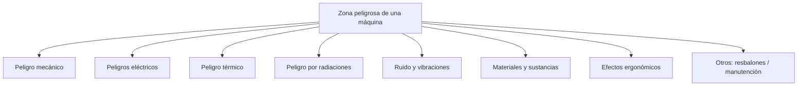
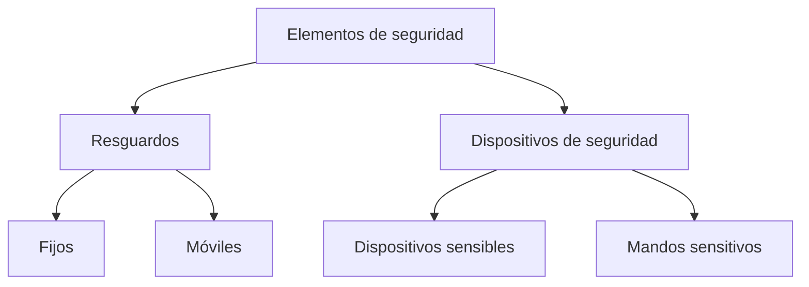

# EPP y Seguridad en las Máquinas

## Elementos de Protección Personal (EPP)

**Definición:** Dispositivos de uso individual diseñados para proteger al trabajador de la exposición a agentes físicos, químicos, biológicos y ergonómicos en el ambiente laboral, cuando no es posible garantizar su protección mediante controles de ingeniería o prácticas de trabajo.

**Función:** No reducir el riesgo o peligro, sino **adecuar al individuo al medio y al grado de exposición.**

**Condiciones de uso** (determinan el tiempo que debe llevarse):
- a) Gravedad del riesgo.
- b) Tiempo o frecuencia de exposición al riesgo.
- c) Prestaciones del propio equipo.
- d) Riesgos adicionales derivados de su propia utilización.

---

## Clasificación de EPP

### 1. Protectores de la cabeza
- Cascos de seguridad (obras, construcción, minas, industrias).
- Cascos de protección contra choques e impactos.
- Prendas de protección (gorros, gorras, sombreros de tejido).
- Cascos para usos especiales (fuego, productos químicos).

**Cascos protectores:** material resistente; protegen contra impactos, penetraciones y choques eléctricos; absorben el choque hasta aprox. **300 kg**. El barbijo sujeta el casco y debe usarse cuando sea necesario.

---

### 2. Protectores del oído
- Protectores auditivos desechables o reutilizables.
- Orejeras con arnés de cabeza, bajo la barbilla o la nuca.
- Cascos antirruido.
- Protectores auditivos acoplables a cascos industriales.
- Protectores auditivos dependientes del nivel.
- Protectores auditivos con aparatos de intercomunicación.

---

### 3. Protectores de los ojos y la cara
- Gafas de montura «universal».
- Gafas de montura «integral» (uni o biocular): encierran toda la región orbital en contacto con el rostro.
- Pantallas faciales.
- Pantallas para soldadura (de mano, de cabeza, acoplables a casco industrial).

---

### 4. Protección de las vías respiratorias
- Equipos filtrantes de partículas (molestas, nocivas, tóxicas o radiactivas).
- Equipos filtrantes frente a gases y vapores.
- Equipos filtrantes mixtos.
- Equipos aislantes con suministro de aire.
- Equipos respiratorios con casco o pantalla para soldadura.
- Equipos respiratorios con máscara movible para soldadura.
- Equipos de submarinismo.

---

### 5. Protectores de manos y brazos
- Guantes contra agresiones mecánicas (perforaciones, cortes, vibraciones).
- Guantes contra agresiones químicas.
- Guantes contra agresiones de origen eléctrico.
- Guantes contra agresiones de origen térmico.
- Manoplas.
- Manguitos y mangas.

---

### 6. Protectores de pies y piernas
- Calzado de trabajo.
- Calzado/cubrecalzado contra calor o frío.
- Calzado de protección y de seguridad.
- Zapatos con tacón o suela corrida y suela antiperforante.
- Calzado/cubrecalzado de seguridad con suela termoaislante.
- Polainas, calzado y cubrecalzado fáciles de quitar.
- Calzado frente a la electricidad.
- Calzado de protección contra motosierras.
- Polainas y rodilleras.

> Cuando exista riesgo de traumatismos directos en los pies, contacto eléctrico o resbalones: **puntera de acero / suela aislante / suela antirresbalante**, respectivamente.

---

### 7. Protectores de la piel
- Cremas de protección y pomadas.

---

### 8. Protectores del tronco y el abdomen
- Chalecos, chaquetas y mandiles contra agresiones mecánicas (perforaciones, cortes, proyecciones de metales en fusión).
- Chalecos, chaquetas y mandiles contra agresiones químicas.
- Chalecos termógenos.
- Chalecos salvavidas.
- Mandiles de protección contra rayos X.
- Cinturones de sujeción del tronco.

---

### 9. Protección total del cuerpo
- Equipos de protección contra caídas de altura.
- Dispositivos anticaídas deslizantes.
- Arneses.
- Cinturones de sujeción.
- Dispositivos anticaídas con amortiguador.
- Ropa de protección contra: mal tiempo / agresiones mecánicas / agresiones químicas / proyecciones de metales en fusión y radiaciones infrarrojas / calor intenso o estrés térmico / bajas temperaturas / contaminación radiactiva.
- Ropa antipolvo.
- Ropa antigás.
- Ropa y accesorios de señalización (retrorreflectantes, fluorescentes).

---

## Máquinas — Riesgos y Medidas de Seguridad

### Concepto básico

**Máquina:** Conjunto de piezas u órganos unidos entre sí, de los cuales uno al menos es móvil, con órganos de accionamiento, circuitos de mando y potencia, para una aplicación determinada (transformación, tratamiento, desplazamiento y acondicionamiento de material).

**Tres partes diferenciadas:**
1. **Estructura o soportes:** parte en la que apoyan las partes móviles; da unidad al conjunto.
2. **Sistema de transmisión:** elementos mecánicos que producen, transportan o transforman la energía.
3. **Zona o punto de operación:** lugar donde se efectúa el trabajo previsto.

---

### Zona peligrosa

Cualquier zona dentro y/o alrededor de una máquina en la que la presencia de una persona suponga un riesgo para su seguridad o salud.

**Tipos de peligros:**

---

### Descripción de los peligros

**Peligro mecánico:** Factores físicos que dan lugar a lesión por acción mecánica de elementos de máquinas, herramientas, piezas o materiales proyectados. Formas elementales: aplastamiento, cizallamiento, corte/seccionamiento, enganche, atrapamiento/arrastre, impacto, perforación/punzamiento, fricción/abrasión, proyección de sólidos o fluidos.

**Peligros específicos de las máquinas:**

| Peligro | Elemento origen |
|---|---|
| Corte | Elementos móviles de trabajo |
| Atrapamiento | Elementos móviles de energía o movimiento |
| Choque eléctrico | Instalación eléctrica |
| Proyección de fragmentos o partículas | Herramientas de trabajo |
| Pérdida de audición | — |

**Seguridad de una máquina:** aptitud para desempeñar su función, ser transportada, instalada, ajustada, mantenida, desmantelada y retirada en las condiciones previstas por el fabricante. Debe contemplarse en **todas las fases de su vida** y garantizarse solo para el **uso estipulado por el fabricante**.

---

**Peligros eléctricos** causados por:
- Contactos eléctricos directos (contactos activos).
- Contactos eléctricos indirectos (masas puestas accidentalmente).
- Fenómenos electrostáticos.
- Fenómenos térmicos (cortacircuitos o sobrecargas).

**Peligro térmico:** quemaduras por contacto con objetos/materiales a temperatura extrema, llamas, explosiones o radiación de fuentes de calor; y efectos nocivos por ambiente caliente o frío.

**Peligro por radiaciones** (arcos de soldadura, láseres, campos electromagnéticos de alta frecuencia, radiaciones ionizantes).

**Peligro por ruido y vibraciones:** sordera, molestias por ambiente ruidoso, trastornos neurológicos y vasculares por vibraciones.

**Peligro por materiales y sustancias:** contacto/inhalación de fluidos, gases, nieblas, humos y polvos nocivos/tóxicos/corrosivos/irritantes; incendio o explosión; peligro biológico.

**Peligro ergonómico** (inadaptación de la máquina al ser humano): efectos fisiológicos por malas posturas o esfuerzos; efectos psicofisiológicos por sobrecarga mental/estrés; errores humanos.

**Otros peligros:** resbalones o pérdida de equilibrio; peligros de manutención de la propia máquina o sus partes.

---

### Identificación y evaluación de riesgos

Deben identificarse los riesgos en **todas las fases de la vida de la máquina**.

La **probabilidad de producirse daño** está relacionada con:
- La exposición al peligro (frecuencia de acceso y duración de permanencia en la zona de peligro).
- La facilidad de desencadenarse un fallo que motive un suceso peligroso.
- La posibilidad de evitar o limitar el daño.

---

### Medidas de protección — diseñador/fabricante

Se aplican para proteger contra riesgos que no pueden evitarse o reducirse suficientemente mediante prevención intrínseca. Dos tipos fundamentales:

**Secuencia de aplicación:**

**Objeto de las medidas de seguridad:**
1. Disminuir el nivel de riesgo actuando sobre los elementos peligrosos.
2. Tener en cuenta siempre los **riesgos residuales**.

---

### Resguardos

Elemento de la máquina que garantiza la protección mediante una **barrera material**. Según su forma: carcasa, cubierta, pantalla, puerta, envolvente.

**Modos de función:**
- **Solo:** solo eficaz cuando está cerrado.
- **Asociado a dispositivo de enclavamiento o enclavamiento con bloqueo:** protección garantizada en cualquier posición del resguardo.

#### Resguardos fijos
Mantienen su posición de forma permanente o mediante elementos de fijación.
- **Fijo envolvente:** impide el acceso a la zona peligrosa por confinamiento total.
- **Fijo distanciador:** no encierra completamente pero limita el acceso por sus dimensiones y alejamiento del riesgo.

#### Resguardos móviles
- **Autorregulable:** movido por el propio elemento trabajado.
- **Regulable:** parcial o totalmente regulable.
- **Con dispositivo de enclavamiento:** las funciones peligrosas no pueden desarrollarse hasta que esté cerrado; su apertura durante el funcionamiento genera una orden de parada; su cierre permite funcionar la máquina pero **no implica la puesta en marcha**.
- **Motorizado:** movido por energía distinta a la gravedad o la fuerza humana (neumático o motor).

---

### Dispositivos de seguridad

Medios que determinan el límite de aproximación a la zona peligrosa y actúan cuando el trabajador rebasa ese límite, parando la máquina o deteniendo/invirtiendo el movimiento de los elementos peligrosos.

#### Mandos sensitivos

**Mando manual:**
- Funciona solo mientras se mantiene accionado.
- Al soltarse, la máquina vuelve automáticamente a su posición de seguridad.

**Mando a dos manos:**
- Requiere la acción simultánea de ambas manos para iniciar y mantener una fase peligrosa.
- El efecto protector no debe ser fácilmente anulable (burlado con una mano, mano-codo, antebrazo, etc.).
- El sistema de botones no debe poder accionarse accidentalmente.

**Plataforma sensible (alfombra sensible):**
- Detecta la presencia de una persona en la zona peligrosa durante operaciones de carga/descarga o reglaje.

**Borde sensible:**
- Evita peligro de aplastamiento o detiene los elementos peligrosos.
- Material flexible que reduce el riesgo.
- Debe garantizarse **seguridad positiva**: sus fallos no deben ir en perjuicio de la seguridad.
