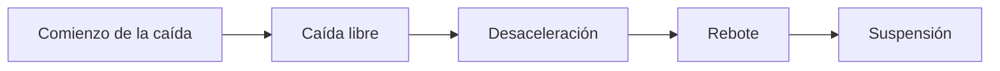

# Trabajos en Altura y Riesgos en Oficina

## Trabajos en Altura

**Definición:** Toda operación que se realice por encima del nivel del suelo. Históricamente representa uno de los mayores problemas de seguridad, ya que las consecuencias suelen ser graves, muy graves o mortales.

---

## Escalera de Mano

**Tipos:** simples, tipo tijera, extensibles.

**Reglas de colocación:**
- Inclinación: **75°** con respecto del suelo (o entre 15° y 20° de separación con la pared → separación = **1/4 de la longitud** de la escalera).
- Los largueros deben sobrepasar **1 metro** el punto superior de apoyo.
- Apoyar sobre suelos estables, contra superficie sólida y fija; impedir doblado o deslizamiento mediante cadenas, cuerdas u elementos resistentes.

**Normas de uso (19 reglas):**
1. Construcción rígida.
2. Respetar indicaciones del fabricante. No usar escaleras de más de **5 metros** cuya resistencia no esté garantizada.
3. Prohibido usar escaleras de construcción improvisada.
4. Sin nudos, roturas ni grietas.
5. No pintarlas, salvo con barniz transparente.
6. Largueros de una única pieza; peldaños ensamblados (no claveteados).
7. Ángulo de apoyo contra la pared: **75°** respecto del suelo.
8. Largueros sobrepasan **1 metro** el punto superior de apoyo.
9. Si se accede frecuentemente al mismo lugar, usar escala de servicio.
10. No utilizarlas simultáneamente por 2 trabajadores.
11. No apoyar sobre cascotes o ladrillos.
12. Mantener limpias de toda materia deslizante (barro, etc.).
13. Zapatas antideslizantes en el pie o ganchos de sujeción en la parte superior.
14. Ascenso y descenso siempre de frente. Usar **arnés de seguridad homologado** para trabajos en altura superiores a **2 metros** que requieran esfuerzos peligrosos.
15. No transportar ni manipular cargas que comprometan la seguridad.
16. No subir por encima del **tercer peldaño** contando desde arriba.
17. No dejar herramientas o materiales sobre los peldaños.
18. No permitir el paso de personas por debajo de la escalera.
19. En escaleras de tijera: tensor de seguridad completamente extendido. No trabajar a caballo sobre ellas.

---

## Andamios

**Definición:** Estructura temporal con plataformas, soportes y defensas de protección, utilizada para sostener trabajadores y materiales en sitios inaccesibles desde lugares firmes (construcción, mantenimiento, demolición).

**Tipos:**
- **Tubulares:** tubos metálicos como soportes verticales, transversales, longitudinales y elementos de unión.
- **Colgantes:** plataformas suspendidas mediante cables de acero con sistemas de anclaje.
- **Móviles o rodantes:** tubulares sobre ruedas o rodillos.
- **En voladizo:** sin apoyo directo al suelo.
- **Autoestables:** tubulares que no necesitan vientos ni anclajes a la estructura.

> Durante un desplazamiento: nadie debe permanecer sobre la plataforma y debe trasladarse descargado.

**Recomendaciones para andamiajes:**
1. Montaje exclusivo por empresas con capacidad y calificación técnica.
2. Revisión periódica por empresas instaladoras.
3. El personal sobre el andamio debe usar EPP contra caídas.

**Recomendaciones para trabajos verticales:**
1. Solo personal entrenado en centros especializados con cursos de capacitación aprobados.
2. Únicamente equipos certificados como EPI.
3. Equipos en perfectas condiciones y de uso exclusivo laboral (no deportivo).

---

## Protección contra Caídas

**Fases de una caída:**

- El trabajador puede soportar colgado aproximadamente **14 minutos** antes de correr riesgo de daños severos o fatales.
- Tras la caída libre, el sistema se activa; el trabajador recorre una **distancia de desaceleración** adicional hasta detenerse.

**Sistema Personal de Detención de Caída (activo):** arnés del cuerpo, cuerdas dinámicas, barandillas de seguridad, ganchos de cierre instantáneo, puntos de anclaje.

### Arnés

Permite puntos de anclaje **dorsal** y **torsal**; reparte la presión de choque en caídas o suspensión.

**Recomendaciones de uso:**
- Preferentemente con amortiguador de energía.
- Tirantes en el centro de los hombros; ajuste correcto en su totalidad.
- Argolla dorsal a la altura de los omóplatos.
- Cintas de piernas sin retorcimientos.
- Asignar siempre al mismo operario para evitar distintos ajustes (que dañan el arnés).
- Punto de anclaje rígido para evitar desgarres o desprendimientos.
- Todo arnés que haya sufrido una caída o genere dudas en inspección visual → reemplazar.
- Ninguna modificación en costuras, cintas ni bandas.

### Punto de anclaje
- Resistente a la fuerza de caída.
- Revisar antes de conectarse que no tenga daños.
- Sin obstáculos en el recorrido.
- Considerar la altura a la que se trabaja.

### Normas de seguridad generales para trabajo en altura
- Certificación habilitante.
- Permiso de trabajo al grupo.
- EPP completo.
- Herramientas, equipos y escaleras adecuados.
- Supervisión durante toda la ejecución.
- Herramientas solo en cinturón portaherramientas.
- Una vez en altura, engancharse a la línea de vida.
- **No trabajar** con fuertes vientos, lluvias, granizadas o descargas eléctricas.

---

## Riesgos en Oficinas — Consejos Preventivos

### Posturas de trabajo

**Buenas prácticas:**
- Mobiliario con estándares ergonómicos; ajustar altura de silla y apoyo lumbar periódicamente.
- Espalda recta, barbilla ligeramente levantada.
- Evitar giros e inclinaciones frontales o laterales del tronco.
- No sentarse demasiado lejos ni demasiado bajo; no inclinar la cabeza.
- Estirar las piernas (favorece el riego sanguíneo).
- Realizar breves descansos y ejercicios de relajación.

**Posturas inadecuadas más frecuentes:**
1. Giro de la cabeza.
2. Falta de apoyo en la espalda.
3. Elevación de hombros por mal ajuste altura mesa-asiento.
4. Falta de apoyo para muñecas y antebrazos.
5. Extensión y desviación de la muñeca al teclear.

---

### Contusiones y golpes

**Causas:** cajones entreabiertos, archivadores sobrecargados en los primeros cajones, puertas de cristal sin señalizar.

**Prevención:** cerrar cajones, no sobrecargar la parte superior de archivadores, anclar estanterías a la pared, señalizar puertas acristaladas.

### Caídas al mismo nivel
- No acumular materiales u objetos en zonas de paso.
- Cables eléctricos por canaletas (no en el suelo).
- Mantener orden y limpieza: cada cosa en su sitio.

---

### Contacto eléctrico
- Verificar buen estado de cables de equipos eléctricos.
- No manipular conexiones ni reparar equipos eléctricos por cuenta propia.
- No sobrecargar enchufes con zapatillas.
- Toda instalación eléctrica posee tensión hasta que no se comprueba lo contrario.

---

### Trabajos con Pantallas de Visualización de Datos (PVD)

**Configuración general:**
- Pantalla a distancia mínima de **40 cm**.
- Ubicarse de frente al monitor (sin girar la cabeza).
- Dejar espacio entre el teclado y el borde de la mesa.
- Espacio libre bajo la mesa para las piernas.

**Ángulo del monitor:**
- Inclinar hacia arriba **10° a 20°**; pantalla perpendicular a la mirada del usuario.
- La pantalla no debe estar por encima ni por debajo de los **60°** del ángulo visual.
- Pantalla en posición ligeramente inclinada para evitar reflejos.

**Mesa de trabajo:** superficie poco reflectante, dimensiones suficientes, soporte de documentos estable y regulable para minimizar movimientos de cabeza y ojos.

**Escritorio — posiciones correctas:**
- Mantener ordenado; documentos más usados al alcance sin flexionar la espalda.
- Teléfono y ratón a mano.
- Distancia óptima al monitor: **40 cm**.
- Espacio libre bajo la mesa (sin objetos que obliguen a flexionar las piernas).

---

#### Fatiga visual

**Causa:** exceso de uso de la pupila al fijar el ojo en pantalla/texto por largos períodos, intentando acomodarse a las variaciones de iluminación.

**Síntomas:** picor, ardor, lagrimeo, pesadez de párpados, ojos enrojecidos, visión borrosa, imagen doble transitoria, dolor de cabeza, vértigo, ansiedad; en casos graves: epilepsia.

**Prevención:**
1. Evitar que las fuentes de luz se reflejen en la pantalla.
2. Caracteres bien definidos y claros (sin imágenes opacas).
3. Iluminación correcta del área: ni mucha ni poca.
4. Evitar superficies de trabajo brillantes.
5. Ángulo visual máximo de **60°** (ni por encima ni por debajo).
6. Pantalla en posición ligeramente inclinada.
7. Teclado con reposamanos bajo la muñeca; evitar inclinar la mano al usar el mouse.

---

#### Fatiga física

**Causa:** malas posturas al sentarse (falta de apoyo de espalda, espalda muy flexionada), posición de cabeza-cuello (flexión o torsión al escribir o mirar la pantalla), posición de brazos y muñecas al teclear (sin apoyo, desviación cubital).

**Síntomas:** dolores en cuello y nuca, dolores de espalda, lumbalgias, contracturas, hormigueos, **síndrome del túnel carpiano**.

**Prevención:** equipos de oficina ergonómicos (mesas, sillas, equipos) que cumplan normas técnicas de ergonomía.

---

#### Teclado convencional — errores frecuentes
- No adoptar postura neutral (manos inclinadas hacia adelante y arriba, codos separados del cuerpo).
- Corrección: rotar el antebrazo para que las palmas queden de frente al teclado.

#### Teclados alternativos
- Diseñados para cambiar la postura del usuario; basados en descanso de palma-muñeca.
- Nuevos modelos orientados a esfuerzos mínimos.
- El reconocimiento de voz empieza a adoptarse en algunas aplicaciones.

---

### Incendio en Oficina
- Apagar correctamente cigarrillos; no volcar ceniceros en papeleras.
- Mantener despejado el acceso a extintores, mangueras y alarmas.
- No saturar conexiones eléctricas (evitar cortocircuitos).
- Verificar que los aparatos eléctricos no se calienten excesivamente.
- Cumplir las recomendaciones del plan de emergencia y evacuación.
