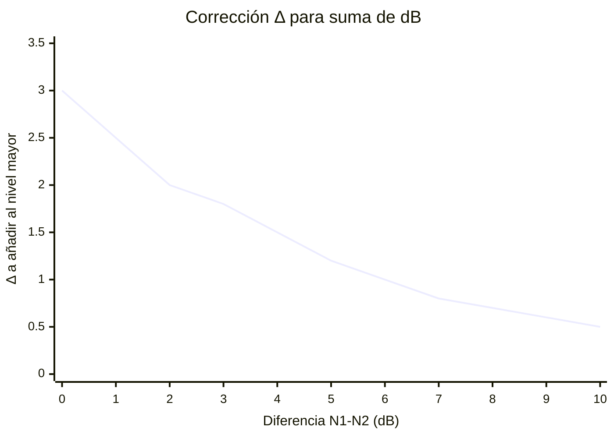
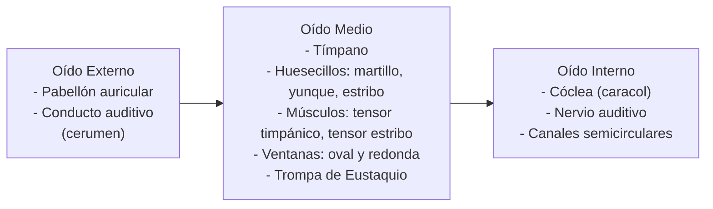
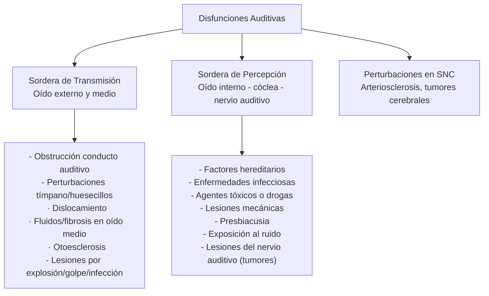

usar normativa SRT para el calculo de NSCE
## 1. El Sonido

**Definición:** Toda vibración acústica capaz de producir una sensación audible.
Se propaga en un medio elástico (ej: aire) mediante movimiento vibratorio de los cuerpos.

**Tipos:**
- **Sonido puro:** señal senoidal de una sola frecuencia.
- **Sonido compuesto:** suma de varios sonidos puros.

**Propiedades:** Frecuencia (Hz) · Intensidad (dB)

**Propagación:** Al hacer vibrar una varilla se generan compresiones y enrarecimientos del aire → onda longitudinal → varía la presión → hace vibrar el tímpano.

---

## 2. Física del Sonido

### Características del Ruido
- Definición subjetiva: sonido inarticulado, confuso, indeseable.
- Formado por componentes de distintas frecuencias no relacionadas → sin tonalidad definida.
- **Rango audible:** 20 Hz – 20 kHz.

### Tono
Cualidad asociada al carácter agudo/grave:
- Frecuencias altas → tonos agudos
- Frecuencias bajas → tonos graves

### Timbre
Permite distinguir sonidos de igual frecuencia (ej: clarinete vs piano).
Determinado por el número e intensidad de los **armónicos** (múltiplos enteros de la frecuencia fundamental).

---

## 3. Magnitudes Físicas: el Decibel (dB)

**Definición:** Unidad que expresa la relación entre dos magnitudes.

$$L_x = 10 \log\left(\frac{x}{x_0}\right) \text{ [dB]}$$

### Niveles en Decibeles

| Nivel en dB | Magnitud | Valor de referencia |
|---|---|---|
| $L_p = 20\log\dfrac{p}{p_0} = 10\log\dfrac{p^2}{p_0^2}$ | Presión sonora (Pa) | $p_0 = 20\ \mu\text{Pa}$ |
| $L_w = 10\log\dfrac{W}{W_0}$ | Potencia (W) | $W_0 = 10^{-12}\ \text{W}$ |
| $L_I = 10\log\dfrac{I}{I_0}$ | Intensidad (W/m²) | $I_0 = 10^{-12}\ \text{W/m}^2$ |

### Magnitudes principales
- **Potencia Sonora (W):** característica de la fuente.
- **Intensidad Sonora (W/m²):** energía por unidad de tiempo y superficie.
- **Presión Sonora (N/m²):** diferencia entre presión estática y existente.

### NPS de referencia

| Lugar | NPS (dB) |
|---|---|
| Umbral de sonido | 0 |
| Oficina | 50 |
| Calle | 70 |
| Umbral de dolor | 120 |

### Suma de dB
Si $N_1 \geq N_2$:  $N_t = N_1 + \Delta$

| $N_1 - N_2$ | 0 | 1 | 2 | 3 | 4 | 5 | 6 | 7 | 8 | 9 | 10 | >10 |
|---|---|---|---|---|---|---|---|---|---|---|---|---|
| $\Delta$ | 3 | 2.5 | 2 | 1.8 | 1.5 | 1.2 | 1 | 0.8 | 0.7 | 0.6 | 0.5 | $N_1$ |

---

## 4. Relación Nivel de Potencia y Nivel de Presión

Para sonido isótropo en campo libre:

$$L_p = L_w - 20\log r - 10.9 + C$$

- $r$: distancia a la fuente (m)
- $L_w$: nivel de potencia (dB)
- $C$: corrección por temperatura y presión atmosférica

**Ejemplo:** $L_w = 90\ \text{dB}$, $r = 10\ \text{m}$, $T = 20°C$, $P = 1000\ \text{mb}$, $C = 0$

$$L_p = 90 - 20\log 10 - 10.9 + 0 \approx 59\ \text{dB}$$

---

## 5. Gráfico para Sumar dB

> Cuanto mayor es la diferencia entre los dos niveles, menor es la corrección a aplicar. Cuando la diferencia supera los 10 dB, el nivel total es prácticamente igual al mayor.

---

## 6. Sonidos Característicos

| Sonido | NPS (dB) | Efecto |
|---|---|---|
| Zona lanzamiento de cohetes | 180 | Pérdida auditiva irreversible |
| Operación en pista de jets | 140 | Dolorosamente fuerte |
| Trueno | 130 | — |
| Despegue jets (60m) / Bocina auto (1m) | 120 | Umbral de dolor |
| Martillo neumático / Concierto de Rock | 110 | Extremadamente fuerte |
| Camión pesado (15m) / Tránsito urbano | 90 | Muy molesto / Daño auditivo (8 hs) |
| Reloj despertador (0.5m) / Secador | 80 | Molesto |
| Restaurante / Autopista / Oficina | 70 | Difícil uso del teléfono |
| Aire acondicionado / Conversación normal | 60 | Intrusivo |
| Biblioteca / Susurro a 5m | 30 | Muy silencioso |
| Estudio de radiodifusión | 20 | — |
| — | 10 | Apenas audible |
| — | 0 | Umbral auditivo |

---

## 7. Distribución Espectral

Los sonidos son espectros de frecuencias; los instrumentos miden **bandas de frecuencias**.

**Por duración:**
- **Continuos:** variación < ±5 dB
- **Discontinuos:** de impacto o impulsivos
- **Fluctuantes**

**Ruidos de impacto:** crecimiento casi instantáneo, repetición < 10/seg, decrecimiento exponencial.
**Ruidos impulsivos:** crecimiento casi instantáneo, duración < 50 ms.

---

## 8. El Oído Humano

**Funciones:**
1. Captar señal acústica, transformarla y transmitirla al cerebro.
2. Contribuir al equilibrio (canales semicirculares).

**Anatomía:**

---

## 9. Factores de Riesgo de Pérdida Auditiva

1. Nivel de presión sonora
2. Tipo de ruido
3. Tiempo de exposición
4. Edad del trabajador

---

## 10. Efectos Biológicos del Ruido

### Efectos sobre el aparato auditivo

| Tipo | Descripción |
|---|---|
| **Trauma acústico** | Lesión inmediata por explosión intensa. Ruidos 120–150 dB pueden provocar sordera temporaria. |
| **DTU (Desplazamiento Temporario del Umbral)** | Elevación del umbral auditivo con recuperación total en < 10 días. También llamada **fatiga auditiva**. |
| **Sordera temporaria** | Pérdida de audición con recuperación al día siguiente. |
| **Sordera profesional / Hipoacusia** | Alteración **irreversible**. Primero afecta 4000–6000 Hz, luego la banda conversacional (500–2000 Hz). El ruido destruye células ciliadas → **hipoacusia neurosensorial pura**. |

### Efectos fisiológicos no auditivos

**a) Psicológicos:** sensación molesta, mayor tensión, menor concentración, fatiga. Los sonidos agudos, inesperados y discontinuos molestan más.

**b) Interferencia en la comunicación:** frecuencias importantes para el habla: 200–6000 Hz. Intensidad de conversación normal: 65 dB.

---

## 11. Disfunciones Auditivas

---

## 12. Evaluación de Exposición a Ruidos

**Instrumentos:**
- **Decibelímetro (medidor de nivel sonoro):** micrófono + sección de procesamiento + unidad de lectura. Para ruidos prácticamente constantes (variación < 5 dB), con compensación A y respuesta lenta (S). Micrófono a la altura del oído del trabajador.
- **Dosímetro:** integrador para ruidos variables.
- **Analizadores estadísticos:** para ruidos de nivel o duración variable.

**Cuantificación depende de:** niveles sonoros en el lugar · características temporales · composición espectral · características espaciales del campo sonoro.

---

## 13. Curvas de Igual Sonoridad

El oído tiene **diferente sensibilidad según la frecuencia**. La intensidad es magnitud física; la **sonoridad** (sensación en el oído) es subjetiva y se mide en **fonios**.

**Ejemplos:**
- 80 dB a 50 Hz → 6F0 fonios
- 45 dB a 5000 Hz → 40 fonios

> La curva de igual sonoridad muestra que para percibir la misma intensidad subjetiva, se necesita mayor potencia física en frecuencias bajas y muy altas respecto a las frecuencias medias (~1000–4000 Hz).

---

## 14. Nivel Sonoro Continuo Equivalente (NSCE)

**Definición:** Nivel sonoro constante que, durante el tiempo T, produce un efecto equivalente al de la exposición real en cuanto al deterioro auditivo permanente.

**Criterios:**
- **Igual energía (ISO):** el deterioro depende de la energía total incidente.
- **Igualdad de efectos (OSHA):** exposiciones equivalentes cuando producen el mismo DTU (2 min).

**Fórmula:**

$$\text{NSCE} = 10 \log \left( \frac{1}{T} \sum_{i=1}^{n} t_{p_i} \cdot 10^{0.1 N_i} \right)$$

- $T$ = tiempo total
- $t_p$ = tiempo parcial en ese nivel sonoro
- $N$ = nivel sonoro en dBA

**Límite general:** NSCE = 90 dBA para 8 hs diarias y 48 semanas.

### Tabla de tiempos máximos de exposición

| Exposición (h/día) | ISO – igual energía (dBA) | OSHA – igual efecto (dBA) |
|---|---|---|
| 8 | 90 | 90 |
| 4 | 93 | 95 |
| 2 | 96 | 100 |
| 1 | 99 | 105 |
| ½ | 102 | 110 |
| ¼ | 105 | 115 |

---

## 15. Decreto 351/79 vs Resolución SRT 295/2003

| Exposición (h/día) | Decreto 351/79 (dBA) | Res. SRT 295/2003 (dBA) |
|---|---|---|
| 8 | 90 | 85 |
| 7 | 90.5 | — |
| 6 | 91 | — |
| 5 | 92 | — |
| 4 | 93 | 88 |
| 3 | 94 | — |
| 2 | 96 | 91 |
| 1 | 99 | 94 |
| 30 min | 102 | 97 |
| 15 min | 105 | 100 |
| 1 min | 115 | 112 |

---

## 16. Marco Legal – Decreto Nacional 351, Cap. 13

- **Art. 85:** Dosis máxima admisible: **90 dB(A) NSCE / 8 hs diarias / 48 hs semanales**. Por encima de 115 dB(A): protección individual obligatoria. Por encima de 135 dB(A): prohibido trabajar incluso con protectores.
- **Art. 87:** Si se supera la dosis: (1) ingeniería → (2) protección auditiva → (3) reducción de tiempo de exposición.
- **Art. 88:** Si ingeniería es impracticable → uso obligatorio de protectores auditivos.
- **Art. 91:** Con protectores, al nivel medido se le resta la atenuación del protector (certificada por organismos oficiales).
- **Art. 92:** Todo trabajador expuesto a > 85 dB(A) NSCE → audiometrías periódicas. Si aumenta persistentemente el umbral → protectores permanentes. Si continúa → reasignación a tareas no ruidosas.

---

## 17. Control del Ruido

### Estrategia general
1. Mediciones por bandas de octavas.
2. Comparar con criterios de aceptación.
3. Aplicar reducción mediante:
   - **Ingeniería:** reducción en la fuente, barreras, absorción, montaje aislante.
   - **Limitación de exposición / EPP.**
   - Si hay varias fuentes, reducir la más importante primero.

### Medidas de control (jerarquía)
1. **De ingeniería**
2. **Administrativas**
3. **EPP (equipo de protección personal)**

### Metodología: Planeamiento y Sustitución
- Seleccionar equipos con bajo nivel de emisión.
- Diseño del Lay Out: alejar máquinas ruidosas, colocarlas en cerramiento o al personal en cabina.
- Equipos silenciosos (ventiladores lentos, herramientas eléctricas vs neumáticas).
- Procesos silenciosos (soldadura en vez de remachado).
- Materiales silenciosos (goma, plástico).

### Campo Sonoro
- **Campo libre:** al duplicar la distancia, NPS disminuye **6 dB**.
- **Campo reverberante:** paredes generan reflexión → incremento de presión.

### Absorción Acústica
- Energía no reflejada (independiente de lo que pasó con ella).
- Cada material tiene coeficiente de absorción **α** (depende de la frecuencia).
- **Tiempo de reverberación (Ts):** tiempo que tarda la intensidad en reducirse a la millonésima parte al cesar la fuente. Ts pequeño → paredes absorbentes.

### Aislación Acústica (cuando la fuente está fuera del local)
$$RR = P_t - 10\log\left(\frac{1}{4} + \frac{S_p}{R}\right)$$
- $P_t$ (pérdida de transmisión de la pared) $= 10\log(1/\tau)$, donde $\tau$ = coeficiente de aislación de la pared.
- $S_p$ = superficie de la pared; $R$ = constante del local.

### Relación Potencia–Presión en local
- **Q** (coeficiente de direccionalidad): $Q = I_d / I_m$
- **R** (constante del local): depende de la superficie envolvente y absorción acústica de paredes.

### Modificación de la Fuente
**Fuentes Clase A:** vibración de superficies sólidas/líquidas.
**Fuentes Clase B:** turbulencias, gas a alta velocidad.

Acciones:
- Reducir fuerza impulsora: balance dinámico, minimizar velocidad, desacoplar fuerzas.
- Reducir respuesta de superficie vibrante: amortiguación, rigidez, masa, cambiar frecuencia de resonancia.
- Reducir área vibrante, usar direccionalidad de la fuente, reducir turbulencia.

### Modificación de la Onda Sonora
- Confinamiento mediante barreras.
- Absorción dentro del cerramiento o revistiendo ductos.
- Fenómeno de resonancia: dos tonos de igual frecuencia se cancelan (base de absorbentes reactivos).

---

## 18. Vibraciones

**Definición (OIT):** Todo movimiento transmitido al cuerpo humano por estructuras sólidas capaz de producir efecto nocivo o molestia.
Caracterizado por: amplitud de desplazamiento, velocidad y aceleración.

**Fuentes:** mecanismos de máquinas, masas rotatorias mal equilibradas, pulsos de aire comprimido, choques, impulsos.

### Tipos de vibración
- **Periódica:** se repite después de un período de tiempo.
- **Aleatoria:** múltiples frecuencias.
- **Transitoria / Choques:** corta duración, repentina.

### Parámetros de valoración del riesgo
Aceleración · Frecuencia · Parte del cuerpo afectada · Dirección de la vibración

### Clasificación según parte del cuerpo
- **Mano-brazo:** trastornos vasculares, osteoarticulares, neurológicos, musculares.
- **Cuerpo entero (globales):** afectan a trabajadores del transporte, se transmiten por asiento.

### Receptores de vibración
Oído interno · Receptores mecánicos (musculares, viscerales, articulares) · Órganos de la visión · Receptores dérmicos.

---

## 19. Efectos de las Vibraciones en el Organismo

### Alta frecuencia (mano-brazo)
- Trastornos osteoarticulares (artrosis hiperostosante de codo).
- Lesiones de muñeca (malacia del semilunar, osteonecrosis del escafoides).
- Afecciones angioneuróticas de la mano, calambres, trastornos de sensibilidad.
- **Síndrome de Raynaud** (dedos muertos) – expresión vascular.
- Aumento de enfermedades estomacales.
- Efectos neurológicos: hipoestesia, disestesia, polineuropatía.
- Efectos musculares: atrofias musculares, tendinitis.
- Efectos generales: cefaleas, neurosis, irritabilidad, insomnio, efectos cardiovasculares.

### Baja frecuencia (cuerpo entero)
- Lumbalgias, lumbociáticas, hernias, pinzamientos discales.
- Agravamiento de lesiones raquídeas.
- Síntomas neurológicos: variación del ritmo cerebral, alteraciones del equilibrio.
- Trastornos de visión por resonancia.

### Muy baja frecuencia
- Estimulación del laberinto del oído interno.
- Trastornos del SNC.
- Mareos y vómitos (mareo del viajero).
- Afecta trabajadores del transporte (avión, barco, tren, auto).

---

## 20. Control de Vibraciones

### Prevención en la fuente
- Diseño ergonómico de herramientas.
- Adquirir equipos de vibración reducida.
- Desfasar/desintonizar vibraciones (modificar masa o rigidez).
- Mandos a distancia.
- Suspensión de vehículos en buen estado.
- Superficies de rodadura sin discontinuidades.

### Prevención en el medio
- Interponer materiales aislantes/absorbentes entre fuente y trabajador.
- Plataformas/sillas con sistemas amortiguados.
- Tapetes, columpios, plataformas amortiguantes.
- Estructuras independientes o discontinuas.

### Prevención en el trabajador
- Manijas/asas de material elástico o absorbente.
- Reducción del tiempo de exposición y pausas.
- Guantes, cinturones, plantillas de calzado y muñequeras antivibración.
- Mantener las manos calientes.
- Instruir sobre agarre mínimo necesario de la herramienta.
- Señalización ordenativa de EPP.

### Criterios preventivos básicos
1. Disminuir tiempo de exposición.
2. Rotación de puestos de trabajo.
3. Sistema de pausas durante la jornada.
4. Adecuación a diferencias individuales.
5. Minimizar intensidad de vibraciones.
6. Reducir vibraciones entre piezas de máquinas.
7. Reducir vibraciones por funcionamiento de maquinaria/motores.
8. Mejorar irregularidades del terreno.
9. Uso de EPP: guantes antivibración, zapatos, botas, etc.

### Aislamiento de vibraciones
Muelles, elementos elásticos, masas de inercia, plataformas aisladas, manguitos en empuñaduras, asientos sobre soportes elásticos → **no disminuyen la vibración original, impiden su transmisión al cuerpo**.

### Medición de vibraciones
- Directamente en los equipos.
- En el punto de transmisión al cuerpo.

**Equipos:** Acelerómetro (de asiento, mano-brazo, corriente) · Analizador de bandas.

# Preguntas 
diferencia entre presion y potencia sonoras 
