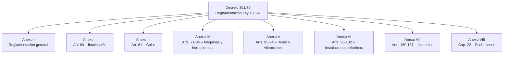
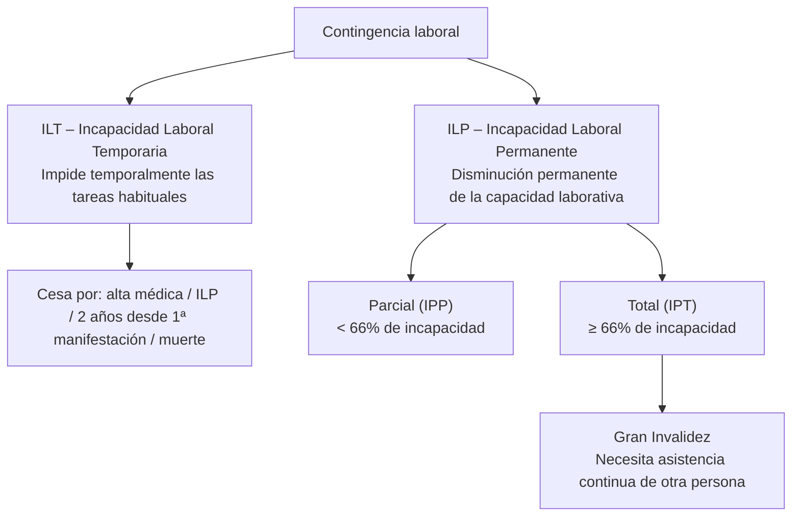
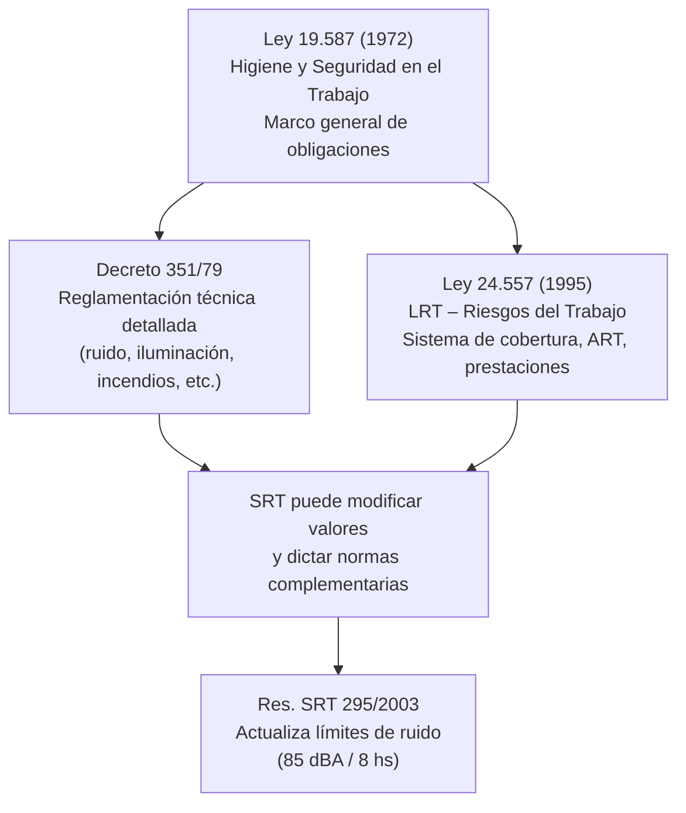

# Marco Legal – Higiene y Seguridad en el Trabajo (Argentina)

---

## 1. Ley N° 19.587 – Higiene y Seguridad en el Trabajo (1972)

**Ámbito:** Se aplica a **todos los establecimientos** del territorio nacional, persigan o no fines de lucro, cualquiera sea la naturaleza de la actividad.

**Definiciones clave:**
- **Establecimiento / puesto de trabajo:** todo lugar donde se realicen tareas con presencia permanente, circunstancial, transitoria o eventual de personas físicas.
- **Empleador:** persona física o jurídica que utiliza la actividad de uno o más trabajadores en virtud de un contrato o relación de trabajo.
- Si la prestación es ejecutada por **terceros** en instalaciones del dador principal, éste es **solidariamente responsable**.

### Objetivos de la higiene y seguridad (Art. 4)
a) Proteger la vida e integridad psicofísica de los trabajadores.
b) Prevenir, reducir, eliminar o aislar los riesgos.
c) Estimular una actitud positiva hacia la prevención.

### Principios y métodos (Art. 5) — selección relevante
- Creación de servicios de medicina, higiene y seguridad de carácter **preventivo y asistencial**.
- Sistema de reglamentaciones por ramas, actividades y dimensión de empresas.
- Investigación de factores determinantes de accidentes (físicos, fisiológicos, psicológicos).
- Estadísticas normalizadas de accidentes y enfermedades.
- Corrección de ambientes cuando los niveles de agentes agresores sean permanentes durante la jornada.
- Exámenes médicos **pre-ocupacionales y periódicos**.

### Condiciones de higiene – factores a considerar (Art. 6)
- Diseño de plantas industriales, locales, puestos de trabajo, maquinarias.
- **Factores físicos:** cubaje, ventilación, temperatura, carga térmica, presión, humedad, iluminación, **ruidos, vibraciones** y radiaciones ionizantes.
- Contaminación ambiental: agentes físicos, químicos y biológicos.
- Efluentes industriales.

### Condiciones de seguridad (Art. 7)
- Instalaciones, artefactos, herramientas: ubicación y conservación.
- Protección de máquinas e instalaciones eléctricas.
- **Equipos de protección individual (EPP).**
- Prevención de accidentes y enfermedades del trabajo.
- Identificación y rotulado de sustancias nocivas; señalamiento de lugares peligrosos.
- Prevención y protección contra incendios y siniestros.

### Obligaciones del empleador (Arts. 8 y 9)
- Construcción y equipamiento de edificios en condiciones ambientales adecuadas.
- Colocación y mantenimiento de resguardos y protectores de maquinarias.
- Suministro y mantenimiento de EPP.
- Examen pre-ocupacional y revisaciones periódicas del personal.
- Mantener en buen estado maquinarias, instalaciones y útiles de trabajo.
- Instalar equipos de renovación de aire y eliminación de contaminantes.
- **Eliminar, aislar o reducir los ruidos y/o vibraciones perjudiciales.**
- Disponer de medios para primeros auxilios.
- Colocar avisos o carteles de higiene y seguridad.
- **Promover la capacitación del personal** en prevención de riesgos.
- Denunciar accidentes y enfermedades del trabajo.

### Obligaciones del trabajador (Art. 10)
- Cumplir normas de higiene y seguridad y usar correctamente el EPP.
- Someterse a exámenes médicos preventivos y periódicos.
- Cuidar avisos y carteles de seguridad.
- Colaborar en programas de formación y asistir a cursos durante horas de labor.

### Sanciones (Art. 12)
Las infracciones son sancionadas conforme a la Ley 18.694.

---

## 2. Decreto N° 351/79 – Reglamentación de la Ley 19.587

Reglamenta la Ley 19.587 y deroga el Decreto 4.160/73. Contiene **8 Anexos**.

**Disposiciones generales:**
- **Art. 1:** Aprueba los Anexos I a VIII.
- **Art. 2:** Faculta a la **Superintendencia de Riesgos del Trabajo (SRT)** a otorgar plazos, modificar valores y dictar normas complementarias.

**Capítulo 13 – Ruido y Vibraciones (Arts. 85–92) → remite al Anexo V:**

| Artículo | Contenido |
|---|---|
| **Art. 85** | NSCE máximo admisible: **90 dB(A) / 8 hs / 48 hs semanales**. Sobre 115 dB(A): protección individual obligatoria. Sobre 135 dB(A): prohibido trabajar aun con protectores. |
| **Art. 86** | El NSCE se determina siguiendo el procedimiento del Anexo V (ruidos no impulsivos, de impacto, impulsivos, y con protectores). |
| **Art. 87** | Si el NSCE supera la dosis: (1) ingeniería → (2) protección auditiva → (3) reducción del tiempo de exposición. |
| **Art. 88** | Si ingeniería es impracticable → **uso obligatorio de protectores auditivos**. |
| **Art. 89** | Si ingeniería y EPP son impracticables → reducir tiempos de exposición según Anexo V. |
| **Art. 91** | Con protectores: al nivel medido se resta la atenuación del protector (certificada por organismo oficial). |
| **Art. 92** | Trabajadores expuestos a > **85 dB(A)** NSCE → **audiometrías periódicas**. Si persiste aumento del umbral → protectores permanentes. Si continúa → reasignación a tareas no ruidosas. |

**Excepciones de aplicación:**
- **Industria de la construcción:** rige el Decreto 911/96.
- **Actividad agraria:** rige el Decreto 617/97.
- **Actividad minera:** rige el Decreto 249/2007.

---

## 3. Ley N° 24.557 – Ley sobre Riesgos del Trabajo (LRT, 1995)

### Objetivos (Art. 1)
a) Reducir la siniestralidad laboral mediante la **prevención**.
b) **Reparar** los daños derivados de accidentes de trabajo y enfermedades profesionales, incluyendo rehabilitación.
c) Promover la **recalificación y recolocación** de trabajadores damnificados.
d) Promover la negociación colectiva para mejorar prevención y prestaciones.

### Ámbito de aplicación (Art. 2)
**Incluidos obligatoriamente:**
- Funcionarios y empleados del sector público (nacional, provincial, municipal).
- Trabajadores en relación de dependencia del sector privado.
- Personas obligadas a prestar servicio de carga pública.

**Pueden incluirse por decreto:** trabajadores domésticos, autónomos, vinculados por relaciones no laborales, bomberos voluntarios.

### Seguro obligatorio (Art. 3)
- Los empleadores deben afiliarse a una **ART (Aseguradora de Riesgos del Trabajo)** de libre elección, salvo que acrediten solvencia para **autoasegurarse**.
- El Estado nacional, provincias y municipios también pueden autoasegurarse.

### Obligaciones de prevención (Art. 4)
- Empleadores, trabajadores y ART deben adoptar medidas para **prevenir eficazmente** los riesgos.
- Las ART deben establecer un **Plan de Acción** para empresas críticas que contemple: evaluación periódica de riesgos, visitas de control, medidas correctivas y propuesta de capacitación.
- Incumplimientos deben ser denunciados por la ART a la SRT.

### Recargo por incumplimiento (Art. 5)
Si el accidente/enfermedad se produce por incumplimiento del empleador de normas de higiene y seguridad → pago al **Fondo de Garantía** de hasta **$30.000** (monto sujeto a actualización por RIPTE).

---

### Contingencias cubiertas (Art. 6)

**Accidente de trabajo:** acontecimiento súbito y violento ocurrido por el hecho o en ocasión del trabajo, o **en el trayecto** entre el domicilio y el lugar de trabajo (accidente in itinere), siempre que no se haya interrumpido el trayecto por causas ajenas al trabajo.

**Enfermedades profesionales:** las incluidas en el **listado del Poder Ejecutivo** (agente de riesgo, cuadros clínicos, exposición y actividades). Las no listadas pueden ser reconocidas por la **Comisión Médica Central** si se demuestra relación directa e inmediata con el trabajo.

**Excluidos:**
- Accidentes causados por **dolo del trabajador** o fuerza mayor extraña al trabajo.
- Incapacidades **preexistentes** acreditadas en el examen preocupacional.

---

### Incapacidades (Arts. 7–10)

**ILP – Carácter provisorio y definitivo (Art. 9):**
- Provisorio: primeros **36 meses** desde su declaración (prorrogable 24 meses más).
- Definitivo: vencidos esos plazos.

---

### Prestaciones dinerarias (Arts. 11–18)

**Ingreso Base (Art. 12):** promedio mensual de todos los salarios devengados durante el **año anterior** a la primera manifestación invalidante, actualizados por el índice **RIPTE**.

| Situación | Prestación |
|---|---|
| **ILT** | Pago mensual = valor mensual del ingreso base. Primeros 10 días: a cargo del empleador. Siguientes: a cargo de la ART. |
| **IPP ≤ 50%** (definitiva) | Pago único = 53 × ingreso base × % incapacidad × (65 / edad). |
| **IPP > 50% y < 66%** (definitiva) | Renta periódica = ingreso base × % incapacidad. |
| **IPT** (provisoria) | 70% del ingreso base mensual. |
| **IPT** (definitiva) | Prestación previsional por retiro por invalidez + complemento de la ART. |
| **Gran invalidez** | Prestaciones de IPT + adicional mensual (actualizado por RIPTE). |
| **Muerte** | Pensión por fallecimiento + prestaciones del Art. 15 ap. 2 + complemento Art. 11 ap. 4. |

**Derechohabientes (Art. 18):** personas enumeradas en el Art. 53 de la Ley 24.241. Límite de edad: 21 años (25 si son estudiantes a cargo exclusivo del fallecido).

---

### Prestaciones en especie (Art. 20)
Las ART otorgan:
- Asistencia médica y farmacéutica.
- Prótesis y ortopedia.
- Rehabilitación.
- Recalificación profesional.
- Servicio funerario.

Las ART pueden **suspender prestaciones dinerarias** si el damnificado se niega injustificadamente a las prestaciones en especie.

---

### Comisiones Médicas (Art. 21)
Determinan:
- La naturaleza laboral del accidente o profesional de la enfermedad.
- El carácter y grado de la incapacidad.
- El contenido y alcance de las prestaciones en especie.

El procedimiento es **gratuito** para el damnificado (incluyendo traslados y estudios).

---

### Derechos, deberes y prohibiciones (Art. 31)

**ART debe:**
- Denunciar incumplimientos de afiliados a la SRT.
- Promover la prevención.
- Mantener registro de siniestralidad por establecimiento.
- No rechazar afiliación de ningún empleador dentro de su ámbito.
- No realizar exámenes psicofísicos previos a la celebración de un contrato de afiliación.

**Empleador debe:**
- Notificar a trabajadores la identidad de la ART.
- Denunciar accidentes y enfermedades a la ART y la SRT.
- Cumplir normas de higiene y seguridad.
- Mantener registro de siniestralidad.

**Trabajador debe:**
- Recibir información y capacitación en prevención.
- Cumplir normas de higiene y seguridad.
- Informar al empleador los hechos relacionados con riesgos.
- Someterse a exámenes médicos y tratamientos de rehabilitación.
- Denunciar al empleador los accidentes y enfermedades que sufra.

---

### Sanciones (Art. 32)

| Infracción | Sanción |
|---|---|
| Incumplimiento general de obligaciones | Multa de 20 a 2.000 AMPOs |
| Omisión de asistencia médica (Art. 20 inc. a) | Pena Art. 106 Código Penal |
| Omisión de pago de cuotas o declaración de pago | Prisión 6 meses a 4 años |
| Incumplimiento de prestaciones dinerarias o aportes a fondos | Prisión 2 a 6 años |

Los delitos se configuran si el obligado no cumple dentro de los **15 días corridos** de ser intimado. Competencia: **justicia federal**.

---

### Fondos (Arts. 33–34)

**Fondo de Garantía (Art. 33):** administrado por la SRT. Financia prestaciones cuando el empleador tiene **insuficiencia patrimonial** declarada judicialmente.

**Fondo de Reserva (Art. 34):** administrado por la Superintendencia de Seguros de la Nación. Financia prestaciones cuando una ART entra en **liquidación**.

---

### SRT – Superintendencia de Riesgos del Trabajo (Arts. 35–38)
Entidad autárquica en jurisdicción del Ministerio de Trabajo. Funciones principales:
- Controlar cumplimiento de normas de higiene y seguridad.
- Supervisar y fiscalizar el funcionamiento de las ART y empresas autoaseguradas.
- Imponer sanciones.
- Mantener el **Registro Nacional de Incapacidades Laborales** y elaborar índices de siniestralidad.
- Gestionar el Fondo de Garantía.

---

### Prescripción (Art. 44)
- Acciones derivadas de la LRT: **2 años** desde que la prestación debió ser abonada, o desde el cese de la relación laboral.
- Acciones de entes gestores para cobrar acreencias: **10 años**.

---

### Relación entre las tres normas

